# OpenCode CMS

OpenCode CMS 是一套 **多帳號、多 Provider、多模型** 的 AI 編碼代理控制平面，將原本單機/單入口的 agent runtime 產品化為可持續操作的生產級系統。

---

## 系統全局架構 — IDEF0 功能分解

以下 IDEF0 圖以 IEEE 1320.1 標準描述 OpenCode 的完整功能分解，從 A0 上下文圖逐層展開至 A1–A6 子系統。

### A0 — 系統上下文（OpenCode CMS 全局）

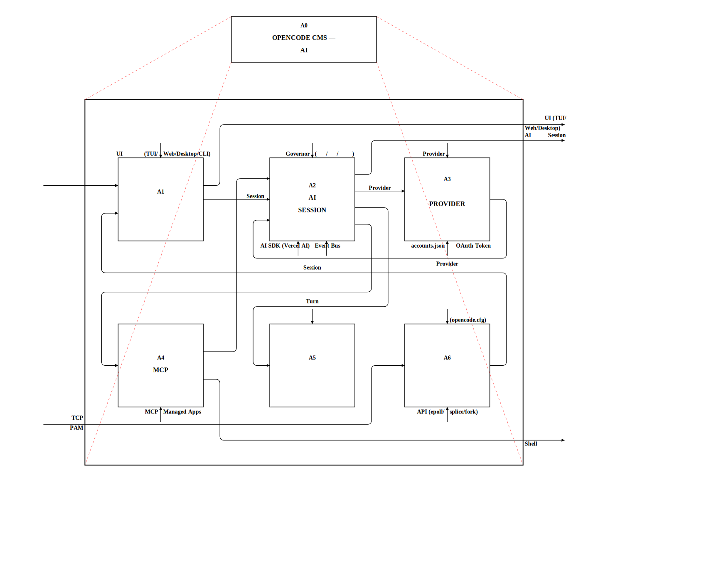

**A0 上下文圖**展示 OpenCode 的六大功能子系統及其資料流：

| 子系統 | 職責 |
|--------|------|
| **A1** Manage User Interface | TUI、Web App、Desktop、CLI 四種介面入口 |
| **A2** Process AI Sessions | 對話生命週期：建立 session、處理訊息、壓縮上下文、持久化 |
| **A3** Route Provider & Account | Provider 組裝、canonical 身分解析、Rotation3D 多維 fallback |
| **A4** Execute Tools & MCP | 內建工具與 MCP managed apps 的註冊、解析、執行 |
| **A5** Orchestrate Autonomous Workflow | 規劃模式、Smart Runner Governor、Workflow Runner、Dialog Trigger |
| **A6** Manage System Infrastructure | C Gateway、Per-user Daemon、Event Bus、Scheduler、Storage |

---

### A1 — Manage User Interface

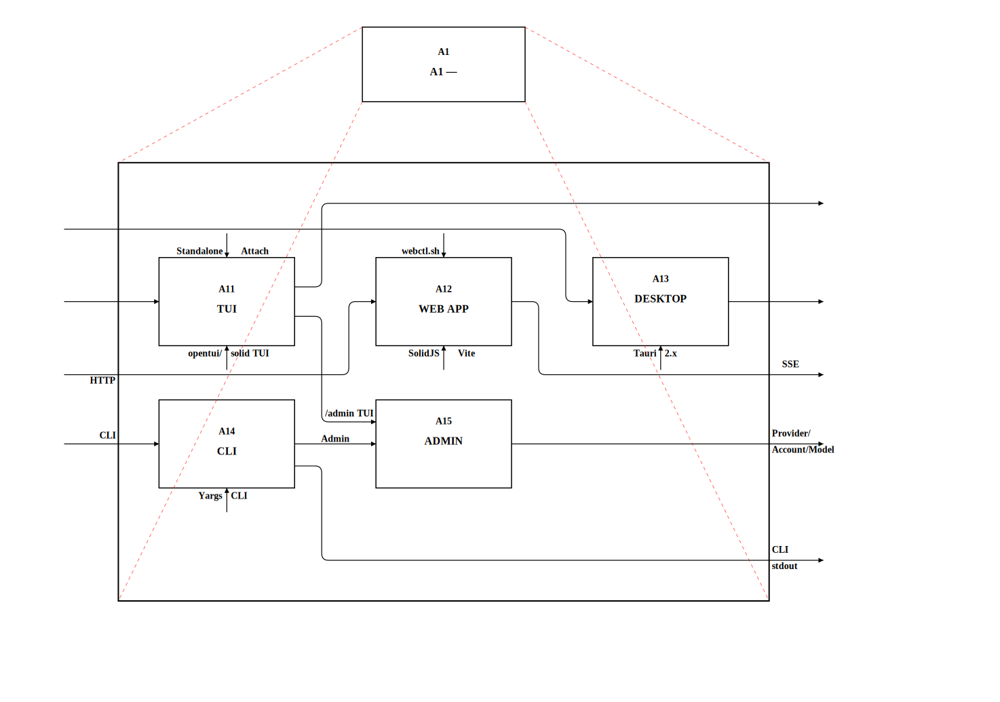

四種平行介面共用同一組後端 API：

- **A11 TUI**：高速終端介面，支援 standalone/attach 雙模式，`/admin` 控制平面
- **A12 Web App**：SolidJS + Solid Start，event-sourced stores，rich rendering（Markdown、Mermaid、SVG cards）
- **A13 Desktop**：Tauri 2.x 原生桌面殼，內嵌 Web App + 系統匣
- **A14 CLI**：Yargs 命令分派（run、auth、accounts、models、mcp、session、agent、cron）
- **A15 Admin**：Provider/Account/Model CRUD、診斷、健康監控

---

### A2 — Process AI Sessions

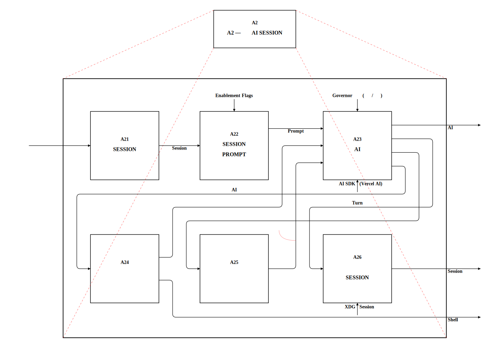

Session 是 OpenCode 的核心執行單元：

- **A21 Create/Load Session**：綁定工作目錄、載入持久化歷史
- **A22 Resolve Prompt**：組裝系統提示詞（規劃狀態、enablement flags、skill metadata、smart runner reminders）
- **A23 Generate AI Response**：透過 Vercel AI SDK 呼叫 LLM，串流回應 tokens
- **A24 Execute Tool Calls**：分派 tool 呼叫至 built-in/MCP/managed-app 執行器
- **A25 Compact Context**：偵測 context overflow，壓縮訊息歷史
- **A26 Persist State**：儲存 session 紀錄至 XDG storage

#### A23 — Generate AI Response（分解）

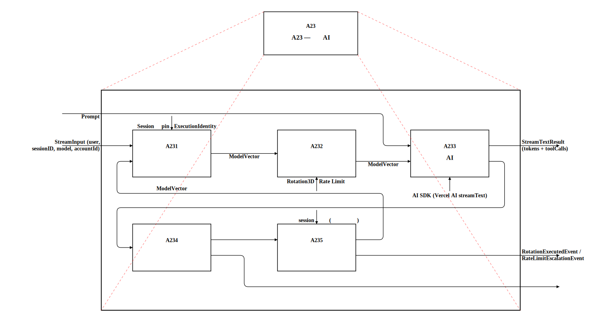

- **A231 Prepare streamText Call**：組裝 model/prompt/tools 參數
- **A232 Evaluate Rate Control**：Rotation3D Rate Limit 判定
- **A233 Stream & Accumulate**：串流 tokens、累積 usage metrics
- **A234 Classify Error**：分類回應錯誤（auth/quota/rate-limit/model-unavailable）
- **A235 Execute Compensatory Rotation**：子 session 限制下的遞補輪替

---

### A3 — Route Provider & Account

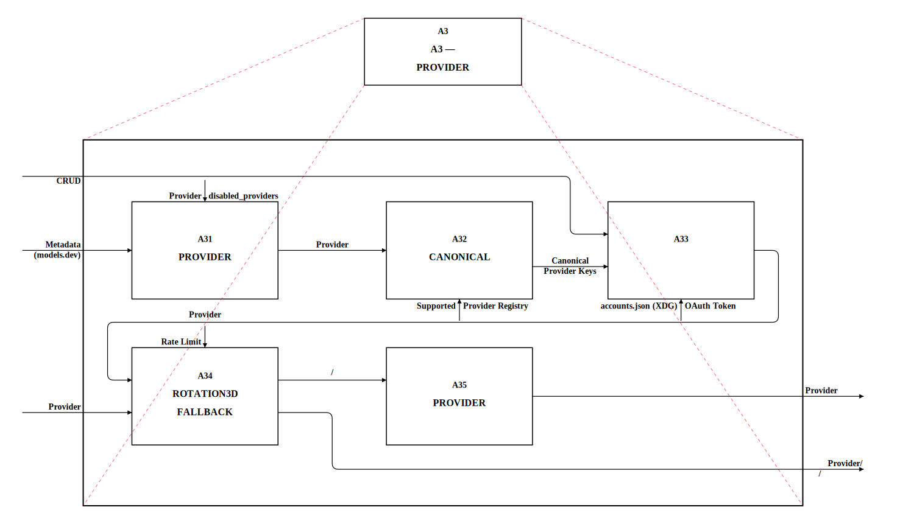

三層帳號架構 + Rotation3D 多維路由：

- **A31 Assemble Registry**：固定組裝順序（models.dev → config → env/auth → account overlays → plugins）
- **A32 Resolve Canonical Identity**：canonical provider key 解析，legacy `anthropic` → `claude-cli` alias
- **A33 Manage Account Lifecycle**：Storage（accounts.json）→ Auth Service（OAuth/API key）→ Presentation（TUI/Web）
- **A34 Execute Rotation3D**：Provider/Account/Model 三維座標 fallback，rate limit 自動降級
- **A35 Monitor Health**：per-model 可用性追蹤、error 分類（auth、quota、rate-limit、model-unavailable）

#### A34 — Execute Rotation3D Fallback（分解）

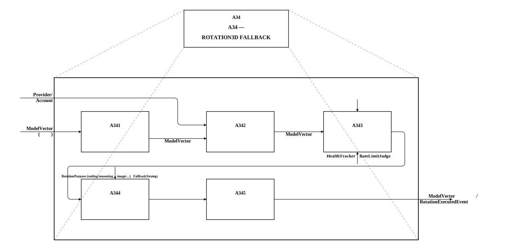

- **A341 Evaluate Rotation Purpose**：判斷 coding/reasoning/image 用途
- **A342 Build Candidate List**：依 FallbackStrategy 偏好排序候選
- **A343 Score Candidate Health**：HealthTracker 持久化狀態 + RateLimitJudge
- **A344 Select Fallback Strategy**：依策略排序後的最佳結果
- **A345 Execute with Cooldown**：健康狀態與冷卻狀態管理

---

### A4 — Execute Tools & MCP

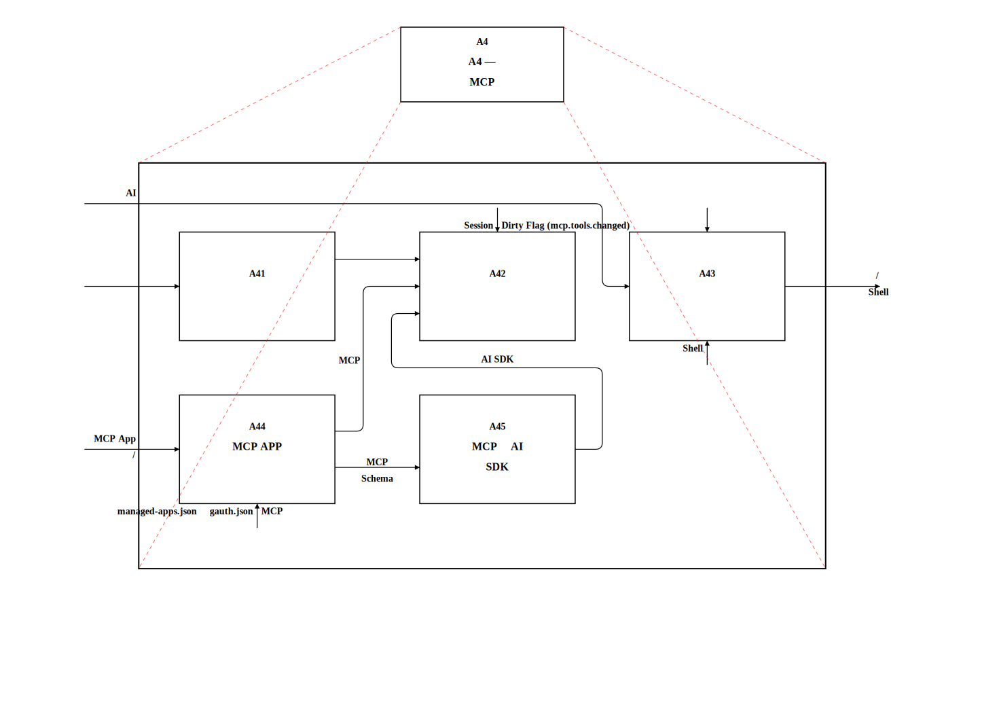

工具系統採 dirty-flag + per-round 解析模式：

- **A41 Register Built-in Tools**：edit、bash、read、write、grep、glob、apply_patch，permission-aware 過濾
- **A42 Resolve Tool Surface**：每輪重建工具表面（built-in + MCP + skill + managed app），dirty-flag 延遲到下一輪
- **A43 Dispatch Execution**：路由至 built-in handler / MCP server / managed app executor
- **A44 Manage MCP Apps**：狀態機 available → installed → pending_config → pending_auth → ready
- **A45 Convert MCP Format**：MCP tool definitions ↔ Vercel AI SDK tool format 雙向轉換

#### A44 — Manage MCP App Lifecycle（分解）

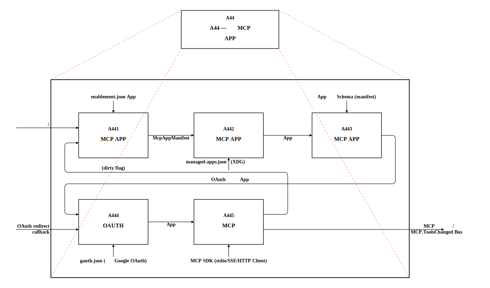

- **A441 Discover & Install**：enablement.json 定義掃描，McpAppManifest 解析
- **A442 Configure App**：App Schema 驗證，組態寫入
- **A443 Authenticate**：Google OAuth 共用 token、gauth.json scope merging
- **A444 Manage Runtime**：MCP SDK stdio/SSE/HTTP client 生命週期
- **A445 Convert to AI SDK**：MCP 工具定義轉換為 AI SDK 相容格式

---

### A5 — Orchestrate Autonomous Workflow

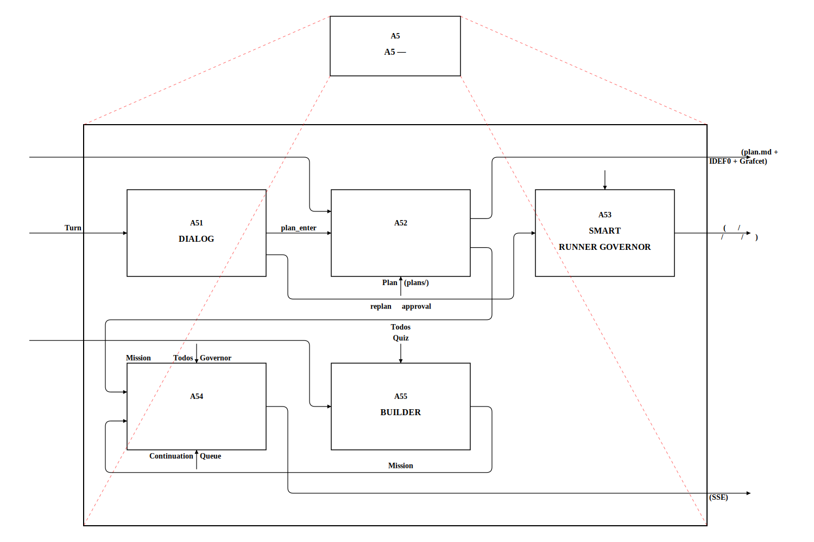

確定性工作流控制，非 AI-based：

- **A51 Detect Dialog Triggers**：rule-first 觸發偵測（replan、approval），round-boundary 評估
- **A52 Manage Planning**：透過 `plan-builder` skill 進行，question-driven clarification，產出 plan + IDEF0/Grafcet artifacts
- **A53 Smart Runner Governor**：per-turn 決策引擎（continue/replan/ask_user/pause_for_risk/complete），bounded adoption
- **A54 Workflow Runner**：continuation queue、blocker detection、supervisor lease/heartbeat、build validation
- **A55 Builder Admission**：machine-verifiable quiz guard、mission metadata 編譯、reflection-based retry

#### A54 — Run Workflow Orchestration（分解）

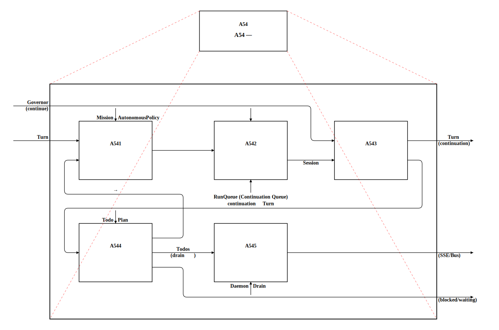

- **A541 Load Mission Context**：Todo 清單與 Plan 狀態載入
- **A542 Evaluate Turn Outcome**：每輪結果判斷（continue/pause/complete）
- **A543 Manage Continuation Queue**：排隊、優先級、lease 管理
- **A544 Detect Blocker Conditions**：阻斷條件偵測（drain 觸發）
- **A545 Coordinate Drain Shutdown**：協調排水關閉程序

---

### A6 — Manage System Infrastructure

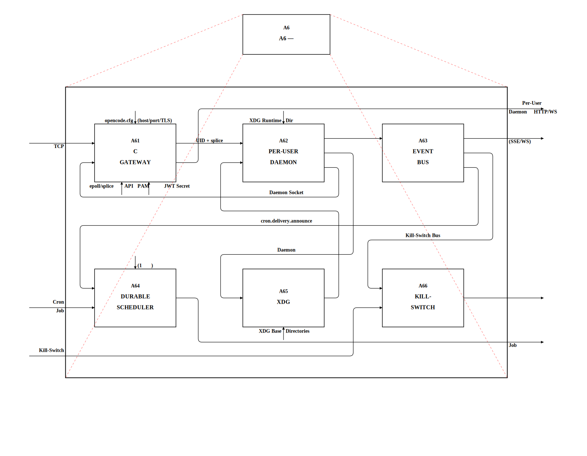

生產級基礎設施層：

- **A61 C Gateway**：root-privileged TCP listener、non-blocking epoll、PAM pthread 認證、JWT session、rate limiting
- **A62 Per-User Daemons**：fork+setuid+execvp、Unix socket 隔離、discovery file、readiness probing、SIGCHLD cleanup
- **A63 Event Bus**：全域 pub/sub（Bus.publish/subscribeGlobal）、module-scope + instance-scope subscriptions、secret sanitization
- **A64 Durable Scheduler**：jobs.json 持久化、boot recovery（stale periodic → 下一觸發時間，stale one-shot → auto-disable）
- **A65 XDG Storage**：JSON atomic writes + backup、accounts.json、managed-apps.json、gauth.json、sessions/
- **A66 Kill-Switch**：soft-pause → hard-kill timeout、trigger/status/cancel API

#### A62 — Manage Per-User Daemon（分解）

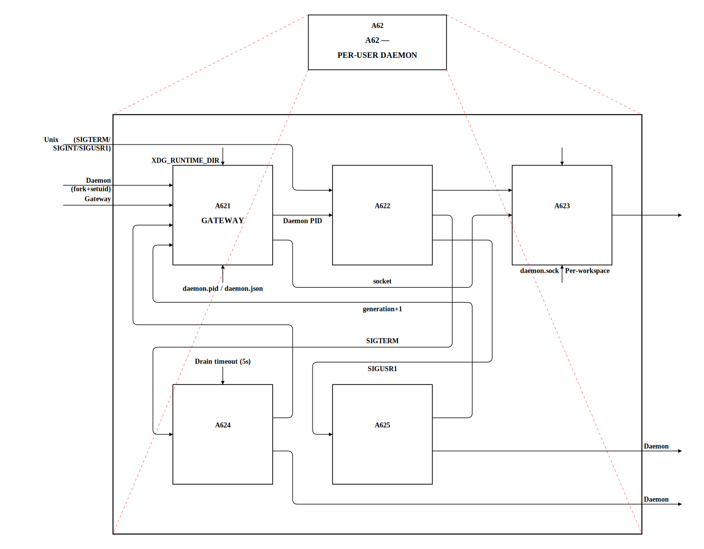

- **A621 Acquire Gateway Lock**：PID 鎖取得、daemon.json 寫入
- **A622 Register Signal Handlers**：SIGTERM/SIGINT/SIGUSR1 信號路由
- **A623 Manage Command Lanes**：車道容量管理、命令分派
- **A624 Execute Drain State Machine**：drain timeout 排水狀態機
- **A625 Coordinate Restart Sequence**：SIGUSR1 觸發重啟序列、generation+1

---

## 行為流程 — GRAFCET 循序控制

以下 GRAFCET 圖以 IEC 60848 標準描述 OpenCode 的兩個核心執行流程。

### Session 執行流程

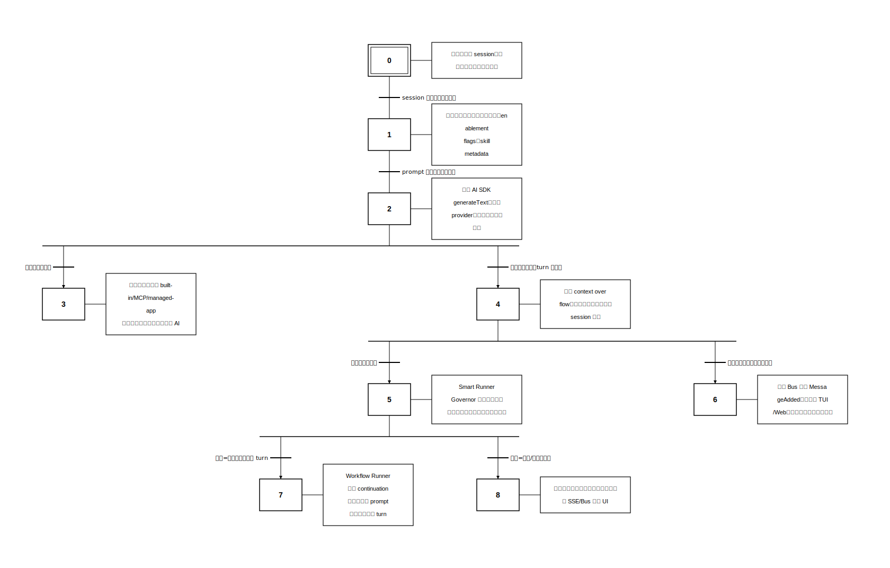

**流程說明**：使用者訊息進入 session → 組裝 prompt → AI 生成回應 → 若有 tool calls 則執行並迴圈 → turn 完成後進入 compaction → 自主模式下由 Smart Runner Governor 判斷是否繼續、暫停或完成。

### Gateway 認證與代理流程

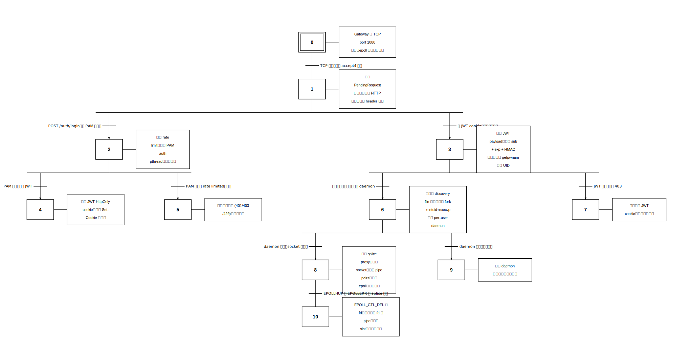

**流程說明**：TCP 連線進入 → HTTP header 解析 → 依類型分流至 PAM 認證或 JWT 驗證 → 認證成功後 find/spawn per-user daemon → 建立 splice proxy 雙向轉發 → 連線結束清理資源。

---

## 核心特色

### 多帳號控制平面

- 以 canonical provider key（`openai`、`claude-cli`、`gemini-cli`、`google-api` 等）統一管理帳號
- 帳號資料集中於 `~/.config/opencode/accounts.json`
- 三層架構：Storage → Auth Service → Presentation

### Rotation3D 多維輪替

- **Provider / Account / Model** 三維座標執行 fallback
- 在 rate limit、配額不足、模型不可用時，自動進行可預測的降級與切換
- 關鍵路徑：`packages/opencode/src/account/rotation3d.ts`

### 自主執行堆疊

- **Smart Runner Governor**：per-turn 決策引擎，bounded adoption + risk pause + replan
- **Workflow Runner**：continuation queue、blocker detection、supervisor lease
- **Dialog Trigger Framework**：確定性、rule-first 觸發偵測，非 AI-based
- **Planning Agent**：透過 `plan-builder` skill 規劃，結構化 todo + IDEF0/Grafcet companion artifacts

### MCP 整合

- 內建 MCP managed apps（Gmail、Google Calendar）
- 狀態機驅動的 app lifecycle
- Google OAuth 共享 token storage + scope merging

### 多使用者閘道

- C 語言 gateway（`daemon/opencode-gateway.c`），root-privileged，non-blocking epoll
- PAM 認證 + JWT session + per-IP rate limiting
- Per-user daemon 隔離（fork+setuid+execvp，Unix socket）

---

## 使用方式

### 先決條件

- `git`、`curl`、`bun`（主要 runtime / package manager）
- Desktop（Tauri）另需 Rust toolchain + [Tauri 系統套件](https://v2.tauri.app/start/prerequisites/)

### 初始化

```bash
chmod +x ./install.sh
./install.sh              # 基本初始化
./install.sh --with-desktop --yes  # 含 Desktop 開發依賴
./install.sh --system-init         # Linux 系統級部署（systemd service）
```

### 推薦開發流程

```bash
# 1) 初始化
./webctl.sh install --dev --yes

# 2) 前端建置（首次或前端改動後）
./webctl.sh build-frontend

# 3) 啟動 Web App
./webctl.sh dev-start

# 4) 需要 TUI 時
bun run dev
```

### TUI 操作

```bash
bun run dev              # Standalone 模式（自帶 server）
bun run dev --attach     # Attach 模式（連到現有 daemon）
opencode attach http://localhost:4096  # 連到遠端 server
```

### Web App 操作

```bash
./webctl.sh dev-start    # 開發模式
./webctl.sh web-start    # Production systemd service
./webctl.sh status       # 查看狀態
./webctl.sh logs         # 查看日誌
./webctl.sh dev-refresh  # 熱重啟
./webctl.sh flush        # 清理 stale runtime process
```

### Desktop（Tauri）

```bash
./install.sh --with-desktop --yes
bun run --cwd packages/desktop tauri dev
```

### 驗證

```bash
bun install
bun run typecheck
bun test
```

---

## 核心設計原則

1. **身分解析 canonical**：所有 provider 身分以 canonical `providerKey` 為準
2. **禁止靜默 fallback**：失敗必須明確報錯，不可悄悄退回備用路徑
3. **Provider 組裝順序固定**：models.dev → config → env/auth → account overlays → plugins
4. **`disabled_providers` 為唯一可見性來源**
5. **Event Bus 優先**：禁止 setTimeout/polling loop 跨模組協調，改用 Bus.publish/subscribe
6. **Per-round tool 解析**：dirty-flag 延遲到下一輪，不在 mid-stream 打斷
7. **確定性控制**：Dialog triggers 是 rule-based，非 AI-governed

---

## 專案結構

```
packages/
├── opencode/          核心 runtime（session, provider, account, tool, mcp, server, bus, auth, cron）
├── app/               SolidJS Web 前端（Solid Start + Vite）
├── web/               Astro web templates
├── ui/                共用 UI 元件庫（Kobalte + Tailwind 4）
├── desktop/           Tauri 2.x 桌面 app
├── mcp/               內建 MCP servers（branch-cicd, gcp-grounding, system-manager）
├── opencode-claude-provider/   Claude AI SDK 整合
├── opencode-codex-provider/    Codex WebSocket + delta 整合
├── sdk/js/            JavaScript SDK
├── plugin/            Plugin 系統
├── util/              共用工具
├── script/            建置/腳本輔助
└── slack/             Slack 整合

daemon/                C Gateway（PAM auth, splice proxy）
specs/                 功能規格（含 IDEF0 + GRAFCET 全局架構圖）
plans/                 活躍規劃套件
docs/                  延伸文件與事件記錄
config/                系統組態
scripts/               部署/建置腳本
templates/             XDG 部署模板
```

---

## 資料持久化路徑

| 路徑 | 用途 |
|------|------|
| `~/.config/opencode/accounts.json` | 帳號與 provider 設定 |
| `~/.config/opencode/managed-apps.json` | MCP app 安裝狀態 |
| `~/.config/opencode/gauth.json` | Google OAuth 共享 token |
| `~/.config/opencode/cron/jobs.json` | Scheduler job 持久化 |
| `/etc/opencode/opencode.cfg` | Gateway runtime 設定 |
| `/etc/opencode/google-bindings.json` | Google OAuth ↔ Linux user binding |
| `/run/opencode-gateway/jwt.key` | JWT secret（file-backed, 0600） |
| `$XDG_RUNTIME_DIR/opencode/daemon.json` | Per-user daemon discovery |
| `$XDG_RUNTIME_DIR/opencode/daemon.sock` | Per-user daemon Unix socket |

---

## 分支與整合策略

- `cms` 是本環境主要產品線
- 來自 `origin/dev` 或 `refs/*` 外部來源的變更，採 **分析後重構移植**，不可直接 merge
- 本 repo 已作為獨立產品線維護，預設不需要建立 PR
- `beta/*`、`test/*` 分支與其 worktree 僅作一次性實作/驗證用，完成後必須立即刪除

---

## 延伸文件

- [系統架構總覽](specs/architecture.md)
- [全局 IDEF0/GRAFCET 架構圖](specs/global-architecture/diagrams/)
- [帳號管理規格](specs/account-management/)
- [Agent Framework](specs/agent_framework/)
- [MCP 子系統](specs/mcp_subsystem/)
- [Daemonization](specs/daemonization/)
- [Scheduler Channels](specs/scheduler-channels/)
- [Codex 協議](specs/codex/)
- [Google Auth 整合](specs/google-auth-integration/)
- [Web App 規格](specs/webapp/)
