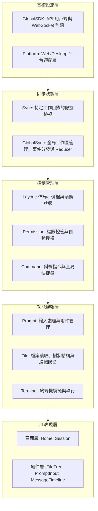
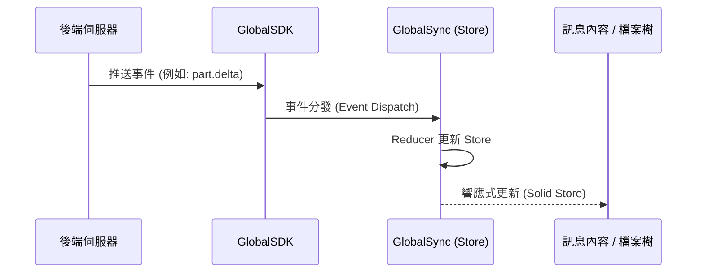

# Antigravity 前端架構指南

本文件旨在為後續開發者（包括 AI 助手）提供系統前端架構的深度導覽。本系統基於 **Solid.js** 構建，採用響應式數據流與多層級 Context 管理，專為處理大規模檔案與複雜 AI 對話場景而設計。

## 1. 模組階層拆解 (Modular Hierarchy)

系統採用由下而上的階層式設計，每一層僅對其下層產生相依性，確保架構的解耦與可測試性。

### 各層級功能說明：
- **Infrastructure (基礎設施)**: 提供與後端通訊的基礎能力（Client/EventSource）及跨平台 API 差異處理。
- **Sync (同步狀態)**: 系統的神經中樞。`GlobalSync` 負責維護所有工作目錄的 `Store`，並根據後端推送的事件（Events）透過 Reducer 更新全局狀態。
- **Control (控制管理)**: 協調全局 UI 行為、佈局切換與使用者權限檢查。
- **Feature (功能邏輯)**: 針對特定業務領域（如對話 Session、檔案系統、終端機）封裝複雜的狀態轉換 Hook 與 Context。
- **UI (表現層)**: 最終的頁面與原子組件，僅負責訂閱 Context 數據並執行渲染。

---

## 2. 資料流向 (Data Flow)

系統主要採用 **單向資料流**，並透過 Solid.js 的 `Store` 實現極細粒度的響應式更新。

### A. 全局狀態同步 (事件驅動)
當後端狀態改變（例如：AI 正在串流輸出、檔案被外部修改）時：
1. **SDK** 接收到來自伺服器的 `EventSource` 事件。
2. **GlobalSync** 根據事件類型（Topic）分發到對應工作目錄的 `Reducer`。
3. **Reducer** 使用 `produce` (可變更更新) 或 `reconcile` (結構化對比更新) 修改 `Solid Store`。
4. **UI 組件** 由於精確訂閱了 Store 的特定屬性，將觸發最小化的 DOM 更新，無需重新渲染整個頁面。

### B. 使用者交互 (指令與行動)
當使用者在介面發起操作（例如：提交對話）時：
1. **PromptInput** 處理附件與文字內容。
2. **Prompt Context** 封裝請求並發送到 **SDK Client**。
3. **Sync Context** 使用 `addOptimisticMessage` 立即在 UI 顯示「樂觀更新」的使用者訊息。
4. 待後端處理完成並回傳事件後，透過上述「全局同步」流程確認最終狀態。

---

## 3. 狀態管理原則 (State Management)

- **響應式原子 (Reactive Primitives)**: 優先使用 `createMemo` 與 `createSignal` 處理本地 UI 狀態，避免過度使用 Store。
- **集中式 Store**: 使用 `solid-js/store` 管理需要持久化或跨組件共享的大型數據集。
- **子 Store 管理器 (Child Store Manager)**: `GlobalSync` 為每個工作目錄動態建立子 Store，保證資料隔離，避免不同專案間的資料碰撞與非必要的重繪。
- **結構化對比 (Reconciliation)**: 更新列表數據（如訊息列表、檔案清單）時，強制使用 `reconcile` 以保持組件實例的穩定性，這對維持虛擬列表的捲動位置至關重要。

---

## 4. 關鍵效能模式 (Performance Patterns)

1. **虛擬列表 (Virtual Scrolling)**: 在 `FileTree` (檔案樹) 與 `MessageTimeline` (對話流) 中使用 `virtua` 庫，確保即使在數萬個節點下，DOM 的負擔也維持在常數級別。
2. **記憶化策略 (Memo Strategy)**: 任何複雜的衍生計算（如 `useFlattenedTree` 的樹狀展開）必須包裹在 `createMemo` 中，避免在每次重繪時重複計算。
3. **取消追蹤存取 (Untrack Access)**: 在 `createEffect` 中存取非依賴性數據時，使用 `untrack` 顯式聲明，防止不必要的副作用連鎖反應。
4. **延遲加載 (Lazy Loading)**: 頁面級組件（如 Home, Session）使用 `lazy` 進行動態導入，優化初始加載速度。

---

## 5. 核心目錄導航

- `src/context/`: 系統的所有業務邏輯與領域狀態中心。
- `src/pages/session/`: 對話頁面的核心實作，遵循「主控制器 (`index.tsx`) + 原子組件 (`components/`) + 邏輯掛鉤 (`hooks/`)」的設計模式。
- `src/hooks/`: 跨組件複用的純邏輯，例如處理檔案列表扁平化的 `useFlattenedTree`。

---
@event_20260207:frontend_architecture_guide
