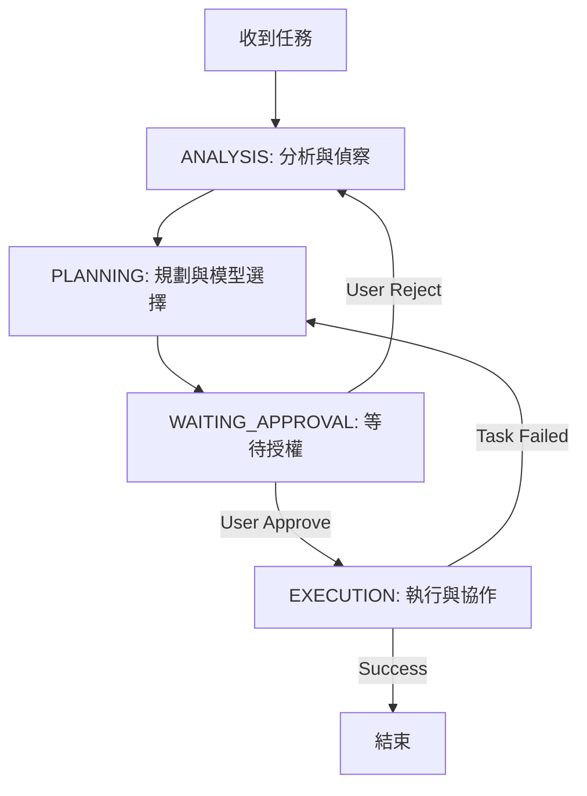

# Agent 工作流程標準規範

## 核心狀態機 (Core State Machine)



### 1. ANALYSIS (分析與偵察)

- **目標**: 徹底理解需求與現有環境，避免盲目行動。
- **允許工具**: `read`, `glob`, `grep`, `ls`, `mcp_question`
- **禁止工具**: `edit`, `write`, `rm`, `task`
- **必要動作**:
  1. **需求釐清**: 使用多選題向用戶確認模糊點。
  2. **環境偵察**:
     - 檢查專案根目錄設定檔 (`package.json`, `Cargo.toml`, `pyproject.toml` 等)。
     - 確認既有的 Linting/Formatting 規則 (`.eslintrc`, `.prettierrc`, `.editorconfig`)。
     - 確認測試框架與指令。
  3. **歷史檢索**: 檢查 `docs/events/` 確認是否有相關聯的過往任務。
- **轉換條件**: 足夠理解需求與環境限制 → 進入 PLANNING。

### 2. PLANNING (規劃與模型選擇)

- **目標**: 制定可執行的步驟，並決定資源分配。
- **允許工具**: `todowrite`, `skill(model-selector)`
- **禁止工具**: `edit`, `write`, `rm`, `task` (除非用於驗證思路)
- **必要動作**:
  1. **擬定計畫**: 拆解任務為原子化的步驟。
  2. **模型決策**: 呼叫 `model-selector` 決定部分任務是否外包給 Subagent 以及使用何種模型。
  3. **撰寫文件**: 將計畫輸出至 `docs/events/event_<date>_<topic>.md`。
- **轉換條件**: 計畫已輸出並向用戶展示 → 進入 WAITING_APPROVAL。

### 3. WAITING_APPROVAL (等待授權)

- **目標**: 確保用戶同意執行方向。
- **觸發詞**: "OK", "Proceed", "開始", "Y", "好", "Go"
- **轉換條件**: 用戶確認 → 進入 EXECUTION。

### 4. EXECUTION (執行與協作)

- **目標**: 精確執行計畫，維持系統穩定。
- **允許工具**: 所有工具
- **原則**:
  - **最小改動**: 優先修改現有檔案，避免非必要的檔案創建。
  - **測試驅動**: 修改後必須執行測試或驗證指令。
  - **即時紀錄**: 遇到阻礙時更新 Event 文件。

---

## 多 Agent 編排規範 (Orchestration)

### 角色定義

- **Orchestrator (Main Agent)**: 負責大腦工作。任務分解、脈絡交接、Code Review、結果彙整。
- **Subagent (Worker)**: 負責手腳工作。單一任務執行、測試編寫、模組實作。

### 脈絡交接 (Context Handover)

Subagent 是無狀態的 (Stateless)，Orchestrator 必須在 `Task` prompt 中包含所有必要資訊：

1. **目標 (Objective)**: 一句話描述要做什麼。
2. **限制 (Constraints)**: 禁止修改的範圍、必須遵循的 Coding Style。
3. **脈絡 (Context)**: **關鍵！**
   - 相關檔案的**絕對路徑**。
   - 相關程式碼片段 (Snippets)。
   - 依賴的函式庫版本。
4. **輸出格式 (Output Format)**: 指定 JSON 或特定 Markdown 格式以便解析。

### 調用範例

```javascript
Task({
  subagent_type: "coding", // 依據 model-selector 建議選擇
  description: "實作 User Authentication API",
  prompt: `
    # 目標
    實作 POST /api/login 接口。

    # 脈絡
    - 路由定義: /src/routes/auth.ts
    - 資料庫模型: /src/models/User.ts (已存在)
    - 工具函式: /src/utils/jwt.ts

    # 限制
    - 使用既有的 Zod 驗證 schema。
    - 嚴禁修改 User.ts 模型定義。
    - 錯誤處理需符合 /src/middlewares/error.ts 規範。

    # 輸出
    完成後回報修改的檔案列表與測試結果。
  `,
});
```

---

## 問題診斷與修復 (Issue Handling SOP)

當處理 Bug 或錯誤時，嚴格執行 **RCA (Root Cause Analysis)** 流程：

1. **重現 (Reproduce)**:
   - 建立最小重現腳本 (Reproduction Script)。
   - **禁止**在未重現問題前嘗試修復 (猜測式修復通常會導致更多問題)。

2. **定位 (Locate)**:
   - 優先檢查日誌 `~/.local/share/opencode/log/debug.log`。
   - 使用 `grep` 搜尋錯誤訊息關鍵字。
   - 插入 Debug Log 追蹤資料流。

3. **修復 (Fix)**:
   - 確保修復方案不破壞現有邏輯 (Regression Test)。
   - 必須附上代碼註解：`// FIX: <issue_description> (@event_<date>)`。

4. **紀錄 (Document)**:
   - 在 `docs/events/` 文件中紀錄「症狀」、「成因」、「解決方案」。

---

## 知識紀錄 (Knowledge Management)

### Event 文件格式

檔案命名: `docs/events/event_<YYYYMMDD>_<feature_slug>.md`

```markdown
# Event: <Feature Name / Issue ID>

Date: YYYY-MM-DD
Status: In Progress | Done | Blocked

## 1. 需求分析

- [ ] 需求 A
- [ ] 需求 B

## 2. 執行計畫

- [x] 步驟 1 (Done)
- [ ] 步驟 2 (Pending)

## 3. 關鍵決策與發現

- 選擇使用 library X 因為...
- 發現既有模組 Y 存在 bug...

## 4. 遺留問題 (Pending Issues)

- [ ] 效能優化待處理
```

---

## 安全操作守則

1. **檔案刪除 (`rm`)**:
   - 絕對禁止使用 `rm -rf *` 或未指定路徑的通配符。
   - 流程：列出擬刪除清單 (`ls`) → 請求用戶確認 → 執行刪除。

2. **大規模重構**:
   - 先建立新的分支或備份關鍵檔案。
   - 採用「平行變更 (Parallel Change)」模式：新增新介面 → 遷移呼叫端 → 移除舊介面。

3. **讀寫操作**:
   - **Read First**: 永遠先讀取檔案確認內容再進行 `edit`。
   - **Verify Later**: 修改後務必再次讀取或執行 Linter 確認語法正確。
