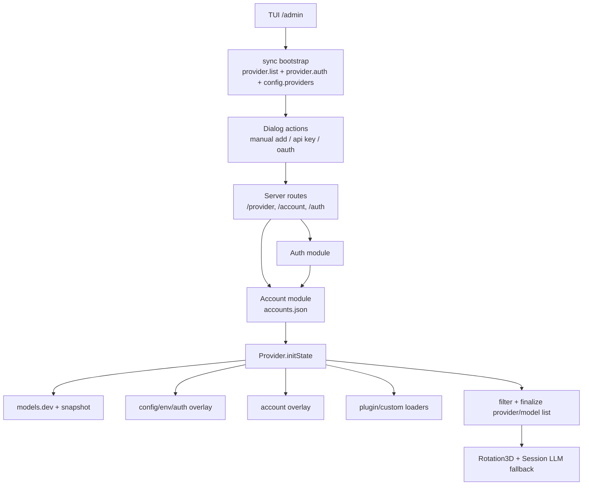
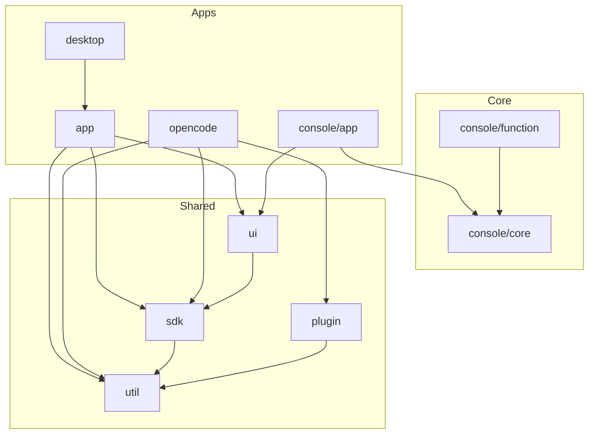
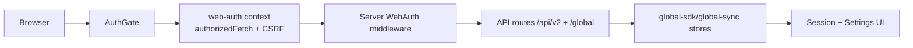
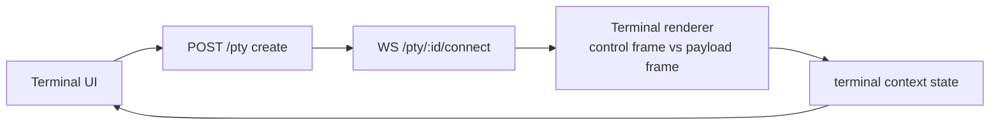
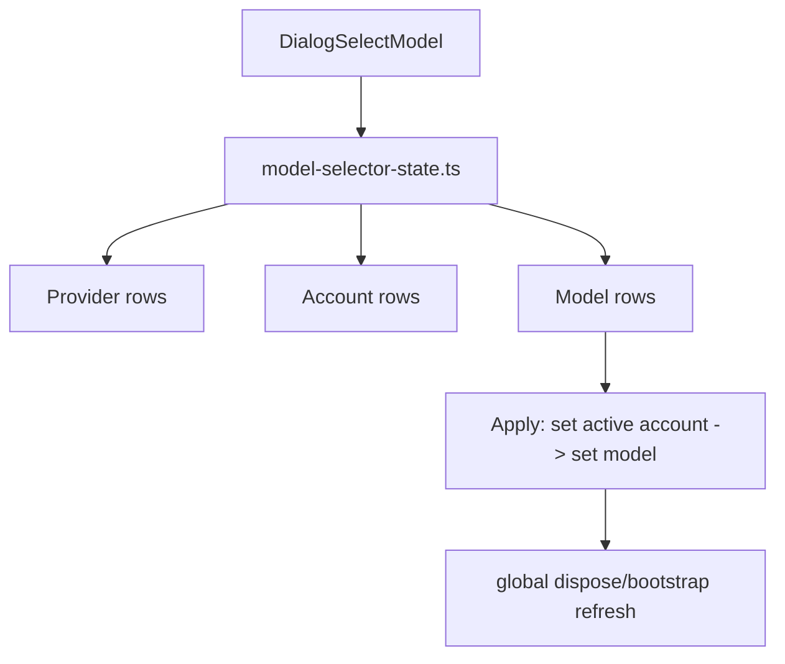

# OpenCode Project Architecture

This document provides a comprehensive overview of the `opencode` monorepo structure, detailing the various packages, their purposes, and relationships. It is intended to guide developers and AI agents in understanding the system's organization.

## Document Purpose & Maintenance Contract

This file is an **architecture state document**, not an event log.

1. **Primary purpose**
   - Record the **current architecture baseline** (what is true now).
   - Provide **high-signal file/module index summaries** for core runtime areas.

2. **What belongs here**
   - Stable architecture contracts, boundaries, invariants, and component responsibilities.
   - File-level summary/index updates when architecture-relevant code paths are added/changed.

3. **What does NOT belong here**
   - Chronological implementation diary, debug timeline, or step-by-step change history.
   - Temporary migration notes that are no longer part of current runtime truth.

4. **Where change history goes instead**
   - Use `docs/events/event_<YYYYMMDD>_<topic>.md` for decision trail, RCA, execution logs, and validation records.

5. **Update rule (mandatory)**
   - If a change affects architecture boundaries/contracts or adds/removes important runtime modules, update this document's relevant architecture section and/or file index summaries in the same task.

## System Overview

OpenCode is an open-source AI coding agent platform. The repository is a monorepo managed with **Bun** and **TurboRepo**, containing the core CLI, web applications, desktop apps, SDKs, and supporting services.

### Key Technologies

- **Runtime**: Bun (primary), Node.js (tooling)
- **Frontend**: SolidJS, Vite, Tailwind CSS
- **Backend/Serverless**: Hono, Cloudflare Workers, Nitro
- **Desktop**: Tauri
- **Infrastructure**: SST (Serverless Stack)
- **Documentation**: Mintlify

---

## Branching Strategy & Project Context

The project operates with a specific branching strategy that defines the architectural direction:

### `cms` Branch (Current Production Line)

The `cms` branch is the primary product line for this environment, featuring significant enhancements over the upstream `origin/dev`.

**Key Features of `cms`:**

1.  **Global Multi-Account Management**: A unified system for managing multiple provider accounts.
2.  **Rotation3D System**: A dynamic model switching and load balancing system (`rotation3d`), enabling high availability and rate limit management.
3.  **Admin Panel (`/admin`)**: A centralized "Three-in-One" management interface for system administration.
4.  **Provider Granularity**: The legacy monolithic `google` provider is canonically split into provider-keyed runtime entries that maximize resource utilization:
    - `gemini-cli`: Optimized for batch processing and large context.
    - `google-api`: For lightweight, high-speed requests.
    - legacy aliases are not valid canonical runtime provider keys.

### Upstream Integration

- **`origin/dev`**: The upstream source. Changes from `origin/dev` are **analyzed and refactored** before being integrated into `cms`. Direct merges are prohibited to preserve the `cms` architecture.
- **External Plugins**: Located in `/refs`, these are also subject to analysis and refactoring before integration.

### Cross-Surface Runtime Architecture (current state)

#### Web runtime boundaries

1. **Auth boundary (`WebAuth`)**
   - Browser uses cookie-session + CSRF protection.
   - CLI/TUI compatibility path can still use Basic auth where required.
   - CLI bearer-token requests are identity-bound: `Authorization: Bearer <OPENCODE_CLI_TOKEN>` must include `x-opencode-user`.

2. **Instance boundary (`Instance.directory`)**
   - Request directory is canonically resolved server-side and echoed via `X-Opencode-Resolved-Directory`.
   - Relative directory overrides are resolved from authenticated user home; absolute paths are preserved (then validated for existence).
   - Directory override from request is only accepted on loopback, authenticated web mode, or explicit global browse enablement.

3. **PTY boundary (`/pty`)**
   - PTY sessions require explicit create → connect lifecycle.
   - Stale PTY ids are treated as invalid session state and must be recreated.

#### TUI/Web admin capability boundary

- **TUI `/admin`** is the canonical control plane for provider/account/model operations and rotation-aware diagnostics.
- **Web** provides an admin-lite model manager that reuses the same backend account/provider APIs, including provider visibility toggles plus account add/view/rename/delete/set-active flows inside `packages/app/src/components/dialog-select-model.tsx`.
- **KillSwitch (Global Control Plane)**: A centralized emergency system to pause or terminate all autonomous activities.
  - Managed via `KillSwitchService` and exposed through `KillSwitchRoutes`.
  - Supports MFA-guarded triggers, scoped actions (global/session), and automated snapshots.
  - Enforcement is integrated into the session prompt path and scheduler.
- **Shared external session-switch bridge** now reuses the existing `tui.session.select` event contract across both surfaces:
  - backend route `/api/v2/tui/select-session` publishes `TuiEvent.SessionSelect`
  - `system-manager.manage_session.open` targets the local loopback runtime control URL derived from `/etc/opencode/opencode.cfg` (`http://127.0.0.1:<OPENCODE_PORT>/api/v2`), not the public proxy URL
  - server auth grants a narrow localhost exception only for requests whose **real Bun socket peer** is loopback and that carry no forwarded/proxy IP headers; this bypass is not header-trust-based
  - TUI consumes `tui.session.select` via `route.navigate(...)`
  - Web consumes the same SSE event in `packages/app/src/app.tsx` via a wildcard `globalSDK.event.listen(...)` listener, then resolves session directory and navigates to `/:dir/session/:sessionID`
  - wildcard listening is required because SSE events are emitted under `directory: Instance.directory`, not a guaranteed `"global"` channel
  - contract goal: MCP/system-manager session open must produce a real visible session switch on both TUI and Web, not a URL-only pseudo-success

#### Deployment/runtime consistency

- Docker web profile (`docker-compose.production.yml` + `Dockerfile.production`) follows the same `/opt/opencode` runtime contract as native environments.
- MCP runtime services are canonicalized under `packages/mcp/*`; `scripts/*` keeps compatibility shims only.
- Beta dev helper `testbeta.sh` launches the beta repo as Linux user `betaman` and intentionally uses betaman's own home/XDG runtime state (`~betaman/.config/opencode`, etc.). This gives betaman a dedicated runtime identity while still avoiding writes into the pkcs12 cms checkout.
- Dev config sync scripts use non-owner/non-group-preserving rsync semantics for template/runtime mirroring, preventing permission failures when runtime user and repo owner differ.
- For dev safety, template/runtime skill mirroring is skipped when the effective runtime `skills` path resolves outside the current user's home (for example a shared symlink such as `~betaman/.config/opencode/skills -> /home/pkcs12/projects/skills`). This prevents beta launches from mutating shared/cms-adjacent skill trees.
- `script/runtime-init-check.ts` is a **dev-only preflight** wired into `bun run dev` variants. Its job is to ensure baseline XDG runtime dirs/files exist from `templates/manifest.json` before local development startup. Production/runtime install responsibility remains with `install.sh` + `script/install.ts`, not with this dev helper.
- Production install normalizes `OPENCODE_FRONTEND_PATH` to the installed frontend bundle under `/usr/local/share/opencode/frontend`, so installed systemd/web runtimes do not depend on repo-local `packages/app/dist` paths.
- `./webctl.sh web-refresh` is intentionally repo-detached for installed production runtimes: it is now restart-only, and no longer rebuilds or redeploys frontend/binary assets from the source checkout. Any production asset rollout must go through an explicit install/deploy step.
- Controlled Web restart now has an explicit runtime control-path contract:
  - Web settings may trigger `POST /api/v2/global/web/restart`
  - backend restart control resolves the script path from runtime configuration (`OPENCODE_WEBCTL_PATH`, default `/etc/opencode/webctl.sh`)
  - `webctl.sh restart` intentionally preserves the currently active runtime mode; dev returns to dev semantics, production returns to production semantics
  - frontend then waits for `/api/v2/global/health` to recover before reloading
  - this is **action-triggered restart recovery**, not a generic always-on auto-refresh channel
- `./webctl.sh dev-start` now declares internal MCP source mode explicitly (`OPENCODE_INTERNAL_MCP_MODE=source` + `OPENCODE_REPO_ROOT`). In that mode, project-owned MCP entries such as `system-manager` and `refacting-merger` are deterministically normalized to `bun <repo>/packages/mcp/...` commands instead of `/usr/local/lib/opencode/mcp/*` system binaries; enable/disable still remains config-driven via each MCP entry's `enabled` flag.

#### Web multi-user runtime architecture

1. **Service identity model**
   - `opencode-web.service` runs as a no-home service identity (`HOME=/nonexistent`).
   - Service binaries/wrappers are expected under `/usr/local/*`.

2. **Gateway + per-user daemon topology**
   - Gateway process serves web/auth/API entrypoints.
   - User-scoped runtime operations are routed to per-user daemon instances (`opencode-user-daemon@.service`) under authenticated Linux user context.

3. **Routed API policy**
   - Per-user-daemon routed APIs use strict no-fallback behavior: daemon path failure returns structured `503`.
   - This prevents mixed-source reads/writes across service-scope and user-scope runtime paths.

4. **Daemon-routed API domains**
   - Config APIs: read/update.
   - Account APIs: list + mutation routes.
   - Session APIs: list/read/status/top + mutation routes.

- Session records now also carry persisted workflow metadata (`workflow.autonomous`, `workflow.state`, stop reason, timestamps) as the foundation for autonomous-session continuation.
- Session records now also carry a persisted runner mission contract (`session.mission`) that acts as the authority boundary for autonomous execution. Current mission contract shape is OpenSpec-derived: autonomous continuation is only allowed when the session carries an approved `openspec_compiled_plan` / `implementation_spec` mission marked `executionReady=true`.
- `plan` / `build` semantics are now being reinterpreted around **discussion emphasis vs execution emphasis**, not naive readonly vs writable separation:
  - `plan` is the planner-first discussion agent responsible for spec refinement, decision capture, and plan-derived todo maintenance
  - `build` is the execution-first workflow mode under which coding/review/testing/docs/explore agents advance the current plan
  - this means entering `plan` does not conceptually imply “absolutely no edits ever”, and being in `build` does not imply “planning is forbidden”; instead, the difference is the default responsibility and gate posture
- In-process continuation is now wired inside the prompt loop: after an assistant round completes, the runtime can synthesize the next user step from outstanding todos when autonomous mode is enabled and no blocker/approval stop condition is active.
- `plan_exit` is now the canonical bridge from planning to runner execution authority: after companion artifacts pass completeness gates and the user approves the handoff, runtime both materializes structured todos and persists the approved mission contract onto the session. This means `/specs` plans are no longer just planner-side artifacts; they are the first supported runtime mission source for autonomous runner work.
- Todo authority is now **mode-aware** with two distinct semantics:
  - **Plan mode (working ledger)**: todowrite() may be used freely for exploration, debugging, small fixes, and temporary tracking. Structure changes are auto-promoted to `working_ledger` mode. No planner artifacts are required before writing todos.
  - **Build mode (execution ledger)**: todo is a runtime projection of planner artifacts, not a freeform authoring surface. The durable source of truth is the active planner package under `specs/<date>_<plan-title>/`. `tasks.md`/handoff drive runtime todo materialization. Structure changes require explicit `plan_materialization` or `replan_adoption` mode. `status_update` mode is limited to status transitions only.
  - sidebar/work monitor is the observability surface for runtime todo state in both modes
  - in build mode, visible runtime todo should remain stable unless planner artifacts/replan/status actually changed; it must not drift just because the assistant internally reorganized its own short-term working notes
  - when the system asks the user for a decision, it should reference the same planner-derived runtime todo names shown in sidebar/work monitor
  - `plan_exit` is the canonical transition point: it materializes planner-derived execution todos and switches todo authority from working ledger to execution ledger
  - `plan_enter` switches todo authority back to working ledger mode
- Planner package layout is now:
  - root: `specs/<date>_<plan-title>/`
  - title segment uses a slugified session title when available; default generated session titles fall back to session slug
  - companion artifacts remain `implementation-spec.md`, `proposal.md`, `spec.md`, `design.md`, `tasks.md`, and `handoff.md`
- Planner re-entry now prefers continuity over recomputing a fresh root:
  - if `session.mission.artifactPaths.root` exists and still contains an implementation spec, planner reuses that package
  - otherwise planner checks current title-derived root and immutable slug-derived root for an existing package before creating a new one
  - this prevents the same workstream from fragmenting into multiple planner roots just because session title changed after the first real user prompt
- `tasks.md` checklist parsing and runtime todo lineage now have an explicit shared contract:
  - shared parser lives in `packages/opencode/src/session/tasks-checklist.ts`
  - planner materialization uses **unchecked** checklist items as the runtime todo seed
  - mission consumption may read both unchecked and checked items for bounded execution trace purposes
  - current handoff metadata now exposes `todoMaterializationPolicy` with the active defaults (`maxSeedItems=8`, first todo `in_progress/high`, remaining todos `pending/medium`, `linear_chain` dependency strategy)
- Because planner discussions are iterative, overlapping replans no longer fully overwrite todo truth. `Todo.update()` now preserves overlapping `completed`, `cancelled`, and `in_progress` items so a fresh plan skeleton cannot silently erase visible progress state.
- Autonomous turns now also emit short transcript-visible progress narration messages (`continue` / `pause` / `complete`) so the shared session surface can explain what the runtime is doing without requiring the user to inspect only sidebar state.
- Incoming real user prompts may now safely preempt a busy autonomous synthetic run. Runtime cleanup is keyed by per-run identity so an old aborted loop cannot accidentally clear the replacement loop.
- A durable continuation queue foundation now exists under session storage, and the server runtime now starts an in-process autonomous supervisor that scans pending continuation records and re-enters session loops for idle autonomous sessions.
- Autonomous synthetic continuation turns now also carry mission metadata (`source / contract / planPath / artifactPaths`) on the synthetic user text part, so downstream execution can be traced back to the approved OpenSpec mission that authorized the run.
- Delegated execution baseline is now implemented on top of that continuation path: synthetic continuation metadata includes a bounded delegation contract (role/source/todo trace), and runtime only emits bounded roles `coding` / `testing` / `docs` / `review` / `generic`.
- When mission artifacts cannot be consumed, autonomous continuation now fail-fast stops with `stopReason=mission_not_consumable` and records `workflow.mission_not_consumable` anomaly evidence (no silent fallback to todo-only continuation).
- `mission_not_approved` is now a first-class stop reason in the autonomous continuation pipeline. When a session lacks an approved mission contract, runtime moves workflow state to `waiting_user` with `stopReason=mission_not_approved` instead of silently continuing from todos alone.
- Current autorunner compatibility baseline:
  - autorunner is already structurally coupled to approved mission artifacts (`implementation-spec.md`, `tasks.md`, `handoff.md`) and current todo/workflow state
  - this is sufficient for plan-derived continuation, queue resume, and gate-aware stopping
  - autorunner now has a phase-1 dedicated runner-level contract asset at `packages/opencode/src/session/prompt/runner.txt`, and `workflow-runner.ts` prepends that contract to autonomous build-mode continuation instructions
  - however, this is still not full session-governor formalization: stop-gate ownership remains deterministic in runtime code, and deeper planner-boundary/runtime-ownership binding is still pending
  - the next architectural direction is documented in `docs/specs/autorunner_daemon_architecture.md`: evolving session execution from conversation-turn-centric to daemon-owned long-lived jobs with event-sourced state, durable queue/lease/heartbeat model, prompt loop demotion to execution adapter, and independent worker supervisor registry
- Planning agent reactivation is now formalized in `docs/specs/planning_agent_runtime_reactivation.md`: the goal is to make plan mode a first-class front door for non-trivial autonomous work by strengthening trigger classification, aligning plan-mode prompts with current `agent-workflow` / `todowrite` / question contracts, and ensuring plan output is directly consumable as autorunner substrate (not just a document artifact)
- Planner/runner handback boundaries now include:
  - `spec_dirty`: approved planner artifacts changed after approval; autonomous execution must stop and return to planner
  - `replan_required`: host-adopted replan/governor signal requires planner re-entry instead of silent todo reshaping continuation
- A new session-scoped runtime event journal baseline exists in `packages/opencode/src/system/runtime-event-service.ts`. It persists structured runtime events with fixed fields (`ts / level / domain / eventType / sessionID / todoID? / anomalyFlags[] / payload`) and currently serves as the minimal evidence substrate for runner/workflow anomalies.
- First anomaly integration is now active for stale delegated-subagent waits: when workflow evaluation stops at `wait_subagent` but no active subtask remains and todo state still says `waitingOn=subagent`, runtime records `workflow.unreconciled_wait_subagent` into that event journal instead of leaving the inconsistency purely implicit in scattered state surfaces.
- Web prompt footer now exposes a direct autonomous entrypoint in `packages/app/src/components/prompt-input.tsx`: the first footer provider label (for example `OpenAI`) doubles as the autonomous toggle. When enabled, that provider label switches to a highlighted active state; clicking it calls `POST /api/v2/session/:sessionID/autonomous`, which persists `workflow.autonomous.enabled` and, when enabling an idle session, immediately enqueues a synthetic autonomous continue turn so the in-process supervisor can resume work without waiting for a manual follow-up prompt. In per-user daemon routed mode, this same endpoint follows the existing `routeSessionMutationEnabled` path and is forwarded via `UserDaemonManager.callSessionAutonomous(...)` so autonomous toggles and continuation enqueue remain user-scoped.
- Experimental Smart Runner support now has two guarded stages:
  - `experimental.smart_runner.enabled=true`: after the deterministic runner chooses a low-risk continue path, the prompt loop may invoke `packages/opencode/src/session/smart-runner-governor.ts` with a compact context pack and persist the advisory result under `workflow.supervisor.lastGovernorTrace*`; the supervisor also keeps a bounded recent `governorTraceHistory` window for session-side inspection.
  - `experimental.smart_runner.assist=true`: the same Smart Runner trace may adjust only low-risk continuation behavior (`continue_current`, `start_next_todo`, `docs_sync_first`, `debug_preflight_first`). For docs/debug modes, the runtime now injects an explicit preflight continuation contract before the planned step; deterministic guardrails still remain the sole authority for stop gates, approval gates, completion, and pause states.
- Smart Runner traces now also carry assist outcome metadata (`enabled / applied / mode / finalTextChanged / narrationUsed`) so session-side inspection can distinguish between advisory noise and actually adopted bounded-assist decisions.
- Smart Runner traces may also carry bounded `suggestion` metadata for non-authoritative route shaping. The currently unlocked suggestion types are `replan` and `ask_user`; both are surfaced in session inspection/history only and do not mutate todos or override deterministic control flow.
- For `replan` suggestions, Smart Runner may now also attach a bounded replan request structure (`targetTodoID / requestedAction / proposedNextStep / note`) so humans can inspect the proposed reshaping without letting runtime mutate todos.
- For `replan` suggestions, Smart Runner may also attach a bounded adoption proposal (`proposalID / targetTodoID / proposedAction / proposedNextStep / rationale / adoptionNote`) so the host/runtime can later choose to adopt the proposal into a real todo replan without granting Smart Runner direct mutation authority.
- For `replan` suggestions, those adoption proposals now also carry bounded policy metadata (`trustLevel / adoptionMode / requiresUserConfirm / requiresHostReview`). The current policy is `host_adoptable` at `medium` trust with required host review.
- A deterministic host-adoption path is now unlocked for that `replan` policy: when there is no active in-progress todo, the target todo is dependency-ready, and the proposal does not bypass approval/waiting gates, runtime may promote the proposed target todo to `in_progress` before the next autonomous continue turn. Smart Runner still does not mutate todos directly; runtime records the adoption result back onto the trace as `hostAdopted=true|false` plus `hostAdoptionReason` so session-side inspection can distinguish adopted proposals from ineligible/rejected ones.
- For `ask_user` suggestions, Smart Runner may now also attach a bounded draft question string so humans can inspect the proposed wording before any actual question flow is triggered.
- For `ask_user` suggestions, Smart Runner may also attach a bounded handoff structure (`question / whyNow / blockingDecision / impactIfUnanswered`) so the human/session host can see exactly what decision is being escalated and why.
- For `ask_user` suggestions, Smart Runner may also attach a bounded adoption proposal (`proposalID / proposedQuestion / targetTodoID / rationale / adoptionNote`) so the host/runtime can later choose to adopt the proposal into a real question flow without granting Smart Runner direct authority.
- For `ask_user` suggestions, those adoption proposals now also carry bounded policy metadata (`trustLevel / adoptionMode / requiresUserConfirm / requiresHostReview`). The current policy is `user_confirm_required` at `medium` trust with required host review.
- A deterministic host-adoption path is now also unlocked for that `ask_user` policy: when the proposal includes a usable question draft, host review is still required, and the session does not already have a pending question, runtime may adopt the proposal by calling `Question.ask(...)`. The Smart Runner proposal itself still does not question the user directly.
- When that host-adopted question is answered, runtime resumes the loop by persisting a synthetic user turn that summarizes the answer and continues under the normal prompt loop. When the question is rejected/dismissed, runtime records the rejection outcome back onto the trace and moves workflow state to `waiting_user` with stop reason `product_decision_needed`.
- Ask-user adoption results are persisted back onto the trace as `hostAdopted=true|false` plus `hostAdoptionReason` (for example `adopted`, `missing_question`, `question_already_pending`, `question_rejected`) so session-side inspection/history can distinguish adopted, ineligible, and rejected host outcomes.
- For `request_approval` suggestions, Smart Runner may attach bounded approval-request metadata (`proposalID / targetTodoID / rationale / approvalScope / adoptionNote / policy`). The current policy is `host_adoptable` at `medium` trust with required host review.
- A deterministic host-adoption path is unlocked for `request_approval`: when the proposal remains `host_adoptable`, does not require explicit user-confirm metadata, and still requires host review, runtime may adopt it by persisting the trace and moving workflow state to `waiting_user` with stop reason `approval_needed`.
- For `pause_for_risk` suggestions, Smart Runner may attach bounded risk-pause metadata (`proposalID / targetTodoID / rationale / riskSummary / pauseScope / adoptionNote / policy`). This is intentionally distinct from formal approval gates: it represents a deliberate human review pause for risky work, not a hard approval contract.
- A deterministic host-adoption path is also unlocked for `pause_for_risk`: under the same `host_adoptable` + host-review-required policy checks, runtime may adopt it by persisting the trace and moving workflow state to `waiting_user` with stop reason `risk_review_needed`.
- For host-adopted Smart Runner stop paths that do not themselves open a visible question flow (`request_approval`, `pause_for_risk`), runtime now emits a transcript-visible pause narration using the governor-proposed operator text, prefixed with `[AI]`, before ending the loop. This keeps adopted governance pauses observable in the shared transcript rather than only in workflow/session debug state.
- Smart Runner `complete` decisions are now interpreted conservatively: the governor may propose a bounded todo-completion request, but host adoption only succeeds if (1) the targeted todo is the current actionable work, (2) it is safe to mark complete, and (3) deterministic re-evaluation immediately confirms the workflow is terminal (`todo_complete`). If any further actionable todo remains, host refuses adoption and records a non-terminal completion reason instead of prematurely closing the workflow.
- Session-side Smart Runner observability now treats `request_approval`, `pause_for_risk`, and `complete` as first-class suggestion/adoption paths alongside `ask_user` and `replan`: the side panel summary counts them explicitly, and trace history/debug output surfaces their proposal IDs, policy mode, and host adoption outcomes.
- For `request_approval` and `pause_for_risk`, host now also preserves non-adopted policy outcomes back into the continuing trace path (for example `policy_not_host_adoptable`), instead of only recording adopted pauses. This keeps later assist/summary history symmetric with `ask_user`, `replan`, and `complete` when a proposal is declined.
- Smart Runner plain `pause` decisions are now surfaced as advisory-only suggestions too. Unlike `request_approval`, `pause_for_risk`, or `complete`, this path intentionally does not create a host-adoptable contract; it exists so session traces can still show that the governor recommended stopping autonomous continuation without escalating to a stronger intervention type.
- Session-side Smart Runner observability now also treats advisory `pause` as a first-class suggestion surface: debug/history can show the pause scope and advisory-only policy, while summary counts it separately from host-adopted pause-like interventions such as `pause_for_risk`.
- Advisory `pause` now also has a bounded assist path: it still does not create a host-adopted stop contract, but when assist mode is enabled, runtime rewrites the next continue instruction into a pause-check/preflight prompt so autonomous execution must first restate uncertainty, missing evidence, or the exact condition that now makes continuation safe.
- Session-side Smart Runner summary now also counts that advisory `pause` assist mode explicitly, so the side panel can distinguish plain pause observations from pause advice that actually rewrote the next continue step.
- Smart Runner adoption policy evaluation is now normalized through a shared helper layer: `ask_user` still keeps extra gates like question-text presence and pending-question checks, but the underlying policy-mode / user-confirm / host-review checks are evaluated through one common contract used by both user-confirm and host-adoptable paths.
- Session-side Smart Runner summary now also aggregates non-adopted reasons across recent trace history (for example `policy_not_host_adoptable`, `not_terminal_after_completion`) so operators can see refusal patterns without manually scanning each individual history row.
- Session-side Smart Runner history/debug now also expands the payload details of `replan` and `complete`: replan surfaces its target todo/action, and complete surfaces its completion scope, so operators can see what was being rearranged or marked done without opening the raw trace JSON.
- As a pre-observability step toward the longer-term meeting model, session summary now exposes a lightweight Smart Runner conversation layer derived from `[AI]` autonomous narration parts: counts of AI narrations/pause/completion signals plus the latest AI-authored transcript text. This does not make Smart Runner a co-equal speaker yet, but it makes its conversational interventions inspectable as a distinct layer next to the main assistant flow.
- That conversation layer now also feeds the top-level session process summary (`AI layer: ...`, `AI latest: ...`), so operators can notice Smart Runner conversational activity even before expanding the detailed history card.
- The conversation layer now also tracks AI narration kind distribution (`continue`, `pause`, `complete`, etc.), giving a lightweight meeting-style view of how Smart Runner has been intervening conversationally over the recent transcript.
- The conversation layer now also derives a semantic `latestRole` classification (`interruption`, `completion`, `continuation`, `other`) from the latest `[AI]` narration kind, so summaries and the side panel can describe the most recent Smart Runner intervention in meeting-style terms rather than only raw kind labels.
- The conversation layer now also aggregates role distribution counts from recent `[AI]` narrations, so operators can inspect meeting-style intervention mix (`interruption`, `completion`, `continuation`, `other`) alongside raw narration-kind counts.
- The conversation layer now also keeps a short recent-role trend sequence derived from the latest `[AI]` narrations, allowing summaries and the side panel to show the recent meeting-style intervention flow (for example interruption → completion → continuation).
- The conversation layer now also derives a compact operator digest from the latest role plus recent-role trend, giving session summaries and the side panel a short human-scannable Smart Runner status line without requiring operators to parse every individual field.
- The recent-role trend and operator digest are now explicitly bounded to the latest 5 Smart Runner narration roles, establishing a stable observability window for UI summaries and tests rather than leaving that window size as an implicit implementation detail.
- The operator digest now uses a shorter role-sequence token format (`int/cmp/cont/other`) and is treated as the primary trend line in process summary output, reducing duplicated long-form trend text while preserving side-panel detail fields.
- Session-side inspection now also derives a Smart Runner summary layer from recent trace history: applied/noop counts, assist-mode counts, suggestion counts, and a short recent-decision trend strip for faster human evaluation.
- When Smart Runner actually rewrites autonomous loop text (synthetic continue instructions or narration overrides), runtime now prefixes that inserted text with `[AI]` so it is visually distinguishable from ordinary assistant output.
- Model preference APIs: read/update.

5. **Web realtime behavior**
   - Primary path: SSE global events (`/global/event`) drive incremental UI updates.
   - Reliability fallback: while `session.status !== idle`, web periodically forces message snapshot hydration (`session.sync(..., { force: true })`) so assistant replies remain visible without page refresh if SSE propagation is delayed/dropped.
   - Prompt footer quota metadata is **not** driven by raw SSE deltas alone. For OpenAI usage, web uses a conditional refresh gate in `packages/app/src/components/prompt-input.tsx`: it refetches quota only when a new assistant turn completes **and** the previous quota refresh is older than 60 seconds **and** the effective provider key is `openai`.
   - This keeps footer usage reasonably fresh after real AI interaction while avoiding constant polling for idle pages or non-OpenAI providers.

6. **Runtime ownership target**
   - Runtime memory/history/config/state are owned by authenticated user home (`~/.config`, `~/.local/share`, `~/.local/state`).
   - Historical transition details and RCA remain in `docs/events/`.

7. **Review data-path observability contract (web)**
   - `GET /file/status` returns lightweight diagnostics headers:
     - `X-Opencode-Review-Directory`
     - `X-Opencode-Review-Count`
   - Deep diagnostics route `GET /experimental/review-checkpoint` is available only when `OPENCODE_DEBUG_REVIEW_CHECKPOINT=1`.

8. **Web scroll incident observability contract**
   - Frontend scroll RCA auto-capture now has a dedicated retained server path separate from generic `/log` batching.
   - Browser auto-capture posts to `POST /experimental/scroll-capture`.
   - Latest retained evidence is readable from `GET /experimental/scroll-capture/latest`.
   - Server persists this retained slot at `${Global.Path.log}/scroll-capture-latest.json` with `latest` plus bounded `recent` history.
   - Goal: when an operator reports「發生了」, debugging can inspect a fixed capture slot instead of scanning generic debug.log output.

9. **Session turn rendering contract (web session UI)**
   - Session turn steps/tool/reasoning output no longer depend on a collapsible trigger to be visible.
   - The working trace is rendered inline in normal document flow inside `packages/ui/src/components/session-turn.tsx`.
   - The transient working/status row (`thinking` / retry / duration) is rendered as a separate bottom status line _after_ the inline steps block, so growing tool/reasoning output stays above it.
   - Sticky header participation is disabled for this inline-steps path; the session scroller remains the intended outer scroll owner.
   - Working tool cards (`part.state.status !== "completed"`) bypass the `BasicTool` collapsible route and render via a flat inline container.
   - `packages/ui/src/components/basic-tool.css` must not use `content-visibility: auto` on tool triggers, because deferred layout/paint on long streaming mobile sessions can destabilize scroll-follow behavior.
   - Mobile scroll repair: while a session is actively working on mobile (`!isDesktop()`), prompt dock resize no longer continuously redefines layout padding or triggers prompt-dock-driven auto-follow. The page freezes a `mobilePromptHeightLock` until the session returns to idle, reducing iOS/mobile viewport chrome induced oscillation.

#### Capability registry contract

- Capability discovery source-of-truth is `packages/opencode/src/session/prompt/enablement.json` with template mirror at `templates/prompts/enablement.json`.
- Prompt/runtime routing should use this registry for tools/skills/MCP inventory and on-demand MCP lifecycle policy.

### Provider Identity & TUI Admin Runtime Architecture (cms)

Canonical naming note:

- `providerKey` / `providers` are the preferred canonical contract terms.
- Legacy `family` / `families` remain compatibility terms only and should not be extended into new APIs, docs, or helper surfaces unless explicitly required for backward compatibility.

This section defines the **authoritative** provider/account/model architecture for cms TUI `/admin` and backend runtime.
Historical change logs belong in `docs/events/`; this document keeps the current architecture only.

#### A) cms Provider Graph (authoritative coordinates)

The runtime must treat identities as explicit coordinates, with a strict hierarchy:

1. **Provider** (canonical runtime/vendor key)
   - This is the account-bearing boundary.
   - Provider decides auth, account binding, quota/cooldown tracking, routing, and execution ownership.
   - Examples: `openai`, `github-copilot`, `gemini-cli`, `google-api`.
2. **Account** (provider-scoped)
   - Active + candidate accounts under a provider in `accounts.json`.
   - Account selection must never be inferred from model-family labels.
3. **Model / Model family**
   - Model family is only the catalog/grouping layer for model lists and capabilities.
   - A provider may expose one or many model families.
   - Example: provider `openai` exposes OpenAI families; provider `github-copilot` may expose OpenAI / Claude / Gemini families through one provider account boundary.

Architectural rule: **provider and model family are not synonyms**.
The system must prioritize provider as the operational identity boundary, while model family remains a model-catalog concept.
No runtime decision should depend on guessing provider/account ownership from an arbitrary model-family-like string.

Provider-first migration status:

- high-risk runtime/account selection paths now prefer provider-key helpers over family-named helpers
- account/selection UI paths now group for display but bind accounts/routing via canonical provider keys
- response contracts are in compatibility mode: account APIs may still expose legacy `families` fields/paths, but newer payloads also expose provider-oriented fields such as `providerKey` / `providers`
- storage file format remains backward compatible (`accounts.json` still stores `families`), but internal helpers now increasingly treat that map as provider-keyed storage

#### A.1) Session execution identity contract

- Session execution identity is now a persisted 3D coordinate: `{ providerId, modelID, accountId? }`.
- Session-level SSOT is now additionally persisted on the session record itself as `session.execution = { providerId, modelID, accountId?, revision, updatedAt }`.
- Persistence surfaces that can now carry `accountId`:
  - `MessageV2.User.model`
  - `MessageV2.SubtaskPart.model`
  - `MessageV2.Assistant`
- Session-level execution pinning rules:
  - real user-message persistence pins `session.execution`
  - manual Web/TUI session model/account switches now also PATCH `session.execution` immediately through `session.update`, instead of waiting for the next real user turn
  - `lastModel()` now prefers `session.execution` before scanning latest user message history
  - autonomous/synthetic user turns (continuations, Smart Runner ask-user resume) must prefer `session.execution` over stale last-user snapshots
  - processor write-back paths (`assistant-persist`, fallback-applied assistant metadata) also sync the resolved runtime identity back into `session.execution`
- `revision` is the persisted session execution-identity epoch for detecting real selection changes over time; `updatedAt` records the latest authoritative write-back.
- Runtime propagation path is:
  - prompt / shell / command input
  - `user-message-context`
  - session processor preflight
  - LLM/provider transform options
  - assistant message update after actual execution / fallback
- Operational goal: session execution identity should no longer depend solely on whichever latest user/assistant message happened to survive hydration; the session record itself is now the canonical pin.
- Rule: runtime must prefer the session-carried `accountId` when present. Provider-level active account is only a fallback for legacy/default execution paths that did not pin a session account.
- Result: two sessions using the same provider may now execute with different accounts without mutating each other's execution identity, even if they happen to use models from the same model family.

#### A.2) Session runner mission contract

- Session-local autonomous execution now has a separate authority layer from plain execution identity: `session.execution` answers **which provider/model/account is executing**, while `session.mission` answers **what approved plan authorizes autonomous continuation**.
- Current persisted mission contract is stored on the session as:
  - `source` (currently `openspec_compiled_plan`)
  - `contract` (currently `implementation_spec`)
  - `approvedAt`
  - `planPath`
  - `executionReady`
  - `artifactPaths` (`root`, `implementationSpec`, `proposal`, `spec`, `design`, `tasks`, `handoff`)
- Architectural rule: autonomous runner must not continue solely because todo state exists. It may continue only when autonomous mode is enabled **and** the session carries an approved mission contract.
- Current first supported mission source is repo-local `/specs` OpenSpec change artifacts. This is the initial product path for session-scoped runners: consume an approved development plan, then drive delegated execution under that plan boundary.
- Synthetic continuation contract now includes both mission and delegated execution trace:
  - mission metadata: `source / contract / planPath / artifactPaths`
  - delegation metadata: bounded role derivation trace (`role` + derivation source/todo evidence)
- Delegated execution is intentionally bounded at this stage: `coding` / `testing` / `docs` / `review` / `generic`; ambiguous cases must stay `generic` instead of escalating to unsupported orchestration behavior.

#### B) TUI `/admin` provider operation pipeline (cms)

| Stage                             | UI Component / Route                                                          | Runtime Side Effect                                                                                      |
| :-------------------------------- | :---------------------------------------------------------------------------- | :------------------------------------------------------------------------------------------------------- |
| Provider inventory bootstrap      | `tui/context/sync.tsx` (`provider.list`, `provider.auth`, `config.providers`) | Hydrates provider/auth/config state for admin menus                                                      |
| Add provider entry                | `dialog-admin.tsx` → `DialogProviderManualAdd`                                | Writes `config.provider[...]`, triggers sync bootstrap                                                   |
| Add API key (legacy route naming) | `DialogApiKeyAdd`                                                             | `Account.add(family, accountId, apiKey)` using legacy compatibility naming over canonical provider scope |
| Add Google API account            | `DialogGoogleApiAdd`                                                          | Adds `google-api` account with explicit canonical provider key                                           |
| OAuth account connect             | `DialogProvider` → `/provider/:id/oauth/*`                                    | Stores auth via `Auth.set(...)` / account module                                                         |
| Active account switch             | `/account/:family/active` (legacy route name; operationally provider-scoped)  | Rotation and model availability read new active account                                                  |

#### B.0) Control-plane vs session-local selection boundary

- **Global active account** remains a control-plane/admin concept. It is still changed through explicit account-management actions such as `/account/:provider/active` and is used as the default account when no session-local override exists.
- **Session model selection** in TUI/Web is a separate execution-state layer. Selecting a provider/model/account for the current session must update local session state first and must not require `setActive()` merely to choose the session's execution identity.
- Manual session model/account selection now has a two-write contract:
  1. update local session selection immediately for UI responsiveness
  2. PATCH `session.execution` immediately on the server so background/autonomous/runtime paths see the same pinned identity before the next prompt is submitted
- TUI `/admin` activity/model selection and Web model selection therefore operate on session-local `{ providerId, modelID, accountId? }` state, while explicit account-management screens continue to own true global active-account changes.
- Rotation/fallback may still change the effective execution account, but that change is recorded back into session/assistant metadata instead of silently rewriting the global active account.
- Manual runtime interruption now has a workflow contract too: `SessionPrompt.cancel()` aborts the in-flight runtime, clears pending autonomous continuation queue state for that session, and moves workflow state to `waiting_user` with stop reason `manual_interrupt`.
- **Same-provider rotate cooldown contract:** when rate-limit fallback performs a same-provider rotate (provider unchanged, account/model changed), runtime arms a provider-level cooldown window (default 5 minutes).
- While that cooldown is active, rotation candidate selection blocks further same-provider rotate candidates for the same provider and forces cross-provider rescue (or no-rotation if none are available).
- The cooldown is cross-process and persisted in unified rotation state as `sameProviderRotationCooldowns`.
- Rotation observability now exposes explicit checkpoints for this guard: `Same-provider rotate guard armed`, `Same-provider rotate quota consumed; forcing cross-provider fallback`, and `No cross-provider fallback available; rotation stopped`.
- Terminology rule for future work: account-binding logic, routing, cooldowns, and execution identity should be reasoned about in **provider** terms first, not in model-family terms.

#### B.0.a) Planner / build handoff contract (authoritative)

- Planner/build phase control is a **runtime state + formal artifact** contract, not a prompt-text contract.
- `plan_enter` and `plan_exit` are the authoritative phase-transition tools.
- Planner intent and executor instructions must be transmitted only through:
  1. planner artifacts (`implementation-spec.md`, `proposal.md`, `spec.md`, `design.md`, `tasks.md`, `handoff.md`)
  2. `plan_exit` handoff metadata
- Runtime must not rely on `<system-reminder>...</system-reminder>` text to tell build mode what to do.
- `packages/opencode/src/session/prompt/plan.txt` is the single prompt SSOT for plan-mode behavioral guidance, but it is not the source of truth for phase state or handoff authority.
- Plan-mode enforcement is now runtime-based:
  - allowed endings: `question` tool call, `plan_exit` tool call, or non-question progress summary
  - plain-text bounded decision questions in plan mode are enforcement violations and must fail fast instead of being repaired through synthetic retry prompt text
- Design rule: if planner wants build to know something, that information belongs in formal artifacts / handoff metadata, not in synthetic reminder text.

#### B.0.b) Synthetic reminder boundary

- Synthetic text wrappers may still exist for generic runtime packaging of queued user messages, but these wrappers are **not** authoritative control-plane signals.
- Operators and future runtime changes must distinguish:
  - **control state** → workflow/session/runtime metadata and tool transitions
  - **display or packaging text** → synthetic text parts that help model formatting or conversation continuity
- Any future attempt to encode planner/build control, approval gates, or execution permissions in synthetic reminder text should be treated as an architectural regression.

#### B.1) Prompt footer quota/runtime metadata pipeline (TUI + Web)

This subsection documents how prompt footer usage/account metadata stays fresh without high CPU polling.

1. **TUI prompt footer orchestration**
   - Entry point: `packages/opencode/src/cli/cmd/tui/component/prompt/index.tsx`
   - TUI computes footer metadata from current provider/model/account state and provider-specific quota hints.
   - OpenAI quota is loaded through a Solid `createResource(quotaRefresh, ...)` path (`codexQuota`).
   - Refresh policy is event-driven, not interval-driven:
     - **provider relevance gate**: quota path is only armed when the current effective provider key is `openai`
     - **initial on-demand hydrate**: entering an OpenAI-backed footer can trigger one refresh if the last refresh is older than 60 seconds
     - **turn completion signal**: when `lastCompletedAssistant` changes, TUI refreshes quota only if the previous refresh is older than 60 seconds
   - Footer account label and footer OpenAI quota both resolve from the same effective account snapshot.

- Effective account precedence is:
  1.  current session-local `accountId`
  2.  fail-soft / no quota label when account identity is absent
- Footer/quota paths must no longer silently switch to another active account just to fill UI gaps.
  - The low-frequency footer timer (default 15s via `OPENCODE_TUI_FOOTER_REFRESH_MS`) is retained for lightweight elapsed/account display updates only; it does **not** poll OpenAI quota in the background.
  - Result: footer usage stays fresh during real OpenAI usage while avoiding idle quota polling.

    1.1 **TUI `/admin` quota display behavior**

- Entry point: `packages/opencode/src/cli/cmd/tui/component/dialog-admin.tsx`
- Opening `/admin` is treated as a legitimate quota display request.
- Admin OpenAI usage rows resolve through `getQuotaHintsForAccounts(...)` → `getOpenAIQuotaForDisplay(...)`, so they share the same display cache policy as the prompt footer.
- Shared rule: OpenAI display cache TTL is 60 seconds. Within that window, footer/admin reuse cached values; after that window, the next visible display request returns cached data and triggers refresh via stale-while-revalidate.

2. **Web prompt footer orchestration**
   - Entry point: `packages/app/src/components/prompt-input.tsx`
   - Web prompt footer also derives metadata from current provider/account state, but OpenAI quota refresh is stricter than TUI for browser efficiency.
   - The footer's model/account identity is backed by session-local Web selection state from `packages/app/src/context/local.tsx`.
   - `packages/app/src/pages/session.tsx` must therefore synchronize that session-local selection from both:
     1. the latest visible user message model (initial/pinned session identity)
     2. the latest completed non-narration assistant message model/account (post-`rotation3d` effective execution identity)
   - Guard rule: Web must not treat autonomous narration-only assistant messages as execution-identity updates, and it must not overwrite a session-local selection that the operator has already manually changed away from the last user-pinned model.

- Effective account precedence mirrors TUI: prefer session-local selected `accountId`, then fall back to the provider active account.
- Web footer is still session/local-state-driven, but account/quota surfaces should prefer explicit session account identity and fail soft rather than silently consulting a different account.
- The web quota resource key is gated by `quotaRefresh` and only becomes active for `openai`.
- Observability contract for turn-level execution identity now includes explicit `audit.identity` checkpoints in debug log:
  - `requestPhase=preflight`: processor selected the current turn's provider/model/account before API call
  - `requestPhase=llm-start`: `LLM.stream()` started with the resolved execution identity
  - `requestPhase=fallback-switch`: rate-limit / temporary / permanent failure switched to another provider-account-model vector
  - `requestPhase=assistant-persist`: resolved execution identity was written back into assistant metadata
- Required audit fields:
  - `sessionID`
  - `userMessageID`
  - `assistantMessageID?`
  - `providerId`
  - `modelID`
  - `accountId`
  - `source` (`session-pinned`, `user-message`, `active-account-fallback`, `rate-limit-fallback`, `temporary-error-fallback`, `permanent-error-fallback`, `assistant-persist`)
- Purpose: allow operators to grep one assistant turn end-to-end and answer "which account actually paid for this request, and why was it chosen?" without reconstructing the whole fallback chain from generic logs.
- Under the newer strict session policy, provider/account fallback is now blocked once session execution identity is pinned:
  - runtime may still persist a model change that stays on the same provider/account
  - runtime must not silently jump to a different provider/account inside the same session
  - when rotation proposes a different provider/account, `LLM.handleRateLimitFallback()` now emits `Session identity blocked provider/account fallback` and returns no fallback switch
- Request-layer hardening rules:
  - if session execution identity includes `accountId`, `LLM.stream()` must resolve the outbound `executionModel` to that **account provider** before calling `Provider.getLanguage(...)`
  - base providers (for example `openai`) may inherit custom fetch only from the **active account**, never from insertion-order first account
  - insertion order is not a valid account-routing policy in multi-account systems
    - Refresh policy is event-driven, not interval-driven:
      - wait for a **new completed assistant turn**
      - require **more than 60 seconds** since the previous quota refresh
    - require effective provider key = `openai`
- Non-OpenAI providers do not participate in this refresh path.

3. **Shared OpenAI quota source-of-truth**
   - Canonical implementation: `packages/opencode/src/account/quota/openai.ts`
   - Responsibilities:
     - refresh expired Codex/OpenAI OAuth access tokens
     - maintain shared OpenAI display cache (`OPENAI_QUOTA_DISPLAY_TTL_MS = 60_000`) for TUI footer and `/admin`
     - call `https://chatgpt.com/backend-api/wham/usage`
     - normalize usage windows into footer-friendly remaining percentages (`hourlyRemaining`, `weeklyRemaining`, `hasHourlyWindow`)
   - Backend route `packages/opencode/src/server/routes/account.ts` exposes `/account/quota` for web consumption.

4. **Caching / load-shedding contract**
   - OpenAI quota fetching uses in-process cache (`quotaCache`) with 5-minute TTL and stale-while-revalidate behavior.
   - This means UI-triggered refresh does **not** imply a guaranteed remote usage API call every time; cached quota may be served immediately while refresh happens only when stale.
   - Architectural goal: preserve operator-visible freshness after actual AI usage while keeping CPU/network cost bounded.

#### C) Backend provider graph assembly (canonical order)

`provider/provider.ts` state initialization is conceptually:

1. Load models registry (`models.dev` + snapshot) into provider database.
2. Apply provider-specific manual correction layer to raw model feeds (remove known-bad upstream entries, add curated missing entries).
3. Merge config providers and aliases.
4. Merge env/auth-derived provider options.
5. Merge provider-keyed account inventory from `Account.listAll()` into account-scoped provider entries.
6. Apply plugin/custom loaders.
7. Apply model/provider filtering (ignored/deprecated/disabled/rate-limit aware checks).

Implementation note:

- several internals still use legacy names like `family`, `knownFamilies`, and `storage.families` for compatibility
- however, current design intent should be read as:
  - provider key = account-bearing boundary
  - model family = model catalog grouping only
  - legacy `family` names are compatibility wrappers, not a semantic license to route by model-family abstraction

This order guarantees provider-owned model catalogs are assembled first, then account- and plugin-specific behavior is overlaid.

#### D) Provider resolution and identity boundaries

To enforce 3D identity boundaries:

- Auth/account resolution must treat the canonical **provider** as the first operational key.
- Some legacy helper/API names still use `family`, but in current cms architecture that layer should be interpreted as a provider-resolution compatibility shim, not as the primary business concept.
- Resolution order remains deterministic for backward compatibility:
  - exact provider match
  - account-id pattern-derived provider
  - longest known provider prefix
- Account load now normalizes legacy/non-canonical provider keys (example: `nvidia-work` → `nvidia`) and preserves data during merge.
- Deprecated fallback behavior that treated arbitrary dashed IDs as valid provider IDs was reduced.
- Canonical resolver API is still the primary runtime path:
  - `Account.resolveFamily(providerId)`
  - `Account.resolveFamilyOrSelf(providerId)`
- Despite the historical method names above, new logic should conceptually read them as **provider resolution APIs**.
- Provider-level UI inventory is now separated from runtime account-scoped provider entries:
  - canonical UI provider source: `packages/opencode/src/provider/canonical-family-source.ts`
  - current first consumer: TUI `/admin` root/provider list in `packages/opencode/src/cli/cmd/tui/component/dialog-admin.tsx`
  - rule: UI provider lists consume canonical provider rows only; account-scoped provider IDs remain internal runtime coordinates for account/model execution paths.
  - backend `/provider` route (`packages/opencode/src/server/routes/provider.ts`) now emits provider rows from the same canonical source so web consumers can converge on the same provider inventory.

#### D.1) Identity invariants (must hold)

1. **No fuzzy provider parsing in runtime decisions**
   - Model routing, fallback, health checks, and provider route composition must use canonical resolver API.
2. **Provider is operational; account is scoped; model family is descriptive**
   - `provider-id` and `account-id` are execution coordinates; model family is catalog metadata and must not override provider/account truth.
3. **Storage self-heals legacy provider keys**
   - On account load and explicit migration, non-canonical keys are normalized and merged without silent data loss.
4. **Operational migration is explicit**
   - `opencode auth migrate-identities` provides a reportable/manual path to normalize identity drift.

#### D.2) Refactor coverage and verification gates

This refactor is not limited to `Auth` or `Account`; canonical identity resolution was propagated to all major provider decision paths:

- Session model routing/fallback (`session/llm.ts`, `session/processor.ts`, `session/image-router.ts`)
- Provider health and availability checks (`provider/health.ts`)
- Provider API composition (`server/routes/provider.ts`)
- Rotation and scoring (`account/rotation3d.ts`, `agent/score.ts`)
- Runtime provider inheritance (`provider/provider.ts`) — legacy regex inheritance removed and replaced with resolver-based inheritance.

To prevent regressions for the original NVIDIA admin issue, the project now includes both test and script-level gates:

- Regression tests:
  - `packages/opencode/test/auth/family-resolution.test.ts`
  - `packages/opencode/test/account/family-normalization.test.ts`
  - `packages/opencode/test/provider/provider-cms.test.ts` (includes admin-like NVIDIA flow)
- Scripted E2E tester:
  - `scripts/test-e2e-provider-nvidia-admin.ts`
  - Verifies: add NVIDIA API account → activate account → provider model list visible → model resolvable
  - **Non-polluting cleanup guarantee**: tester always removes temporary `e2e-*` account and restores previous active account in `finally`.

#### E) Provider-logic network map (cms runtime)



Reference decision record:

- `docs/events/event_20260226_provider_identity_refactor.md`

---

## Detailed Package Analysis

This section provides a deep dive into the specific file structures and responsibilities of the core packages.

### 1. Core Agent (`packages/opencode`)

This package contains the core application logic, including the CLI, the Agent runtime, the Session manager, and the API server.

#### A. Core & CLI (`src/index.ts`, `src/cli`)

| File Path                                    | Description                                                                                                                                                             | Key Exports                                                                   | Input / Output                                                                                     |
| :------------------------------------------- | :---------------------------------------------------------------------------------------------------------------------------------------------------------------------- | :---------------------------------------------------------------------------- | :------------------------------------------------------------------------------------------------- |
| `src/index.ts`                               | **CLI Entry Point.** Configures `yargs`, sets up global error handling, and registers all CLI commands.                                                                 | _None_                                                                        | **Input:** CLI args<br>**Output:** Command execution                                               |
| `src/cli/bootstrap.ts`                       | **Initialization Utility.** Wraps command execution to initialize the project context/directory.                                                                        | `bootstrap`                                                                   | **Input:** Directory, Callback<br>**Output:** Promise result                                       |
| `src/cli/cmd/run.ts`                         | **Run Command.** Primary interface for running agents. Handles interactive sessions and loops.                                                                          | `RunCommand`                                                                  | **Input:** Message, files, model<br>**Output:** Streaming output                                   |
| `src/cli/cmd/serve.ts`                       | **Serve Command.** Starts the OpenCode server in headless mode for remote connections or MCP.                                                                           | `ServeCommand`                                                                | **Input:** Port, Host<br>**Output:** HTTP Server                                                   |
| `src/cli/cmd/agent.ts`                       | **Agent Management.** Subcommands to create/list agents.                                                                                                                | `AgentCommand`                                                                | **Input:** Name, Tools<br>**Output:** Agent Config                                                 |
| `src/cli/cmd/session.ts`                     | **Session Management.** Manages chat sessions (list, step, worker).                                                                                                     | `SessionCommand`                                                              | **Input:** Session ID<br>**Output:** Session Logs                                                  |
| `src/cli/cmd/auth.ts`                        | **Authentication.** Manages provider credentials (login, logout, list).                                                                                                 | `AuthCommand`                                                                 | **Input:** Provider, Keys<br>**Output:** Stored Creds                                              |
| `src/cli/cmd/admin.ts`                       | **Admin Interface.** Launches the Terminal User Interface (TUI).                                                                                                        | `AdminCommand`                                                                | **Input:** URL<br>**Output:** TUI Render                                                           |
| `src/cli/cmd/tui/component/prompt/index.tsx` | **TUI Prompt Footer + Variant Trigger.** Renders prompt footer model metadata and opens variant picker (`Thinking effort`) for supported model variants.                | `Prompt`                                                                      | **Input:** Local model/session state<br>**Output:** Prompt UI + variant selection interaction      |
| `src/cli/cmd/tui/util/model-variant.ts`      | **Variant Normalization Policy.** Canonicalizes provider/model variant options, OpenAI label/order mapping, and effective default value resolution (`medium` fallback). | `buildVariantOptions`, `getEffectiveVariantValue`, `shouldShowVariantControl` | **Input:** Raw variant list + provider key<br>**Output:** Display-ready variant options/visibility |
| `src/cli/ui.ts`                              | **UI Utilities.** Standardized terminal output, colors, styles, and user prompts.                                                                                       | `UI`                                                                          | **Input:** Text<br>**Output:** Formatted Stdout                                                    |

#### B. Agent Definition (`src/agent`, `src/acp`)

| File Path            | Description                                                             | Key Exports                    | Input / Output                                |
| :------------------- | :---------------------------------------------------------------------- | :----------------------------- | :-------------------------------------------- |
| `src/acp/agent.ts`   | **ACP Agent.** Implements Agent Client Protocol handling.               | `ACP`, `Agent`                 | **In:** ACP Conn<br>**Out:** Events           |
| `src/acp/session.ts` | **ACP Session.** Manages in-memory state of ACP sessions.               | `ACPSessionManager`            | **In:** Session ID<br>**Out:** State          |
| `src/agent/agent.ts` | **Agent Config.** Defines/loads native agents (coding, planning, etc.). | `Agent`, `Info`, `get`, `list` | **In:** Name<br>**Out:** Agent Config         |
| `src/agent/score.ts` | **Model Scoring.** Ranks models based on domain/capability/cost.        | `ModelScoring`, `rank`         | **In:** Task Domain<br>**Out:** Ranked Models |

#### C. Session Core (`src/session`)

| File Path                            | Description                                                                                                                                                                                                                                                                                                                                                                                                                                                                                                                                                                                                                                                                                                                                                                                                                                                                                                                                                                                                                                                                                                                                                                                                                                                                                                                                                                                                                                                                            | Key Exports                                                                                                                                                                                                                                                                                                            | Input / Output                                                                                                    |
| :----------------------------------- | :------------------------------------------------------------------------------------------------------------------------------------------------------------------------------------------------------------------------------------------------------------------------------------------------------------------------------------------------------------------------------------------------------------------------------------------------------------------------------------------------------------------------------------------------------------------------------------------------------------------------------------------------------------------------------------------------------------------------------------------------------------------------------------------------------------------------------------------------------------------------------------------------------------------------------------------------------------------------------------------------------------------------------------------------------------------------------------------------------------------------------------------------------------------------------------------------------------------------------------------------------------------------------------------------------------------------------------------------------------------------------------------------------------------------------------------------------------------------------------- | :--------------------------------------------------------------------------------------------------------------------------------------------------------------------------------------------------------------------------------------------------------------------------------------------------------------------- | :---------------------------------------------------------------------------------------------------------------- |
| `src/session/index.ts`               | **Session Manager.** CRUD operations, persistence, event publishing. Also persists session workflow metadata (`autonomous` policy + workflow state), including supervisor-side lease/retry/category fields, and emits workflow update events as the autonomous-session foundation.                                                                                                                                                                                                                                                                                                                                                                                                                                                                                                                                                                                                                                                                                                                                                                                                                                                                                                                                                                                                                                                                                                                                                                                                     | `Session`, `create`, `get`                                                                                                                                                                                                                                                                                             | **In:** ID/Data<br>**Out:** Session Info                                                                          |
| `src/session/llm.ts`                 | **LLM Interface.** Handles generation, streaming, tool resolution, cost tracking.                                                                                                                                                                                                                                                                                                                                                                                                                                                                                                                                                                                                                                                                                                                                                                                                                                                                                                                                                                                                                                                                                                                                                                                                                                                                                                                                                                                                      | `LLM`, `stream`                                                                                                                                                                                                                                                                                                        | **In:** Messages, Model<br>**Out:** StreamResult                                                                  |
| `src/session/message-v2.ts`          | **Message Schema.** Defines User/Assistant message structures and rich content parts. Autonomous progress narration now uses assistant text-part metadata (`excludeFromModel`) so transcript-visible status notes can remain user-visible without being replayed back into model context.                                                                                                                                                                                                                                                                                                                                                                                                                                                                                                                                                                                                                                                                                                                                                                                                                                                                                                                                                                                                                                                                                                                                                                                              | `MessageV2`, `Part`                                                                                                                                                                                                                                                                                                    | **In:** Raw Data<br>**Out:** Typed Message                                                                        |
| `src/session/todo.ts`                | **Todo Store.** Persists session todo lists and now supports optional structured action-plan metadata so autonomous planning can consume explicit action kind/risk/waiting/dependency signals instead of relying only on freeform todo text. The runtime enriches missing action metadata on write, and now also provides minimal dependency-ready selection plus task-result-driven auto-advance/reconciliation for autonomous step progression.                                                                                                                                                                                                                                                                                                                                                                                                                                                                                                                                                                                                                                                                                                                                                                                                                                                                                                                                                                                                                                      | `Todo`, `update`, `get`, `inferActionFromContent`, `nextActionableTodo`, `reconcileProgress`                                                                                                                                                                                                                           | **In:** SessionID + todos<br>**Out:** Persisted todo state                                                        |
| `src/session/prompt.ts`              | **Prompt Loop.** Entry point for the main agent execution loop (tools/reasoning). Hosts the in-process autonomous continuation hook, transcript-visible autonomous narration, and interrupt-safe runtime replacement for new user prompts that supersede a busy autonomous synthetic run. It now also emits explicit replanning narration when a real user message interrupts the autonomous loop, and ignores narration-only synthetic assistant messages when deciding whether the loop already has a terminal reply. It also preserves explicit subtask model hints when handing work to `TaskTool`, so command/subtask-specified models are not silently replaced downstream.                                                                                                                                                                                                                                                                                                                                                                                                                                                                                                                                                                                                                                                                                                                                                                                                      | `SessionPrompt`, `prompt`, `loop`                                                                                                                                                                                                                                                                                      | **In:** User Input<br>**Out:** Execution Result                                                                   |
| `src/session/narration.ts`           | **Synthetic Transcript Narration.** Shared helper for writing transcript-visible but model-excluded synthetic assistant narration used by autonomous progress, replanning interrupts, and task/subagent lifecycle milestones. It also provides helper logic to detect narration-only assistant messages so runtime loop logic can ignore them for stop/completion decisions.                                                                                                                                                                                                                                                                                                                                                                                                                                                                                                                                                                                                                                                                                                                                                                                                                                                                                                                                                                                                                                                                                                           | `emitSessionNarration`, narration helpers                                                                                                                                                                                                                                                                              | **In:** Session + parent turn + narration text<br>**Out:** Synthetic assistant transcript entry                   |
| `src/session/prompt-runtime.ts`      | **Prompt Runtime Ownership.** Tracks in-process session runs. Runtime entries are now keyed by per-run identity so replacement of a busy autonomous run can abort the old loop while preventing the old loop's deferred cleanup from clearing the new one.                                                                                                                                                                                                                                                                                                                                                                                                                                                                                                                                                                                                                                                                                                                                                                                                                                                                                                                                                                                                                                                                                                                                                                                                                             | `start`, `finish`, `cancel`, runtime helpers                                                                                                                                                                                                                                                                           | **In:** SessionID + runtime lifecycle<br>**Out:** Active run ownership / callbacks                                |
| `src/session/workflow-runner.ts`     | **Autonomous Workflow Runner.** Evaluates whether a session should auto-continue, writes synthetic continuation prompts, persists pending continuation records, runs the in-process supervisor/resume scan for idle autonomous sessions, and can switch autonomous synthetic main turns onto a better-fit operational model for the current agent domain before persisting the next user step. It attaches the latest main-turn model arbitration trace onto synthetic user-part metadata for observability, applies fairness scheduling plus provider-family budget buckets, maintains a minimal supervisor contract with lease ownership/retry/classified failures, and includes a lightweight planner/executor contract that chooses between continuing in-progress work, starting dependency-ready pending work, waiting on active subagents, or stopping for explicit approval/product-decision blockers and `requireApprovalFor` safety gates. The planner now prefers structured todo action metadata over plain-text heuristics when available, only gates on dependency-ready work, returns the active todo for narration, and exposes a pure interrupt gate used when real user input should preempt a busy autonomous run. Resume scheduling now also penalizes repeatedly failing sessions when readiness is otherwise equal, and retry scheduling for provider rate limits aligns with provider-family/model bucket wait time instead of plain exponential backoff alone. | `decideAutonomousContinuation`, `planAutonomousNextAction`, `describeAutonomousNextAction`, `detectApprovalRequiredForTodos`, `enqueueAutonomousContinue`, `resumePendingContinuations`, `pickPendingContinuationsForResume`, `computeResumeBackoffMs`, `computeResumeRetryAt`, `classifyResumeFailure`, queue helpers | **In:** Session workflow + todo state<br>**Out:** Continue decision / pending continuation record / resumed loop  |
| `src/session/smart-runner-governor.ts` | **Smart Runner Governor.** Session-level LLM governance layer that evaluates autonomous continuation decisions. Produces structured decisions (`continue / replan / ask_user / request_approval / pause_for_risk / pause / complete / docs_sync_first / debug_preflight_first`) with confidence, narration, and next-action metadata. Operates in dry-run/advisory mode; host/runtime retains adoption authority. | `SmartRunnerGovernor`, `SmartRunnerDecision`, `SmartRunnerTrace` | **In:** Recent messages + todo graph + workflow state<br>**Out:** Structured governance decision + trace |
| `src/session/model-orchestration.ts` | **Session Model Orchestration.** Centralizes domain-aware model selection rules shared by autonomous main turns and subagent dispatch. Applies precedence `explicit > agent pinned > scored domain candidate > fallback model`, checks rate-limit / account-health / provider-health signals, can request a Rotation3D rescue fallback when the preferred candidate is not operational, and emits a compact arbitration trace that can be surfaced in UI metadata.                                                                                                                                                                                                                                                                                                                                                                                                                                                                                                                                                                                                                                                                                                                                                                                                                                                                                                                                                                                                                     | `domainForAgent`, `shouldAutoSwitchMainModel`, `orchestrateModelSelection`, `selectOrchestratedModel`, `resolveProviderModel`                                                                                                                                                                                          | **In:** Agent name + explicit/agent/fallback models<br>**Out:** Resolved model/model instance + arbitration trace |
| `src/session/instruction.ts`         | **System Instructions.** Loads system prompts from `AGENTS.md` and config.                                                                                                                                                                                                                                                                                                                                                                                                                                                                                                                                                                                                                                                                                                                                                                                                                                                                                                                                                                                                                                                                                                                                                                                                                                                                                                                                                                                                             | `InstructionPrompt`                                                                                                                                                                                                                                                                                                    | **In:** Context<br>**Out:** System Prompt                                                                         |

#### D. Server & API (`src/server`)

| File Path                           | Description                                                                                                                                                                                                                                                                                                                                                  | Key Exports          | Input / Output                                                                                |
| :---------------------------------- | :----------------------------------------------------------------------------------------------------------------------------------------------------------------------------------------------------------------------------------------------------------------------------------------------------------------------------------------------------------- | :------------------- | :-------------------------------------------------------------------------------------------- |
| `src/server/server.ts`              | **Server Entry.** Configures Hono app and HTTP listener.                                                                                                                                                                                                                                                                                                     | `Server`, `listen`   | **In:** Config<br>**Out:** Running Server                                                     |
| `src/server/routes/session.ts`      | **Session Routes.** API for chat session management. `session.diff` remains a session-history / attribution surface: message-summary diff when `messageID` is provided, and runtime-owned session dirty attribution when omitted. Current UI `Changes` surfaces should not treat this endpoint as the canonical source for plain git-uncommitted file lists. | `SessionRoutes`      | **In:** HTTP Req<br>**Out:** JSON/Stream                                                      |
| `src/server/routes/file.ts`         | **File Routes.** API for file reading, searching, and git status; `file.status` exposes raw current-workspace git truth that runtime attribution code may reuse, and emits review diagnostic headers for web observability.                                                                                                                                  | `FileRoutes`         | **In:** Path/Pattern<br>**Out:** Content/List                                                 |
| `src/server/routes/project.ts`      | **Project Routes.** API for project metadata.                                                                                                                                                                                                                                                                                                                | `ProjectRoutes`      | **In:** ID<br>**Out:** Project Info                                                           |
| `src/server/routes/workspace.ts`    | **Workspace Routes.** API boundary for workspace list/current/status/read plus lifecycle state transitions and runtime-owned reset/delete operations (`reset-run`, `delete-run`) backed by workspace service/operations.                                                                                                                                     | `WorkspaceRoutes`    | **In:** Instance project/workspace<br>**Out:** Workspace list/read/status/lifecycle/operation |
| `src/server/routes/provider.ts`     | **Provider Routes.** API for models and auth flows.                                                                                                                                                                                                                                                                                                          | `ProviderRoutes`     | **In:** ID<br>**Out:** Models/Auth                                                            |
| `src/server/routes/global.ts`       | **Global Routes.** System health and SSE stream.                                                                                                                                                                                                                                                                                                             | `GlobalRoutes`       | **In:** N/A<br>**Out:** Health/Events                                                         |
| `src/server/routes/account.ts`      | **Account Routes.** API for multi-account management.                                                                                                                                                                                                                                                                                                        | `AccountRoutes`      | **In:** ID<br>**Out:** Status                                                                 |
| `src/server/routes/experimental.ts` | **Experimental/Diagnostics Routes.** Includes per-user daemon snapshots and debug-gated review data-path checkpoint endpoint.                                                                                                                                                                                                                                | `ExperimentalRoutes` | **In:** HTTP Req<br>**Out:** JSON diagnostics                                                 |

#### E. Tools (`src/tool`)

| File Path              | Description                                                       | Key Exports      | Input / Output                            |
| :--------------------- | :---------------------------------------------------------------- | :--------------- | :---------------------------------------- |
| `src/tool/registry.ts` | **Tool Registry.** Manages available tools, filtering by context. | `ToolRegistry`   | **In:** Context<br>**Out:** Tool List     |
| `src/tool/tool.ts`     | **Tool Definition.** Type definitions and Zod schema builder.     | `Tool`, `define` | **In:** Schema<br>**Out:** Tool           |
| `src/tool/read.ts`     | **Read Tool.** Reads file content (with offset/limit support).    | `ReadTool`       | **In:** Path<br>**Out:** Content          |
| `src/tool/write.ts`    | **Write Tool.** Overwrites file content.                          | `WriteTool`      | **In:** Path, Content<br>**Out:** Success |
| `src/tool/edit.ts`     | **Edit Tool.** Replaces string in file (fuzzy match).             | `EditTool`       | **In:** Old/New String<br>**Out:** Diff   |
| `src/tool/bash.ts`     | **Bash Tool.** Executes shell commands.                           | `BashTool`       | **In:** Command<br>**Out:** Output        |
| `src/tool/glob.ts`     | **Glob Tool.** Finds files by pattern.                            | `GlobTool`       | **In:** Pattern<br>**Out:** Paths         |
| `src/tool/grep.ts`     | **Grep Tool.** Searches content by regex.                         | `GrepTool`       | **In:** Pattern<br>**Out:** Matches       |
| `src/tool/webfetch.ts` | **WebFetch Tool.** Fetches URL content (Markdown/HTML).           | `WebFetchTool`   | **In:** URL<br>**Out:** Content           |
| `src/tool/plan.ts`     | **Plan Tools.** `plan_enter` switches to plan agent; `plan_exit` bridges from planning to build/execution authority, materializing structured todos and persisting the approved mission contract. | `PlanEnterTool`, `PlanExitTool` | **In:** Phase transition request<br>**Out:** Agent switch + mission handoff |
| `src/tool/task.ts`     | **Task Tool.** Delegates to sub-agents.                           | `TaskTool`       | **In:** Prompt<br>**Out:** Result         |

#### F. Provider & Plugin (`src/provider`, `src/plugin`)

| File Path                                  | Description                                                                               | Key Exports                      | Input / Output                                             |
| :----------------------------------------- | :---------------------------------------------------------------------------------------- | :------------------------------- | :--------------------------------------------------------- |
| `src/provider/provider.ts`                 | **Provider Core.** Initializes providers, wraps SDK fetch, and applies response bridges.  | `Provider`                       | **In:** Config<br>**Out:** Registry                        |
| `src/provider/toolcall-bridge/index.ts`    | **ToolCall Bridge Manager.** Resolves and applies registered tool-call rewrite bridges.   | `ToolCallBridgeManager`          | **In:** Context, Raw Payload<br>**Out:** Rewritten Payload |
| `src/provider/toolcall-bridge/bridges/*`   | **Bridge Rules.** Provider/model-specific matchers and rewrite policies (e.g. GmiCloud).  | Bridge modules                   | **In:** Bridge Context<br>**Out:** Match + Rewrite         |
| `src/provider/gmicloud-toolcall-bridge.ts` | **Compatibility Wrapper.** Preserves legacy exports, delegates to generic bridge modules. | `rewriteGmiCloudToolCallPayload` | **In:** Raw Payload<br>**Out:** Rewritten Payload          |
| `src/provider/models.ts`                   | **Model DB.** Manages model definitions from `models.dev`.                                | `ModelsDev`                      | **In:** N/A<br>**Out:** Model Data                         |
| `src/provider/health.ts`                   | **Health Check.** Monitors model availability and latency.                                | `ProviderHealth`                 | **In:** Options<br>**Out:** Report                         |
| `src/plugin/index.ts`                      | **Plugin System.** Loads plugins and manages lifecycle hooks.                             | `Plugin`                         | **In:** Config<br>**Out:** Plugins                         |
| `src/mcp/index.ts`                         | **MCP Client.** Manages Model Context Protocol connections.                               | `MCP`                            | **In:** Config<br>**Out:** Clients                         |

#### G. Account & Utilities (`src/account`, `src/project`, `src/util`)

| File Path                         | Description                                                                                                                                                                                                                                                                                                                                                                                                                                                                                                                                     | Key Exports                                                                                                                                      | Input / Output                                                                                                                                    |
| :-------------------------------- | :---------------------------------------------------------------------------------------------------------------------------------------------------------------------------------------------------------------------------------------------------------------------------------------------------------------------------------------------------------------------------------------------------------------------------------------------------------------------------------------------------------------------------------------------- | :----------------------------------------------------------------------------------------------------------------------------------------------- | :------------------------------------------------------------------------------------------------------------------------------------------------ |
| `src/account/rotation3d.ts`       | **Rotation 3D.** Fallback selection across provider/account/model, including provider-scoped same-provider cooldown enforcement during candidate filtering.                                                                                                                                                                                                                                                                                                                                                                                     | `findFallback`, `selectBestFallback`                                                                                                             | **In:** Current vector + candidates<br>**Out:** Best allowed fallback / null                                                                      |
| `src/account/rate-limit-judge.ts` | **Rate Limit Judge.** Central authority for rate limit detection.                                                                                                                                                                                                                                                                                                                                                                                                                                                                               | `RateLimitJudge`                                                                                                                                 | **In:** Error<br>**Out:** Backoff                                                                                                                 |
| `src/account/rotation/*`          | **Unified Rotation State + Guards.** Persists cross-process rotation state in `rotation-state.json` (health, rate limits, daily counters, same-provider cooldowns) and exposes provider-scoped rotation guard helpers.                                                                                                                                                                                                                                                                                                                          | `getHealthTracker`, `getRateLimitTracker`, `getSameProviderRotationGuard`, `SAME_PROVIDER_ROTATE_COOLDOWN_MS`                                    | **In:** Provider/account/model rotation events<br>**Out:** Shared cooldown / health / rate-limit state                                            |
| `src/project/project.ts`          | **Project Manager.** Manages project metadata.                                                                                                                                                                                                                                                                                                                                                                                                                                                                                                  | `Project`                                                                                                                                        | **In:** Path<br>**Out:** Info                                                                                                                     |
| `src/project/workspace/*`         | **Workspace Kernel (Phase 1).** Defines workspace aggregate types, directory→workspace resolution, attachment ownership contracts, registry interface, runtime workspace service façade, lifecycle/update events, worker attachment registration, runtime-owned session dirty attribution helpers, and runtime workspace operations (`reset`, `delete`) that archive sessions + dispose instance state before delegating git worktree mutations. `previewIds` remains a reserved field until a real preview runtime domain/event source exists. | `resolveWorkspace`, `WorkspaceRegistry`, `WorkspaceService`, `WorkspaceEvent`, `WorkspaceOperation`, owned-diff helpers, workspace schemas/types | **In:** Project info + directory + session/pty/worker events<br>**Out:** Workspace aggregate / registry/service/lifecycle/event/operation lookups |
| `src/tool/task.ts`                | **Task Worker Orchestrator.** Manages subagent worker pool/dispatch, emits worker lifecycle bus events so workspace service can track worker attachments, and now resolves subagent execution model through shared orchestration rules instead of blindly inheriting the parent model whenever no explicit override exists.                                                                                                                                                                                                                     | `TaskTool`, `TaskWorkerEvent`                                                                                                                    | **In:** Task request + sessionID<br>**Out:** Worker lifecycle + bridged subagent events                                                           |
| `src/project/vcs.ts`              | **VCS Tracker.** Tracks current git branch.                                                                                                                                                                                                                                                                                                                                                                                                                                                                                                     | `Vcs`                                                                                                                                            | **In:** Events<br>**Out:** Branch                                                                                                                 |
| `src/file/index.ts`               | **File Ops.** Core file reading/listing/searching.                                                                                                                                                                                                                                                                                                                                                                                                                                                                                              | `File`                                                                                                                                           | **In:** Path<br>**Out:** Node/Content                                                                                                             |
| `src/util/git.ts`                 | **Git Wrapper.** Low-level git command execution.                                                                                                                                                                                                                                                                                                                                                                                                                                                                                               | `git`                                                                                                                                            | **In:** Args<br>**Out:** Result                                                                                                                   |

---

### 2. Client SDK (`packages/sdk`)

Provides a programmatic interface to interact with the OpenCode server, primarily used by the frontend or other integrations.

| File Path               | Description                                                                                            | Key Exports            | Input/Output                            |
| :---------------------- | :----------------------------------------------------------------------------------------------------- | :--------------------- | :-------------------------------------- |
| `js/src/index.ts`       | Main entry point. Exports client and server factories.                                                 | `createOpencode`       | `ServerOptions` -> `{ client, server }` |
| `js/src/client.ts`      | Wrapper around the generated client. Handles configuration and headers (e.g., `x-opencode-directory`). | `createOpencodeClient` | `Config` -> `OpencodeClient`            |
| `js/src/server.ts`      | Utility to spawn the `opencode serve` process as a child process.                                      | `createOpencodeServer` | `ServerOptions` -> `ServerInstance`     |
| `js/src/gen/sdk.gen.ts` | The typed API client generated from the server's OpenAPI spec.                                         | `OpencodeClient`       | Typed API calls                         |

### 3. Frontend Application (`packages/app`)

The main frontend application built with **SolidJS**. It handles the user interface for chat, coding, and workspace management.

| File Path                                         | Description                                                                                                                                                                                                                                                                                                                                                                                                                             | Key Exports                                   | Input/Output                                                                                     |
| :------------------------------------------------ | :-------------------------------------------------------------------------------------------------------------------------------------------------------------------------------------------------------------------------------------------------------------------------------------------------------------------------------------------------------------------------------------------------------------------------------------- | :-------------------------------------------- | :----------------------------------------------------------------------------------------------- |
| `entry.tsx`                                       | **Entry Point**. Bootstraps the application, detects the platform (Web/Desktop), and initializes the root `PlatformProvider`.                                                                                                                                                                                                                                                                                                           | `(Execution Only)`                            | **In**: DOM Element<br>**Out**: Rendered App                                                     |
| `app.tsx`                                         | **App Root**. Sets up global shell providers (theme/i18n/dialog/router) and route boundaries; markdown/diff/code providers are session-scoped lazy modules.                                                                                                                                                                                                                                                                             | `AppInterface`, `AppBaseProviders`            | **In**: Server URL (optional)<br>**Out**: Routing Context                                        |
| `src/pages/session.tsx`                           | **Session Workspace Surface.** Shared session UI surface used by the current app shell for both TUI/Web-style interaction flows in this repo. It renders the message timeline, prompt dock, review/files/terminal panes, and session-scoped workflow visibility; it now derives workflow/model-orchestration chips from session metadata so autonomous state is visible without opening debug surfaces.                                 | `default`                                     | **In**: Route/session sync state<br>**Out**: Interactive session UI                              |
| `src/pages/session/session-side-panel.tsx`        | **Shared Sidebar Status Surface.** The reusable session sidebar that already hosts Files / Status / Changes / Context modes. Its Status mode is the canonical place to converge todo progress, task monitor activity, workflow blockers, transcript-derived latest narration, and supervisor debug visibility for both TUI/Web-style interaction flows.                                                                                 | `SessionSidePanel`                            | **In**: Session view-model + sync stores<br>**Out**: Shared sidebar status/files/context UI      |
| `src/pages/session/status-todo-list.tsx`          | **Todo Progress View.** Renders persisted session todos in the sidebar Status mode. This is the current goal/progress spine that autonomous-session UX should continue to build on rather than replacing with a parallel panel.                                                                                                                                                                                                         | `StatusTodoList`                              | **In**: Todo[]<br>**Out**: Visual todo progress list                                             |
| `src/pages/session/use-status-monitor.ts`         | **Task/Agent Monitor Feed.** Pulls active session/subsession/tool activity for the shared sidebar monitor view. This is the current execution/process spine for autonomous-session transparency.                                                                                                                                                                                                                                        | `useStatusMonitor`                            | **In**: SessionID + SDK events<br>**Out**: Reactive monitor entries                              |
| `src/pages/session/helpers.ts`                    | **Session Progress Derivation Helpers.** Shared UI derivation layer for workflow chips, arbitration chips, and sidebar status summary (`current objective`, `method`, `process`, `latest narration`, `latest result`, `debug`) so autonomous progress remains consistent across the shared session surface. It now synthesizes latest task/subagent results from runtime tool parts and workflow supervisor state, not just todo state. | helper exports                                | **In**: Session/todo/message/part state<br>**Out**: UI-ready summary/chip models                 |
| `src/pages/session/monitor-helper.ts`             | **Todo-linked Task Monitor Adapter.** Enriches session monitor rows with task-part metadata such as linked todo step, latest task result, and latest task narration (matched via toolCallId), so sidebar monitor rows can answer which subagent is working on which todo step and what the latest delegated milestone was.                                                                                                              | `buildMonitorEntries`, monitor helpers        | **In**: Raw monitor rows + messages + parts<br>**Out**: Enriched monitor entries                 |
| `pages/session.tsx`                               | **Canonical Session View**. The single source-of-truth session route implementation. Manages message timeline, terminal, drag/drop layout, file pane, and tool sidebar modes.                                                                                                                                                                                                                                                           | `Page` (Default Export)                       | **In**: URL Params (ID)<br>**Out**: Chat Interface                                               |
| `pages/session/index.tsx`                         | **Session Route Forwarder**. Thin forwarding module that re-exports `pages/session.tsx` to avoid duplicate page implementations.                                                                                                                                                                                                                                                                                                        | default re-export                             | **In**: N/A<br>**Out**: Route compatibility                                                      |
| `components/prompt-input.tsx`                     | **Prompt Runtime Guardrails.** Owns submit path + realtime watchdogs (session-status reconcile and forced message snapshot hydration during active runs).                                                                                                                                                                                                                                                                               | `PromptInput`                                 | **In**: Prompt state + SDK sync<br>**Out**: Robust realtime UX                                   |
| `pages/session/session-rich-content-provider.tsx` | **Session Rich Content Boundary**. Route-scoped lazy provider bundle for markdown rendering, diff view, and code view components.                                                                                                                                                                                                                                                                                                       | `SessionRichContentProvider`                  | **In**: Session route children<br>**Out**: Markdown/Diff/Code contexts                           |
| `context/server.tsx`                              | **Server Connection**. Manages the connection URL to the backend, health checks, and the list of available projects.                                                                                                                                                                                                                                                                                                                    | `useServer`, `ServerProvider`                 | **In**: Default URL<br>**Out**: Connection Status                                                |
| `context/global-sdk.tsx`                          | **SDK & Events**. Initializes the OpenCode SDK client and establishes the global Server-Sent Events (SSE) stream.                                                                                                                                                                                                                                                                                                                       | `useGlobalSDK`, `GlobalSDKProvider`           | **In**: Auth Token<br>**Out**: SDK Client, Event Emitter                                         |
| `context/global-sync.tsx`                         | **Directory Event Orchestrator.** Routes directory/global SSE events into child-store reducers; workspace child state now consumes live `workspace.created/updated/lifecycle/attachment` events in addition to bootstrap hydration.                                                                                                                                                                                                     | `useGlobalSync`, `GlobalSyncProvider`         | **In**: Global SDK events + directory stores<br>**Out**: Live synchronized per-directory state   |
| `context/global-sync/child-store.ts`              | **Workspace Adapter Bridge.** Maintains directory-scoped child stores and now derives app-visible `workspace` identity snapshots from `project + worktree + directory`, with bootstrap state preserving the runtime workspace aggregate used by app consumers.                                                                                                                                                                          | `createChildStoreManager`                     | **In**: Directory + hydrated project/path state<br>**Out**: Child store + workspace snapshot     |
| `context/global-sync/bootstrap.ts`                | **Workspace-Aware Directory Bootstrap.** Bootstraps per-directory state and consumes runtime `/workspace/current` via authenticated low-level fetch until SDK regeneration catches up, preserving full runtime workspace aggregate including lifecycle state.                                                                                                                                                                           | `bootstrapDirectory`, workspace fetch helpers | **In**: SDK client + auth fetch + directory<br>**Out**: Bootstrapped workspace-aware child state |
| `context/global-sync/workspace-adapter.ts`        | **Workspace Identity Adapter Facade.** Thin app-side facade over shared `@opencode-ai/util/workspace` helpers so app consumers use the same normalization/kind/id rules as runtime.                                                                                                                                                                                                                                                     | workspace adapter helpers                     | **In**: Directory/worktree/project id<br>**Out**: Normalized workspace identity                  |
| `context/terminal.tsx`                            | **Workspace-Owned PTY Persistence.** Persists terminal tabs against explicit workspace directory scope so terminal state survives session switches inside the same workspace.                                                                                                                                                                                                                                                           | `useTerminal`, `TerminalProvider`             | **In**: Route params + globalSync workspace<br>**Out**: PTY tab state                            |
| `context/prompt.tsx`                              | **Session-with-Workspace-Default Prompt State.** Uses session directory when a session exists, but falls back to explicit workspace directory when no session is selected.                                                                                                                                                                                                                                                              | `usePrompt`, `PromptProvider`                 | **In**: Route params + globalSync workspace<br>**Out**: Prompt/context draft state               |
| `context/comments.tsx`                            | **Session-with-Workspace-Default Comment State.** Mirrors prompt ownership rules for line comments, focus, and active-comment state.                                                                                                                                                                                                                                                                                                    | `useComments`, `CommentsProvider`             | **In**: Route params + globalSync workspace<br>**Out**: Comment state                            |
| `context/file/view-cache.ts`                      | **Session-with-Workspace-Default File View Cache.** Persists per-file scroll/selection state by session when available, or by explicit workspace directory otherwise.                                                                                                                                                                                                                                                                   | `createFileViewCache`                         | **In**: Directory + optional session/workspace scope<br>**Out**: File view cache                 |
| `pages/layout.tsx`                                | **Workspace UX Orchestrator.** Sidebar project/workspace interactions, prefetch/navigation logic, and lifecycle transition calls for reset/delete flows routed through runtime `/workspace/:id/*` endpoints, with busy gating beginning to consume runtime workspace lifecycle state.                                                                                                                                                   | `Page`                                        | **In**: globalSync + globalSDK + route state<br>**Out**: Sidebar/workspace UX                    |
| `context/sync.tsx`                                | **Session Sync Data Path.** Hydrates per-session review state from runtime `session.diff` ownership results, while preserving message-level diff review when a specific turn is selected.                                                                                                                                                                                                                                               | `useSync`, `SyncProvider`                     | **In**: Session ID + SDK events<br>**Out**: Reactive session stores                              |
| `vite.config.ts`                                  | **Frontend Chunk Policy**. Defines manual chunk strategy for heavy dependencies (`ghostty-web`, markdown/katex, solid/core utils) plus i18n chunk isolation and warning threshold governance.                                                                                                                                                                                                                                           | `manualChunks`                                | **In**: module id graph<br>**Out**: deterministic chunk layout                                   |

#### Session page shell contract (`packages/app`)

The web session UI now uses a single canonical page shell centered on `packages/app/src/pages/session.tsx`.

1. **Single page implementation**
   - `pages/session.tsx` is the only authoritative session page implementation.
   - `pages/session/index.tsx` exists only as a forwarding compatibility module and must not carry its own page logic.

2. **Pane topology**
   - **Main conversation pane**: message timeline + prompt dock.
   - **File pane**: dedicated file-view surface for opened file tabs.
   - **Tool sidebar**: right-side tool surface for `changes`, `context`, `files`, and `status` modes.
   - **Terminal panel**: separate bottom panel; not merged into the right sidebar system.

3. **Canonical shell API**
   - `layout.view(sessionKey).filePane` is the canonical open/close/toggle API for the file-view pane.
   - `layout.view(sessionKey).reviewPanel` remains as a temporary compatibility alias only; new work should use `filePane`.

4. **Naming boundary**
   - Shell-layer naming distinguishes:
     - `filePane` = opened file viewer container
     - `changesPanel` = diff/review content rendered inside the tool sidebar
   - Domain-level review concepts such as `SessionReviewTab` and `commentOrigin: "review"` remain valid and were not renamed as part of shell cleanup.

### 4. Console Backend (`packages/console/core`)

Contains the core business logic, database schemas, and data access layers for the console. Uses **Drizzle ORM**.

| File Path          | Description                                                                                                                | Key Exports                        | Input/Output                                          |
| :----------------- | :------------------------------------------------------------------------------------------------------------------------- | :--------------------------------- | :---------------------------------------------------- |
| `src/actor.ts`     | **Context/Permission Manager**. Manages the current execution context (User, Account, or System) and enforces permissions. | `Actor.use()`, `Actor.assert()`    | **In**: Context Type<br>**Out**: Current Actor ID     |
| `src/account.ts`   | **Account Management**. Handles creation and retrieval of accounts.                                                        | `Account.create`, `Account.fromID` | **In**: Account details<br>**Out**: Account ID/Object |
| `src/user.ts`      | **User Management**. Logic for user CRUD, invitations, and role management.                                                | `User.list`, `User.invite`         | **In**: User details<br>**Out**: User objects         |
| `src/workspace.ts` | **Workspace Management**. Handles creation, updating, and deletion of workspaces.                                          | `Workspace.create`                 | **In**: Workspace Name<br>**Out**: Workspace ID       |
| `src/model.ts`     | **AI Model Config**. Manages enabled/disabled AI models for a workspace.                                                   | `Model.enable`, `Model.disable`    | **In**: Model ID<br>**Out**: Boolean/List             |
| `src/zendata.ts`   | **Model Validation**. Validates and lists available AI model configurations and pricing.                                   | `ZenData.list`, `ZenData.validate` | **In**: None<br>**Out**: Model/Provider JSON          |

### 5. Console Functions (`packages/console/function`)

Backend serverless functions powering the console API and background processing.

| File Path              | Description                                                                                                          | Key Exports               | Input/Output                                         |
| :--------------------- | :------------------------------------------------------------------------------------------------------------------- | :------------------------ | :--------------------------------------------------- |
| `src/auth.ts`          | **OpenAuth Issuer**: Handles authentication flows (GitHub, Google), account creation, and session management.        | `default` (Fetch Handler) | **In:** HTTP Request<br>**Out:** Auth Tokens         |
| `src/log-processor.ts` | **Trace Consumer**: Filters and processes Cloudflare Worker logs to extract LLM metrics and sends them to Honeycomb. | `default` (Tail Handler)  | **In:** `TraceItem[]`<br>**Out:** Honeycomb API Push |

### 6. Desktop App (`packages/desktop`)

The Tauri-based desktop application frontend.

| File Path         | Description                                                                                                                | Key Exports          | Input/Output                                      |
| :---------------- | :------------------------------------------------------------------------------------------------------------------------- | :------------------- | :------------------------------------------------ |
| `src/entry.tsx`   | **Entry Point**: Dynamic import router that loads either the main app (`index.tsx`) or the loading screen (`loading.tsx`). | (Side effects only)  | **In:** URL Path<br>**Out:** React Root Render    |
| `src/bindings.ts` | **Rust Bindings**: Type-safe interface for calling Rust backend commands.                                                  | `commands`, `events` | **In:** Function Calls<br>**Out:** IPC Messages   |
| `src/updater.ts`  | **Update Manager**: Handles checking for updates, downloading, and installing new versions.                                | `runUpdater`         | **In:** Update Config<br>**Out:** App Restart     |
| `src/cli.ts`      | **CLI Installer**: Installs the `opencode` command-line tool into the user's system path.                                  | `installCli`         | **In:** User Action<br>**Out:** System File Write |

### 7. Shared Utilities (`packages/util`)

Common utility functions used across the codebase.

| File Path           | Description                                                                                                | Key Exports              | Input/Output                                       |
| :------------------ | :--------------------------------------------------------------------------------------------------------- | :----------------------- | :------------------------------------------------- |
| `src/identifier.ts` | **ID Generator**: Generates sortable, unique identifiers (KSUID-like) with timestamp components.           | `Identifier` (Namespace) | **In:** Timestamp/Config<br>**Out:** Unique String |
| `src/retry.ts`      | **Retry Logic**: Implements exponential backoff retry for async operations with transient error filtering. | `retry`                  | **In:** Async Function<br>**Out:** Promise Result  |

### 8. Plugin System (`packages/plugin`)

Core definitions and types for the plugin architecture.

| File Path      | Description                                                                                              | Key Exports           | Input/Output                                          |
| :------------- | :------------------------------------------------------------------------------------------------------- | :-------------------- | :---------------------------------------------------- |
| `src/index.ts` | **Core Definitions**: Defines the `Plugin` function type and the `Hooks` interface for extension points. | `Plugin`, `Hooks`     | **In:** `PluginInput`<br>**Out:** `Promise<Hooks>`    |
| `src/tool.ts`  | **Tool Builder**: Helper function to define tools with Zod schema validation.                            | `tool`, `ToolContext` | **In:** Schema & Handler<br>**Out:** `ToolDefinition` |
| `src/shell.ts` | **Shell Integration**: Types and interfaces for the `BunShell` integration.                              | `BunShell`            | **In:** Command String<br>**Out:** Process Output     |

---

## 9. Dependency Graph (Simplified)



---

## 10. Documentation & Specifications (`docs/`)

Contains technical specifications, architecture overviews, and historical records.

| Folder / File  | Description                                                                                                                                |
| :------------- | :----------------------------------------------------------------------------------------------------------------------------------------- |
| `docs/specs/`  | **Technical Standards.** Active architecture specifications for the `cms` branch, including system prompts, hooks, UI design patterns, autorunner daemon architecture (`autorunner_daemon_architecture.md`), planning agent reactivation (`planning_agent_runtime_reactivation.md`), and planner methodology (`planner_spec_methodology.md`). |
| `docs/events/` | **Chronological Knowledge Base.** Unified event logs, RCA reports, and historical project milestones named `event_YYYYMMDD_topic.md`.      |

---

## 10. Organizational Folders

In addition to the standard `packages/` directory, these top-level folders serve specific purposes:

| Folder           | Purpose                                                                                                   |
| :--------------- | :-------------------------------------------------------------------------------------------------------- |
| `scripts/`       | **Automation & DevOps.** Scripts for installation (`scripts/install/`), deployment, and daily operations. |
| `scripts/tools/` | **Legacy Tools.** System-level utilities, Nginx fixes, and port-forwarding scripts.                       |
| `scripts/debug/` | **Development Utilities.** Temporary scripts for testing filters, redirection, and model analysis.        |
| `patches/`       | **Package Fixes.** Custom patches applied to third-party dependencies via Bun's `patchedDependencies`.    |
| `refs/`          | **External References.** Upstream repositories or integration prototypes kept for cross-referencing.      |
| `infra/`         | **Infrastructure Definitions.** SST configurations for Cloudflare/AWS resources.                          |
| `docker/`        | **Docker Deployment.** Dockerfiles and compose files.                                                     |
| `github/`        | **GitHub Integration.** Definitions for OpenCode GitHub Action (`action.yml`).                            |
| `templates/`     | **Scaffolding.** Reusable templates for agents, tools, and project structures.                            |
| `recyclebin/`    | **Temporary Archive.** Deprecated files pending final deletion.                                           |

---

## 11. Root Directory Structure

The root directory is kept minimal, containing only essential configuration and orchestration files.

| File            | Description                                                                                                                                                                                                                                                                                                                                                                                                                                                                                                                                                                                       |
| :-------------- | :------------------------------------------------------------------------------------------------------------------------------------------------------------------------------------------------------------------------------------------------------------------------------------------------------------------------------------------------------------------------------------------------------------------------------------------------------------------------------------------------------------------------------------------------------------------------------------------------ |
| `.env`          | **Runtime Secrets.** Local environment variables for API keys and database URLs.                                                                                                                                                                                                                                                                                                                                                                                                                                                                                                                  |
| `package.json`  | **Monorepo Manifest.** Defines project dependencies, workspace structure, and core scripts.                                                                                                                                                                                                                                                                                                                                                                                                                                                                                                       |
| `bun.lock`      | **Lockfile.** Ensures consistent dependency versions across environments.                                                                                                                                                                                                                                                                                                                                                                                                                                                                                                                         |
| `turbo.json`    | **TurboRepo Config.** Orchestrates build, lint, and test tasks across the monorepo.                                                                                                                                                                                                                                                                                                                                                                                                                                                                                                               |
| `sst.config.ts` | **SST Entry.** Main entry point for serverless infrastructure deployment.                                                                                                                                                                                                                                                                                                                                                                                                                                                                                                                         |
| `flake.nix`     | **Nix Shell.** Defines a reproducible development environment with all required system tools.                                                                                                                                                                                                                                                                                                                                                                                                                                                                                                     |
| `tsconfig.json` | **TypeScript Config.** Global compiler options and path aliases.                                                                                                                                                                                                                                                                                                                                                                                                                                                                                                                                  |
| `README.md`     | **Documentation Entry.** The primary project overview and quickstart guide.                                                                                                                                                                                                                                                                                                                                                                                                                                                                                                                       |
| `LICENSE`       | **License Information.** MIT License terms for the project.                                                                                                                                                                                                                                                                                                                                                                                                                                                                                                                                       |
| `webctl.sh`     | **Web Control Entry Point.** Unified command surface for bootstrap install (`install`), development runtime (`dev-*` / `dev-refresh`), production systemd control (`web-*` / `web-refresh`), plus mode-aware `restart` refresh semantics (`dev-refresh` for dev, `web-refresh` for prod). Dev restart is executed through a detached worker pipeline `stop -> flush -> start`, with non-interactive sudo preflight for privileged commands. `flush` classifies and removes stale interactive `opencode` / MCP process trees while protecting active webctl trees and systemd-owned service trees. |

---

## 12. Configuration & Provider State Architecture (Normative)

This section defines the authoritative behavior for runtime config and provider visibility in `cms`.

### A. Runtime Config Source of Truth

1. Runtime configuration for provider enable/disable is **global-scope only**.
2. Project-level `.opencode/opencode.json(c)` is **not part of runtime merge** in this build.
3. Admin/TUI mutations must write to global config via runtime-safe update flow.

**Primary files**

- `packages/opencode/src/config/config.ts`
- `packages/opencode/src/cli/cmd/tui/context/sync.tsx`

### B. Provider State Semantics

1. `disabled` and `hidden` are the same product concept for provider visibility.
2. Provider visibility is controlled by `config.disabled_providers`.
3. Disabled providers are excluded from filtered provider list and shown in Show All as disabled.

**Primary files**

- `packages/opencode/src/cli/cmd/tui/component/dialog-admin.tsx`
- `packages/opencode/src/provider/provider.ts`
- `packages/opencode/src/plugin/index.ts`

### C. Admin Providers List Modes

1. **Filtered mode (default)**: show enabled providers only.
2. **Show All mode**: show full provider set (enabled + disabled).
3. Both modes must use the same underlying provider universe; mode difference is filtering only.

### D. Toggle Behavior Contract

1. In provider root list, toggle action must update enable/disable state in both modes.
2. Root-level provider toggle uses `Space` as the canonical action; root `Delete` path is disabled/hidden.
3. Toggle success must update:
   - persisted config (`disabled_providers`)
   - in-memory runtime state
   - rendered list/status in current mode

### E. Event/Refresh Contract

1. After config mutation, instance disposal must complete before subsequent reads bootstrap new state.
2. TUI sync must refresh on:
   - `server.instance.disposed`
   - `global.disposed`

### F. Debugging Checklist (Provider Toggle)

If toast says success but UI does not change, verify in order:

1. `disabled_providers` actually changed in effective runtime config.
2. TUI sync received disposed event and re-bootstrapped state.
3. Provider list mode logic is filtering correctly (Show All vs filtered).
4. Status label and filter both read from the same disabled source.

## 13. Provider Toggle and Tool-Call Bridge Architecture

This section defines the current provider visibility/toggle architecture and tool-call bridge behavior for `/admin` and runtime provider normalization.

### A. Provider Toggle Behavior

1. Unified semantics:
   - `disable == hide`
   - `enable == show`
2. `Show All` is full list (no visibility filter).
3. `Filtered` mode only shows enabled providers.
4. Root-level provider toggle uses `Space` as primary action; root `Delete` path is disabled/hidden.

**Primary file**

- `packages/opencode/src/cli/cmd/tui/component/dialog-admin.tsx`

### B. UX/State Consistency

1. Resolved stale/slow visual updates with optimistic provider-state updates.
2. Toggle success is reflected immediately in UI; persistence and bootstrap run in background.
3. Removed duplicate footer action label in root provider list.
4. Fixed `Show All` disappearing item regression after toggle.

### C. Config and Refresh Reliability

1. Runtime provider toggle writes through server global-config API path.
2. Post-update refresh chain is aligned with sync event handling.
3. TUI sync listens to both instance and global disposal events for refresh convergence.

**Primary files**

- `packages/opencode/src/cli/cmd/tui/component/dialog-admin.tsx`
- `packages/opencode/src/cli/cmd/tui/context/sync.tsx`
- `packages/opencode/src/config/config.ts`

### D. Guardrail

Any future provider-toggle refactor must preserve:

1. Single source for disabled state (`disabled_providers`).
2. `Show All`/`Filtered` list parity except filter.
3. Disabled Antigravity plugin path must not initialize auth plugin hooks.

### E. Tool Call Bridge Generalization

1. Response rewrite logic for text-protocol tool calls is now routed through a generic Tool Call Bridge manager.
2. Provider/model-specific matching (for example, GmiCloud DeepSeek) is isolated in bridge rule modules under `src/provider/toolcall-bridge/bridges/`.
3. Legacy compatibility exports are preserved via `src/provider/gmicloud-toolcall-bridge.ts` to avoid breaking existing call sites and tests.
4. The generic OpenAI chat rewriter and protocol parser are reusable for future providers that emit textual tool-call markers.

**Primary files**

- `packages/opencode/src/provider/provider.ts`
- `packages/opencode/src/provider/toolcall-bridge/index.ts`
- `packages/opencode/src/provider/toolcall-bridge/bridges/gmicloud-deepseek.ts`
- `packages/opencode/src/provider/toolcall-bridge/openai-chat-rewriter.ts`
- `packages/opencode/src/provider/toolcall-bridge/protocol/text-protocol.ts`
- `packages/opencode/src/provider/gmicloud-toolcall-bridge.ts`
- `packages/opencode/test/provider/toolcall-bridge/manager.test.ts`

---

## 14. External Dependency Architecture

This section inventories current external dependency surfaces for the `cms` branch and clarifies where dependency resolution happens at runtime vs build time.

### A. Dependency Layers (Where dependencies are actually resolved)

1. **Monorepo build/install layer**
   - Source: root `package.json` + workspace package manifests.
   - Manager: Bun workspace (`workspaces`, `catalog`, `overrides`, `patchedDependencies`).
   - Resolution timing: `bun install` in repo.

2. **Runtime user-space layer (dynamic, outside repo)**
   - Source: user directories (`~/.config/opencode`, `~/.local/share/opencode`) and optional custom config dir.
   - Manager: `Config.installDependencies()` in `packages/opencode/src/config/config.ts`.
   - Resolution timing: during runtime bootstrap (tool/plugin loading flow), not only during repo development.

3. **Template bootstrap layer**
   - Source: `templates/package.json` and `.opencode/package.json` templates.
   - Purpose: define default runtime dependencies for initialized user environments.

### B. Monorepo External Dependency Profile (high-level)

1. **AI/provider SDK cluster (core runtime heavy coupling)**
   - Root depends on many provider adapters under `@ai-sdk/*` (Anthropic/OpenAI/Google/Bedrock/Groq/etc.) and MCP/ACP stacks.
   - Architectural implication: provider availability and transport compatibility are external-SDK sensitive.

2. **UI/desktop cluster**
   - `packages/app` depends on Solid ecosystem + rendering/markdown/highlight stack.
   - `packages/desktop` depends on Tauri plugin suite (`@tauri-apps/*`).
   - Architectural implication: desktop release stability is tied to Tauri plugin matrix compatibility.

3. **Console/backend cluster**
   - `packages/console/core` and `packages/console/function` depend on Drizzle/Postgres/Stripe/AWS/OpenAuth stacks.
   - Architectural implication: cloud/service API version drift can affect serverless and billing/auth flows.

4. **Dependency governance mechanisms already present**
   - `catalog:` centralizes many versions.
   - `overrides` pins critical transitive behavior.
   - `patchedDependencies` currently includes `ghostty-web@0.3.0` patch path.

### C. Runtime Dynamic Dependencies (hidden coupling hotspots)

1. **Auto-install path exists in runtime config pipeline**
   - `Config.state()` iterates runtime config directories and calls `installDependencies(dir)`.
   - `installDependencies()` rewrites/ensures `package.json` dependency:
     - `"@opencode-ai/plugin": targetVersion`
   - `targetVersion = Installation.isLocal() ? "*" : Installation.VERSION`.

2. **Version-coupling risk**
   - When `Installation.VERSION` is a custom/non-published build tag (e.g., `0.0.0-cms-*`), runtime install can fail because npm registry has no matching `@opencode-ai/plugin` release.
   - This is a runtime bootstrap coupling, not a monorepo compile-time failure.

3. **Current runtime manifests (observed)**
   - `~/.config/opencode/package.json`
   - `~/.local/share/opencode/package.json`
   - Both are active dependency manifests used by runtime bootstrap.

### D. Template & User-Space Dependency Surfaces

1. `templates/package.json`
   - Includes:
     - `@opencode-ai/plugin`
     - `opencode-openai-codex-auth-multi`
2. `.opencode/package.json` (repo template/runtime scaffold)
   - Includes floating `@opencode-ai/plugin: "*"`.

Architectural implication: user runtime behavior depends not only on repo lockfile, but also on template-emitted manifests and post-install mutation logic.

### E. Coupling Risk Classification (inventory only)

1. **High risk**
   - Runtime pinning of internal package to non-published version identifiers.
   - Floating `*` specifiers in runtime manifests.

2. **Medium risk**
   - Pre-release/timestamped package references (for example OpenAuth prerelease line).
   - URL-based package source in catalog (e.g. preview channel dependencies).

3. **Operational risk**
   - Runtime dependency state split across repo + user directories can produce environment-specific failures that are not reproducible from repo lockfile alone.

### F. Current Conclusion

The project has **three dependency planes** (monorepo, template, runtime user-space), and the most failure-prone area is the runtime plane where dependency versions are mutated during bootstrap. This is the primary external-coupling boundary to target in the next decoupling plan.

---

## 15. External Dependency Decoupling Plan (Draft v1)

This plan aims to reduce runtime dependency fragility while preserving compatibility for current users.

### A. Objectives

1. Eliminate runtime breakage caused by non-published internal package version pins.
2. Reduce hidden dependency drift between repo lockfile and user-space manifests.
3. Keep bootstrap behavior deterministic and diagnosable.

### B. Scope Boundaries

1. **In scope**
   - Runtime dependency installation policy in `Config.installDependencies()`.
   - Template/runtime manifest default version policy.
   - Health checks and telemetry for dependency resolution outcomes.

2. **Out of scope (for v1)**
   - Full removal of runtime plugin extensibility.
   - Re-architecting provider SDK selection model.

### C. Phased Rollout

#### Phase 0 — Safety Guard (Immediate, low risk)

1. Before writing runtime `@opencode-ai/plugin` version:
   - Validate target version format and publish availability.
2. If target is non-resolvable:
   - Fallback to a known-safe version policy (priority: template-pinned version -> latest stable allowed by policy).
3. Emit structured warning/event with cause and chosen fallback.

**Exit criteria**: no startup hard-fail caused by non-published plugin specifier.

#### Phase 1 — Version Source Decoupling (Short-term)

1. Stop direct coupling `pluginVersion := Installation.VERSION` for non-local channels.
2. Introduce explicit plugin resolution strategy:
   - `runtimePluginVersionPolicy` in config (e.g., `pinned`, `range`, `latest-safe`).
3. Resolve plugin version via policy module, not inline conditional.

**Exit criteria**: custom app version tags (`0.0.0-cms-*`) no longer imply same plugin version tag.

#### Phase 2 — Runtime Manifest Governance (Mid-term)

1. Replace floating `*` in runtime/template manifests with policy-driven ranges.
2. Add manifest provenance metadata (who/when/why updated dependency pins).
3. Add `opencode doctor deps` (or equivalent) to display effective dependency state across:
   - repo
   - global config dir
   - global data dir

**Exit criteria**: operators can inspect and reproduce dependency state deterministically.

#### Phase 3 — Optional Bundling / Offline Mode (Long-term)

1. Evaluate bundling core plugin runtime with application release artifact.
2. Keep external plugin install path only for explicitly opt-in custom plugins.
3. Add offline bootstrap path that does not require npm resolution for core runtime.

**Exit criteria**: baseline startup no longer depends on network package resolution for core plugin path.

### D. Policy Proposal (Version Resolution)

Resolution order for `@opencode-ai/plugin` during runtime install:

1. Explicit admin-managed override (managed config).
2. Explicit user config override.
3. Template baseline pinned version.
4. Registry-validated stable fallback.

Hard rules:

1. Never write unresolved/non-published exact version to runtime manifest.
2. Never persist `*` for core runtime dependency in production channels.
3. Record fallback decision in logs/events for auditability.

### E. Risk & Rollback Strategy

1. **Risk**: stricter policy may block previously tolerated custom pins.
   - Mitigation: provide explicit escape hatch config with warning banner.
2. **Risk**: compatibility drift between template version and runtime fallback.
   - Mitigation: CI check to compare template baseline against allowed policy set.
3. **Rollback**:
   - Feature-flag dependency policy module.
   - Revert to legacy install behavior behind emergency env flag.

### F. Validation Matrix

1. Local channel (`Installation.isLocal() = true`) bootstrap.
2. CMS custom version channel (`0.0.0-cms-*`) bootstrap.
3. Managed config override + read-only directory behavior.
4. No-network / registry timeout scenario.
5. Existing user manifests with historical invalid pins.

### G. Deliverables for Implementation Sprint

1. `DependencyVersionResolver` module + unit tests.
2. Runtime install guard in `Config.installDependencies()`.
3. Template manifest policy update.
4. Dependency health report command or admin diagnostics panel entry.

---

## 16. Implementation Tickets (Decoupling Plan v1)

This section translates the decoupling draft into executable engineering tickets.

### TKT-001 — Runtime plugin version resolver module

- **Goal**: Isolate plugin version decision logic from inline install flow.
- **Primary files**:
  - `packages/opencode/src/config/config.ts`
  - `packages/opencode/src/installation/index.ts`
  - `packages/opencode/src/config/` (new resolver module)
- **Work items**:
  1. Add `DependencyVersionResolver.resolvePluginVersion(context)`.
  2. Inputs include channel/version/local flag + optional overrides.
  3. Output includes `{version, source, fallbackReason?}`.
- **Acceptance criteria**:
  1. No direct `Installation.VERSION` assignment to runtime plugin dependency outside resolver.
  2. Resolver returns deterministic output for same input.
  3. Unit tests cover local, stable, and cms-custom version channels.
- **Suggested tests**:
  - `bun test packages/opencode/test/config/dependency-version-resolver.test.ts`

### TKT-002 — Runtime install guard + fallback behavior

- **Goal**: Prevent unresolved package versions from being persisted to runtime manifests.
- **Primary files**:
  - `packages/opencode/src/config/config.ts` (`installDependencies`)
  - `packages/opencode/src/bun.ts` (if helper needed)
- **Work items**:
  1. Validate candidate plugin version before writing `package.json`.
  2. If invalid/unpublished, fallback according to policy order.
  3. Emit warning with structured fields (`requested`, `resolved`, `reason`, `source`).
- **Acceptance criteria**:
  1. Invalid specifier (e.g., `0.0.0-cms-*`) does not cause hard failure.
  2. Runtime manifest stores fallback resolvable version.
  3. Install path remains non-blocking when directory is read-only.
- **Suggested tests**:
  - Add/extend config install tests under `packages/opencode/test/config/*`.

### TKT-003 — Runtime/template manifest version policy hardening

- **Goal**: Remove floating core dependency specifier and align template/runtime policy.
- **Primary files**:
  - `templates/package.json`
  - `.opencode/package.json`
  - `packages/opencode/.opencode/package.json`
  - docs: `specs/architecture.md` (policy reference)
- **Work items**:
  1. Replace `"@opencode-ai/plugin": "*"` with policy-compliant baseline/range.
  2. Define update rule for template baseline version bump.
  3. Document compatibility expectations.
- **Acceptance criteria**:
  1. Core runtime manifest no longer relies on `*` for plugin dependency in production policy.
  2. Template and runtime scaffold are policy-consistent.
  3. CI/policy check fails on forbidden specifier patterns.

### TKT-004 — Dependency diagnostics surface

- **Goal**: Make effective dependency state observable.
- **Primary files**:
  - `packages/opencode/src/cli/cmd/` (new or extended command)
  - `packages/opencode/src/server/routes/` (optional API endpoint)
  - `packages/opencode/src/config/config.ts` (state provider)
- **Work items**:
  1. Add diagnostics output for dependency planes:
     - repo
     - global config dir
     - global data dir
  2. Include source of truth and last resolution reason.
  3. Return actionable remediation hints.
- **Acceptance criteria**:
  1. Operator can identify mismatch between repo and runtime manifests from one command/view.
  2. Diagnostics clearly flags invalid/non-published pins.
  3. Output is stable enough for automation parsing.

### TKT-005 — Regression harness for runtime dependency bootstrap

- **Goal**: Protect against recurrence of startup failures from dependency pins.
- **Primary files**:
  - `packages/opencode/test/` (new integration tests)
  - test fixtures under `packages/opencode/test/fixtures/` (if needed)
- **Work items**:
  1. Add fixture cases for:
     - valid stable pin
     - invalid custom pin
     - read-only config directory
     - network/registry failure simulation
  2. Verify fallback and warning behavior.
- **Acceptance criteria**:
  1. Test suite fails if unresolved pin is persisted.
  2. Test suite validates fallback version is written.
  3. No regression on local/dev startup path.

### Execution Order (Recommended)

1. TKT-001
2. TKT-002
3. TKT-005
4. TKT-003
5. TKT-004

### Ownership & Timeline Template

For each ticket, track:

- **Owner**
- **PR**
- **Target date**
- **Risk level (H/M/L)**
- **Rollback plan**

---

## 17. Runtime Dependency Principle (Normative, cms)

This section defines the dependency boundary policy for runtime behavior in `cms`.

### A. Core Principle

1. Runtime must minimize direct dependency on external package registries.
2. Public LLM provider APIs are an explicit exception (business-required external connectivity).
3. Non-LLM core runtime path must remain bootable under registry/network instability.

### B. Required Runtime Behavior

1. **Bundle-first for core runtime dependencies**
   - Core plugin/runtime capabilities should be loaded from release-bundled artifacts first.
2. **External-optional for non-core extensions**
   - External plugin installation is opt-in and must not block baseline startup.
3. **No runtime speculative version coupling**
   - Runtime install logic must not derive package versions directly from app build tags (for example `0.0.0-cms-*`).
4. **Deterministic fallback policy**
   - On unresolved external dependency, runtime must fallback/degrade with warnings, not hard-fail bootstrap.

### C. Ticket Alignment Update (v1 -> bundle-first)

1. `TKT-003` (manifest policy)
   - Upgrade target: remove floating `*` and mark core dependency path as bundle-first.
2. `TKT-004` (diagnostics)
   - Must classify dependencies as:
     - `core-bundled`
     - `external-optional`
     - `external-required`
3. Add implementation focus to `TKT-001/002`:
   - resolver/guard should prefer non-network core path before any external resolution.

### D. Success Criteria

1. Baseline runtime startup works when npm registry is unavailable (excluding first-time optional extension install).
2. Core agent/session/tool path does not require live dependency fetch.
3. Dependency failures in optional extensions are isolated and observable.

---

## 18. Test Governance Rule: Retire Obsolete Tests (Normative)

As `cms` architecture evolves, test maintenance must distinguish between regressions and obsolete contracts.

### A. Core Rule

If a test validates behavior that is intentionally removed by current architecture, that test should be **retired** (delete or move to legacy suite), not force-fixed.

### B. Retirement Decision Criteria

A test is eligible for retirement when all conditions hold:

1. The behavior is explicitly replaced/disabled in current architecture policy (`specs/architecture.md`) or recorded event decisions.
2. The test asserts legacy contract semantics that no longer represent production responsibilities.
3. Keeping the test causes persistent false alarms and reduces CI signal quality.

### C. Allowed Actions

1. **Delete** test if capability is permanently removed.
2. **Move to legacy suite** gated by explicit flag (e.g., compatibility verification only).
3. **Rewrite** test to validate the new contract if the capability still exists with changed semantics.

### D. PR/Review Requirements

When retiring tests, PR must include:

1. Reason for retirement mapped to architecture/event record.
2. Replacement coverage (if any) for current behavior.
3. Confirmation that CI signal quality improves (lower flaky/false-fail surface).

---

## 19. Web Auth Credential Management Baseline

This section defines the credential-management baseline for self-hosted Web deployments.

### A. Security Policy

1. Runtime credential strategy is selected by `OPENCODE_AUTH_MODE` (`pam`/`htpasswd`/`legacy`/`auto`).
2. Current cms baseline is **PAM-first** (`OPENCODE_AUTH_MODE=pam`) for Linux self-host deployments.
3. Keep htpasswd and legacy env-password as explicit compatibility modes, not implicit defaults.
4. Browser auth flow uses session cookie + CSRF protection; no URL-embedded basic credentials.

### B. Runtime credential behavior by mode

1. `pam`: Linux PAM only (`su` PTY via `bun-pty`); no htpasswd or legacy env password check.
2. `htpasswd`: file-based hash verification only (`OPENCODE_SERVER_HTPASSWD` or `OPENCODE_SERVER_PASSWORD_FILE`).
3. `legacy`: `OPENCODE_SERVER_USERNAME + OPENCODE_SERVER_PASSWORD` only.
4. `auto` (compatibility): htpasswd → legacy env password → PAM (Linux only).

### C. File-to-function mapping

| File Path                                              | Function / Responsibility                                                                                                     | Architectural Impact                                                                      |
| :----------------------------------------------------- | :---------------------------------------------------------------------------------------------------------------------------- | :---------------------------------------------------------------------------------------- |
| `packages/opencode/src/server/web-auth-credentials.ts` | Resolves `OPENCODE_AUTH_MODE`, verifies credentials by mode (pam/htpasswd/legacy/auto), and runs Linux PAM auth via PTY `su`. | Enables deterministic PAM-only deployments while preserving explicit compatibility modes. |
| `packages/opencode/src/server/web-auth.ts`             | Web auth policy layer (session cookie signing, CSRF enforcement helpers, lockout integration).                                | Central auth gate contract consumed by server middleware and auth routes.                 |
| `packages/opencode/src/server/routes/global.ts`        | Auth endpoints for session probe/login/logout; returns `usernameHint` for login UX.                                           | Provides explicit auth API contract for browser clients.                                  |
| `packages/opencode/src/flag/flag.ts`                   | Defines auth flags (`OPENCODE_AUTH_MODE`, `OPENCODE_SERVER_HTPASSWD`, `OPENCODE_SERVER_PASSWORD_FILE`).                       | Standardizes mode-based auth routing across runtime and startup scripts.                  |
| `packages/app/src/context/web-auth.tsx`                | Frontend auth state manager, cookie-based authorized fetch, CSRF header injection.                                            | Aligns browser transport security with server-side CSRF/session model.                    |
| `packages/app/src/components/auth-gate.tsx`            | Login gate UI using `usernameHint` and explicit sign-in flow.                                                                 | Replaces browser-native Basic auth popup with controllable app UX.                        |
| `packages/app/src/components/terminal.tsx`             | Removes websocket URL basic credentials.                                                                                      | Prevents credential exposure in URL/user-info surface.                                    |
| `docker/docker-compose.production.yml`                 | Exposes `OPENCODE_SERVER_HTPASSWD` default path `/opt/opencode/config/opencode/.htpasswd`.                                    | Makes secure-by-default self-host setup practical for home installations.                 |

### D. Operational baseline for Docker self-host

1. Credential file location: `/opt/opencode/config/opencode/.htpasswd`
2. File format: one credential per line (`username:<argon2/bcrypt hash>`)
3. Do not ship default plaintext password values in compose defaults.

---

## 20. WebApp File Structure & Runtime Flow (cms)

This section provides the current architecture view focused on:

1. where core WebApp logic lives, and
2. how the runtime data/auth/terminal flows operate end-to-end.

### A. WebApp structure map (high-signal paths)

| Area                | Primary Files                                                                                                                                                                                     | Responsibility                                                                                                                                           |
| :------------------ | :------------------------------------------------------------------------------------------------------------------------------------------------------------------------------------------------ | :------------------------------------------------------------------------------------------------------------------------------------------------------- |
| Entry / bootstrap   | `packages/app/src/entry.tsx`, `packages/app/src/app.tsx`                                                                                                                                          | App bootstrap, platform/provider tree, dynamic-import recovery guard.                                                                                    |
| Auth boundary       | `packages/app/src/context/web-auth.tsx`, `packages/app/src/components/auth-gate.tsx`                                                                                                              | Cookie-session auth state, CSRF-aware fetch, login gate UX.                                                                                              |
| SDK + event stream  | `packages/app/src/context/global-sdk.tsx`, `packages/app/src/context/global-sync.tsx`, `packages/app/src/context/global-sync/bootstrap.ts`, `packages/app/src/context/global-sync/child-store.ts` | API client wiring, SSE/global event stream, bootstrap/state hydration, and directory-scoped workspace adapter state for child stores.                    |
| Session surface     | `packages/app/src/pages/session.tsx`, `packages/app/src/pages/session/*`                                                                                                                          | Conversation timeline, side panels, request tree, session page orchestration.                                                                            |
| Prompt + slash      | `packages/app/src/components/prompt-input.tsx`, `packages/app/src/pages/session/use-session-commands.tsx`                                                                                         | Prompt submit pipeline, slash command list/merge semantics, session command actions.                                                                     |
| Terminal / PTY UI   | `packages/app/src/components/terminal.tsx`, `packages/app/src/context/terminal.tsx`, `packages/app/src/pages/session/terminal-panel.tsx`, `packages/app/src/pages/session/terminal-popout.tsx`    | PTY tab state, websocket rendering, popout lifecycle, restore policy, and workspace-scoped terminal persistence keyed from explicit workspace directory. |
| Model selector      | `packages/app/src/components/dialog-select-model.tsx`, `packages/app/src/components/model-selector-state.ts`                                                                                      | 3-column provider/account/model selection and deterministic derivation rules.                                                                            |
| Settings admin-lite | `packages/app/src/components/settings-providers.tsx`, `packages/app/src/components/settings-models.tsx`, `packages/app/src/components/settings-accounts.tsx`                                      | Web-side provider/account/model operations and rotation-guided actions.                                                                                  |
| Web diagnostics     | `packages/app/src/utils/api-error.ts`                                                                                                                                                             | Boundary-aware error mapping for user-facing recovery guidance.                                                                                          |

### B. Runtime flow 1: Auth + API request path



Key contract:

- Browser path is cookie-session + CSRF.
- TUI/CLI compatibility may still use Basic auth where required.
- Pre-login event/SDK requests must be gated to avoid expected-but-noisy 401 loops.

### C. Runtime flow 2: Terminal / PTY lifecycle



Required invariants:

1. PTY uses explicit create -> connect contract; stale IDs are invalid state.
2. Hydrated persisted PTY IDs must be validated/pruned on startup.
3. WebSocket handling must separate metadata control frames from renderable payload frames.
4. Popout/inline transitions use `skipRestore` policy to avoid stale-frame replay artifacts.

### C1. Workspace-scoped app state ownership (current beta/cms direction)

The web app currently uses a mixed ownership model while the new workspace kernel is being rolled out:

1. **Workspace-owned state**
   - `context/terminal.tsx`
   - `context/global-sync/child-store.ts`
   - These states now key off explicit workspace directory truth, not just raw route params.

2. **Session-with-workspace-default state**
   - `context/prompt.tsx`
   - `context/comments.tsx`
   - `context/file/view-cache.ts`
   - Rule: if a session id exists, keep per-session scope; otherwise fall back to the explicit workspace directory derived by `globalSync.child(directory).workspace`.

3. **Why this matters**
   - The app no longer treats every persistence surface as a plain directory string.
   - `global-sync` is now the first consumer-facing bridge between runtime workspace modeling and app-side persistence scope.
   - This is still an intermediate phase: runtime owns the canonical workspace kernel under `packages/opencode/src/project/workspace/*`, while app/runtime now share identity normalization via `@opencode-ai/util/workspace`.

### C2. Workspace Abstraction Layer (authoritative current-state contract)

Workspace is no longer just a sidebar label or normalized directory string. The intended architecture is an explicit **execution scope aggregate** that sits between project/worktree boundaries and higher-level app/session UX.

#### Canonical entities

1. **Project**
   - Source of repo/worktree truth.
   - Canonical root boundary comes from `Project.Info.worktree` and project metadata.

2. **Workspace**
   - Canonical runtime aggregate defined by `packages/opencode/src/project/workspace/types.ts`.
   - Identity fields:
     - `workspaceId`
     - `projectId`
     - `directory`
     - `kind` = `root | sandbox | derived`
   - State fields:
     - `origin`
     - `lifecycleState`
     - `displayName`
     - `branch`
     - `attachments`

3. **Session**
   - Remains a session-domain object, but is attached to a workspace via `attachments.sessionIds` and `attachments.activeSessionId`.
   - A session is therefore **workspace-affiliated**, not itself the owner of workspace-wide runtime state.

4. **Workspace attachments**
   - Ownership model currently distinguishes:
     - `workspace`
     - `session`
     - `session_with_workspace_default`
   - Attachment summary includes:
     - `sessionIds`
     - `ptyIds`
     - `previewIds`
     - `workerIds`
     - `draftKeys`
     - `fileTabKeys`
     - `commentKeys`

#### Architectural purpose

The workspace layer exists to solve a class of scope/ownership problems that `directory` alone cannot express:

- root vs sandbox vs derived execution scope
- session affiliation inside the same worktree
- PTY / worker / preview / comments / file-tab ownership
- lifecycle transitions (`active`, `resetting`, `deleting`, `archived`, `failed`)
- future workspace-scoped routing, cleanup, and attribution policies

#### Runtime authority split

1. **Runtime kernel is authoritative**
   - `packages/opencode/src/project/workspace/*`
   - Responsible for identity, registry lookup, lifecycle transitions, attachment summaries, and workspace event publication.

2. **App is a consumer, not the source-of-truth**
   - `packages/app/src/context/global-sync/bootstrap.ts` consumes `/api/v2/workspace/current`
   - `packages/app/src/context/global-sync/event-reducer.ts` consumes live `workspace.*` events
   - App-side adapters may normalize/persist UI state, but should not invent conflicting workspace identity rules.

3. **Directory remains an input, not the final model**
   - Directory is the lookup key used to resolve the workspace aggregate.
   - Once resolved, downstream consumers should prefer workspace aggregate truth over raw path heuristics whenever scope/ownership matters.

#### Data flow (current intended direction)

```mermaid
flowchart TD
  DIR[Request / directory] --> RESOLVE[WorkspaceService.resolve]
  RESOLVE --> REG[Workspace registry]
  REG --> AGG[WorkspaceAggregate]
  AGG --> API[/workspace/current / /workspace/status]
  AGG --> EVT[workspace.created/updated/lifecycle.changed/attachment.*]
  API --> BOOT[global-sync bootstrap]
  EVT --> REDUCER[global-sync event reducer]
  BOOT --> CHILD[directory child store]
  REDUCER --> CHILD
  CHILD --> APP[terminal / prompt / comments / file-view / layout]
```

#### Ownership rules by surface

1. **Workspace-owned**
   - terminal / PTY tabs
   - workspace aggregate itself
   - lifecycle/busy state for reset/delete flows

2. **Session-owned**
   - session messages
   - todo / permission / question state
   - message-derived review details

3. **Session-with-workspace-default**
   - prompt draft
   - comments
   - file-view cache
   - future UX that should survive session switches inside the same workspace unless an explicit session scope exists

#### Dirty/review/file-change boundary (important)

Current review/diff ownership now follows a split contract: runtime owns both raw git working-tree truth and session-owned attribution, while app/TUI own presentation and local caching behavior.

1. **Workspace layer owns affiliation and execution-scope truth**
   - which sessions belong to which workspace
   - which runtime artifacts are attached to that workspace

2. **Session layer may summarize message-local diffs**
   - useful for turn review/history
   - not sufficient by itself to act as the long-term authoritative source for session-owned dirty attribution

3. **Canonical per-session UI `Changes` source is current-dirty session attribution**
   - current API surface: `session.diff` without `messageID`
   - semantics: first derive session-owned candidate files from assistant write/apply-patch targets intersected with latest user-turn summary diffs, then query current git dirty state only for that candidate file set
   - TUI / webapp session `Changes` / `檔案異動` / dirty count surfaces should consume this source so each session only counts files it currently owns and that remain uncommitted

4. **Raw workspace git truth remains separate**
   - current API surface: `file.status`
   - semantics: all current uncommitted files for the resolved workspace directory
   - useful as a lower-level primitive and for diagnostics, but too broad for per-session UI counts

5. **Message-level review remains separate**
   - `session.diff` with `messageID` continues to mean summarized diff for that specific user turn
   - this is review/history data, not the same thing as current workspace dirty ownership

#### Invalidation / refresh contract

1. Bootstrap hydrates the initial workspace snapshot.
2. `workspace.*` SSE events update child-store workspace state incrementally.
3. Session-local caches (messages, diffs, todos, permissions, questions) remain separate from workspace aggregate state.
4. If a feature needs ownership truth across sessions in the same worktree, it should first ask whether the answer belongs in workspace runtime/service rather than another app-only cache.

### D. Runtime flow 3: Model selector and admin-lite parity path



Behavior boundary (current cms WebApp):

1. Provider/account rows derive from provider universe + provider-keyed account inventory.
2. Mode switch (`favorites`/`all`) affects model filtering layer only.
3. Unavailable/cooldown states are surfaced and selection is blocked with explicit reason.
4. Web has admin-lite parity slices; TUI `/admin` remains canonical full control plane.

### E. Smart Runner session-governance architecture

Smart Runner is now a **session-level LLM governance layer**, not the primary assistant speaking role.

It should be modeled as four cooperating layers:

1. **Main Agent / visible assistant**
   - still owns the user-facing assistant response stream
   - remains the canonical conversation actor
   - may emit normal assistant/tool output and narration

2. **Deterministic host / prompt loop**
   - implemented primarily in `packages/opencode/src/session/prompt.ts`
   - owns actual execution side effects:
     - message writes
     - question lifecycle entry
     - todo mutation
     - queueing autonomous continuation
     - workflow-state transitions
   - Smart Runner never bypasses this host layer

3. **Workflow runner / continuation gate**
   - implemented primarily in `packages/opencode/src/session/workflow-runner.ts`
   - remains the deterministic authority for whether a session may continue, stop, wait, or complete
   - emits the baseline `decision.continue + reason + text + todo` contract that Smart Runner may observe and refine, but not replace arbitrarily

4. **Smart Runner governor**
   - implemented primarily in `packages/opencode/src/session/smart-runner-governor.ts`
   - uses LLM reasoning in dry-run/governance mode over:
     - recent messages
     - todo graph
     - deterministic continuation decision
     - session health / pending questions / approvals
   - produces governance metadata, not direct unchecked side effects

Current product position:

- Smart Runner **is** an LLM-backed agent layer
- but it is specifically a **governor / advisor / bounded co-pilot** for session workflow
- not a second primary assistant persona
- not an unrestricted autonomous executor

### F. Smart Runner proposal and adoption contract

The current Smart Runner contract has four distinct output levels:

1. **Trace**
   - every dry-run governance evaluation can be persisted as a Smart Runner trace
   - trace is the durable observability layer for later UI/debug/history inspection

2. **Suggestion**
   - Smart Runner may emit structured suggestions such as:
     - `ask_user`
     - `replan`
   - suggestions are still advisory until host/runtime evaluates them

3. **Bounded assist**
   - low-risk continuation text/narration may be adjusted when policy allows
   - assist never rewrites the deterministic continuation gate itself into an unrelated action

4. **Host adoption**
   - certain suggestions may be adopted by deterministic host/runtime under explicit policy
   - current implemented adoption paths:
     - `ask_user`
     - `request_approval`
     - `replan`

Adoption policy principles:

- proposal policy is explicit (`trustLevel`, `adoptionMode`, `requiresUserConfirm`, `requiresHostReview`)
- host/runtime must still verify local gates before acting
- Smart Runner proposals do not directly mutate session state on their own

### G. Current implemented Smart Runner flows

#### 1. Ask-user adopted path

- Smart Runner may propose `ask_user`
- host/runtime evaluates adoption gates:
  - question text exists
  - policy is `user_confirm_required`
  - host review is still required
  - no pending question already exists for the session
- if adopted:
  - host persists trace/adoption metadata
  - host calls `Question.ask(...)`
  - on reply, host creates a synthetic user text turn and continues the loop
  - on reject, host persists rejection outcome and moves workflow to `waiting_user / product_decision_needed`

#### 2. Replan adopted path

- Smart Runner may propose `replan`
- host/runtime evaluates todo safety gates (dependency readiness, no conflicting in-progress todo, supported action/kind, no approval bypass)
- if adopted:
  - host updates todos deterministically
  - host immediately re-runs continuation evaluation
  - Smart Runner assist may still refine the resulting continue text within bounded rules

#### 3. Request-approval adopted path

- Smart Runner may propose `request_approval`
- host/runtime evaluates approval-adoption policy gates:
  - policy must remain `host_adoptable`
  - host review must still be required
  - no extra user-confirm precondition should exist before requesting approval itself
- if adopted:
  - host persists trace/adoption metadata
  - host transitions workflow to `waiting_user / approval_needed`
  - execution pauses without enqueuing another autonomous continue step

#### 4. Continue-branch side effects

- after deterministic continuation (possibly refined by Smart Runner adoption/assist), host/runtime still owns:
  - narration emission
  - autonomous continue enqueue
  - round-count advancement

### H. Smart Runner testability layering

The current test strategy intentionally avoids relying only on brittle full-loop mocks.

Coverage now exists at multiple layers:

1. **Governor unit tests**
   - proposal generation
   - host-adoption annotations
   - assist application boundaries

2. **Prompt-side helper tests**
   - ask-user question building
   - synthetic answer formatting
   - ask-user orchestration helper
   - replan orchestration helper
   - continuation side-effects helper

3. **Real question event-flow integration**
   - real `Question.ask/list/reply/reject` lifecycle exercised via prompt-side helpers

4. **High-level stop-decision regression**
   - `result === "stop" && decision.continue` Smart Runner branch is now factored into a dedicated high-level helper so the most important governance path can be tested without brittle module-cache mocking

This means current Smart Runner validation is already close to runLoop truth, even though a fully mocked end-to-end `SessionPrompt.loop()` regression is still considered future work.

### I. Deployment/runtime contract for WebApp correctness

1. Server should serve local frontend bundle via `OPENCODE_FRONTEND_PATH` for cms-consistent behavior.
2. If not set, CDN proxy fallback can produce frontend/runtime contract drift (auth and feature mismatch risk).
3. Operationally, direct web mode is primary for host-workspace parity; Docker remains optional isolation path.

### J. Reference decision records

- `docs/events/event_20260223_web_architecture_first_plan.md`
- `docs/events/event_20260223_web_runtime_bug_backlog.md`
- `docs/events/event_20260224_web_auth_401_loop_fix.md`
- `docs/events/event_20260227_web_model_selector_refactor_arch_sync.md`
- `docs/events/event_20260227_web_slash_commands_tui_alignment.md`
- `docs/events/event_20260228_terminal_popout_return_and_selection_fix.md`
- `docs/events/event_20260301_web_dev_refactor_integration.md`
- `docs/events/event_20260307_workspace_context_analysis.md`
- `docs/events/event_20260308_workspace_rewrite_spec.md`
- `docs/events/event_20260308_workspace_registry_runtime_integration.md`
- `docs/events/event_20260308_workspace_api_global_sync_consumption.md`
- `docs/events/event_20260309_workspace_event_reducer_consumption.md`
- `docs/events/event_20260309_workspace_architecture_and_diff_ownership_spec.md`
- `docs/events/event_20260309_session_owned_file_diff_attribution_design.md`

---

## 21. Desktop Runtime Architecture

This section documents the desktop application's current operating principles. The desktop is a **thin Tauri shell** that loads the same web frontend served by `opencode serve`.

### A. Process Architecture (stdout-based sidecar)

```
Tauri Main Process (Rust, minimal)
  ├── Platform env setup (display backend, proxy bypass)
  ├── Spawns child: `opencode serve --hostname 127.0.0.1 [--port N]`
  │   with env: OPENCODE_SERVER_PASSWORD={random UUID}
  │             OPENCODE_CLIENT=desktop
  │             OPENCODE_FRONTEND_PATH={bundled frontend resource}
  ├── Waits for stdout: "opencode server listening on http://..."
  │   (no HTTP health polling — parsed directly from stdout line)
  ├── Opens WebView → parsed server URL (External URL, not bundled HTML)
  │   with init script injecting auto-login credentials
  └── On exit: kill child process (RunEvent::Exit handler)

Child Process (Bun / opencode serve)
  ├── Hono HTTP server on localhost
  ├── API at /api/v2 and /
  ├── Frontend served from OPENCODE_FRONTEND_PATH (bundled in Tauri resources)
  └── SSE event stream at /event
```

**Port selection**: `OPENCODE_PORT` env → explicit `--port N` → port 0 (OS-assigned, reported via stdout).

**Readiness detection**: `cli.rs` reads the child's stdout line-by-line. When a line starts with `SERVER_READY_PREFIX` (`"opencode server listening on http://"`), the URL is parsed from that line and sent via a oneshot channel. Timeout: 30s → error dialog.

**Auto-login**: `windows.rs` injects `window.__OPENCODE__.autoLoginCredentials = { username, password }` via WebView initialization script. The web frontend's `AuthGate` component picks this up on mount and calls `auth.login()` automatically — no login form shown.

### B. Frontend Architecture (web-unified)

Desktop now loads the **same web frontend** (`packages/app/src/entry.tsx`) served by the opencode server, rather than a separate Tauri-specific entry. The WebView points to the server's HTTP URL (`WebviewUrl::External`).

**What this eliminates** (compared to the pre-refactor architecture):

- Desktop-specific `index.tsx` with 15+ Platform interface methods
- Separate Vite build for desktop frontend
- `bindings.ts` fragility (fewer Tauri commands called from frontend)
- Tauri plugins for: dialog, store, notification, clipboard, http

**What remains in Rust**:

- Window creation with server URL + auto-login injection
- Auto-updater (`tauri-plugin-updater`)
- Deep linking (`tauri-plugin-deep-link`)
- Single instance enforcement
- Window state persistence (`tauri-plugin-window-state`)
- Linux display backend configuration (`main.rs`)
- macOS traffic light + overlay title bar styling

### C. Frontend Serving & Runtime Config (Fail-Fast)

The web server frontend path (`server/app.ts`) follows a **fail-fast** contract:

1. Runtime must provide **`OPENCODE_FRONTEND_PATH`** (configured from `/etc/opencode/opencode.cfg` in webctl/systemd flows).
2. If frontend bundle path is missing/invalid, server returns explicit errors (`503/404/400`) — **no silent CDN fallback**.
3. For SPA routes, server serves local `index.html` from the configured frontend root.

Canonical runtime source of truth for web/server launch parameters:

- **`/etc/opencode/opencode.cfg`**
  - Examples: `OPENCODE_PORT`, `OPENCODE_HOSTNAME`, `OPENCODE_PUBLIC_URL`, `OPENCODE_FRONTEND_PATH`, auth-related env.

Canonical launch paths:

- **Dev**: `./webctl.sh dev-start` (reads `/etc/opencode/opencode.cfg`, injects `OPENCODE_LAUNCH_MODE=webctl`)
- **Prod**: `./webctl.sh web-start` (systemd service with `EnvironmentFile=/etc/opencode/opencode.cfg`, injects `OPENCODE_LAUNCH_MODE=systemd`)
- **Mode-aware refresh shortcut**: `./webctl.sh restart` resolves to `dev-refresh` for active dev runtime, `web-refresh` for active production runtime, and refreshes both when both modes are active.
- Installed control-path calls still follow that same mode-preservation rule; success is defined by restart recovery back into the active mode, not by forcing a specific mode branch.
- **Dev restart cleanup contract**: the detached dev restart worker performs `stop -> flush -> start`; `flush` targets **stale interactive runtime trees** (including stale `opencode` / internal MCP trees), while explicitly excluding active webctl-tracked trees, live-TTY interactive roots, restart workers, and systemd-owned service trees. Broad bun-wide kill patterns remain forbidden.

Direct manual `opencode web` launch is guarded by launch-mode checks to prevent configuration drift.

**Desktop (Tauri)**: Bundles `packages/app/dist` as a Tauri resource at `frontend/`, sets `OPENCODE_FRONTEND_PATH` pointing to the resolved resource path at sidecar spawn time.

**Standalone CLI install** (`scripts/install/install`): Downloads `opencode-frontend.tar.gz` from the GitHub release and extracts to `$XDG_DATA_HOME/opencode/frontend/` for standalone distribution scenarios.

```
~/.local/share/opencode/
├── bin/opencode          ← CLI binary
├── frontend/             ← pre-built app dist (index.html, assets/, etc.)
│   ├── index.html
│   └── assets/
├── skills/               ← bundled skills
└── ...
```

Bundled skills are part of the runtime contract, not only documentation. The bootstrap posture is now **minimal-by-default**: `agent-workflow` remains the default workflow substrate, while skills such as `software-architect`, `model-selector`, `mcp-finder`, and `skill-finder` are routed on-demand instead of being implied bootstrap dependencies. In particular, `skills/agent-workflow/SKILL.md` now carries the autorunner-centered contract for conversation-to-plan conversion, structured todo metadata, stop gates, delegation-first execution, narration-as-visibility (not a pause boundary), interrupt-safe replanning, the standardized system-level debug contract, and the requirement to treat framework documentation as a persistent system model. `code-thinker` shares that same debug contract for high-risk code/debug tasks, while `doc-coauthoring` remains the documentation-agent workflow for keeping framework docs synchronized during development/debug work. Therefore any changes to those skills must be synchronized with their counterparts under `templates/skills/**`.

`specs/architecture.md` is the hard-coded long-lived framework document for this repo. It should capture module boundaries, runtime/data flows, state machines, core directory trees, and debug/observability maps. `docs/events/event_<date>_<topic>.md` is the task-local ledger for requirements, conversation highlights, checkpoints, decisions, validation, and architecture-sync results. Complex development/debug sessions should prefer these docs first, then source exploration.

### D. Initialization Flow (post-refactor)

1. **`main.rs`**: Set `NO_PROXY` for loopback; on Linux, configure display backend env vars.
2. **`lib.rs::run()`**: Register Tauri plugins + commands; spawn async `initialize()` task.
3. **`initialize()`**: Check for explicit port (`OPENCODE_PORT` or custom server URL) → spawn sidecar via `cli::serve()` → await stdout readiness signal → create `MainWindow` with `ServerReadyData { url, username, password }`.
4. **`MainWindow::create()`**: Build WebView with `WebviewUrl::External(server_url)`, inject auto-login credentials via initialization script.
5. **Web frontend `AuthGate`**: On mount, reads `window.__OPENCODE__.autoLoginCredentials`, calls `auth.login()`, renders app.

### E. Cross-Surface Comparison (TUI vs Web vs Desktop)

| Aspect              | TUI                                    | Web (`opencode web`)                                                           | Desktop (Tauri)                                   |
| :------------------ | :------------------------------------- | :----------------------------------------------------------------------------- | :------------------------------------------------ |
| Server hosting      | In-process `Server.listen()` in worker | In-process `Server.listen()`                                                   | Separate child process (`opencode serve`)         |
| Frontend renderer   | Terminal (`@opentui/solid`)            | Browser (same-origin)                                                          | Tauri WebView (External URL to localhost)         |
| Frontend entry      | TUI-specific renderer                  | `packages/app/src/entry.tsx`                                                   | Same as web (served by child process)             |
| Auth model          | Env var password → in-process          | Cookie-session + CSRF                                                          | Auto-login via `window.__OPENCODE__` credentials  |
| Frontend resolution | N/A                                    | `OPENCODE_FRONTEND_PATH` (from `/etc/opencode/opencode.cfg`) → fail-fast error | Bundled Tauri resource → `OPENCODE_FRONTEND_PATH` |
| Process count       | 1 (main + worker thread)               | 1                                                                              | 2 (Tauri host + child)                            |
| Readiness detection | In-process (immediate)                 | In-process (immediate)                                                         | stdout line parsing (no HTTP polling)             |

### F. Platform-Specific Behavior

**Windows**:

- WebView2 custom data directory and proxy bypass for loopback (`--proxy-bypass-list=<-loopback>`).
- Overlay titlebar via `tauri-plugin-decorum`.

**macOS**:

- Private API enabled for improved scrolling (`macOSPrivateApi: true`).
- Overlay title bar with hidden title, traffic lights at `(12, 18)`.

**Linux / WSL**:

- WebKit env vars: `WEBKIT_DISABLE_DMABUF_RENDERER`, `WEBKIT_DISABLE_COMPOSITING_MODE`, `WEBKIT_FORCE_SANDBOX=0`, `LIBGL_ALWAYS_SOFTWARE`, `WEBKIT_DISABLE_ACCELERATED_2D_CANVAS`.
- Wayland detection with X11 fallback (respects `OC_ALLOW_WAYLAND` and stored preference).
- GTK gesture zoom handler removal via `PinchZoomDisable` plugin.

### G. Key Files

| Layer           | Files                                                                                                            |
| :-------------- | :--------------------------------------------------------------------------------------------------------------- |
| Rust entry      | `src-tauri/src/main.rs` (env + display backend), `src-tauri/src/lib.rs` (setup, initialize, commands)            |
| Rust sidecar    | `src-tauri/src/cli.rs` (stdout-based spawn + readiness), `src-tauri/src/server.rs` (Tauri commands, URL helpers) |
| Rust windows    | `src-tauri/src/windows.rs` (MainWindow + LoadingWindow + auto-login injection)                                   |
| Build           | `scripts/predev.ts`, `vite.config.ts`                                                                            |
| Config          | `src-tauri/tauri.conf.json` (resources: `../../app/dist → frontend`)                                             |
| Server frontend | `packages/opencode/src/server/app.ts` (local frontend serving + explicit fail-fast errors)                       |
| XDG paths       | `packages/opencode/src/global/index.ts` (`Global.Path.frontend`)                                                 |
| Install         | `scripts/install/install` (downloads frontend tarball alongside binary)                                          |
| Release         | `script/build.ts` (produces `opencode-frontend.tar.gz` artifact)                                                 |
| Runtime config  | `/etc/opencode/opencode.cfg` (single source for web/server runtime parameters)                                   |

### H. Decision Records

- `docs/events/event_20260301_desktop_sidecar_refactor.md`

---

## 22. System Identity & PAM Authentication Architecture

This section details the current Systemd-based user isolation, PAM authentication logic, and authorization bypasses (TUI) used to securely manage user identity impersonation while preserving single-user and local terminal workflows.

### A. Architectural Goals

1. **Strict User Isolation (Web):** A centralized system daemon (`opencode` service) hosts the web UI but spawns processes (like Bash shells or LLM scripts) under the explicitly authenticated Linux user's identity.
2. **Native Environment (TUI):** A terminal user launching the TUI must have requests run seamlessly under their _current session identity_, bypassing web auth flows without escalating or switching privileges.
3. **No Sudo for Opencode Core:** The main server runs as a less-privileged or dedicated `opencode` user and delegates command execution down to the target user via a narrowly-scoped sudoers policy.

### B. Core Components & Responsibilities

| File / Component                                  | Responsibility                                                                                                                          | Impact                                                                                                             |
| :------------------------------------------------ | :-------------------------------------------------------------------------------------------------------------------------------------- | :----------------------------------------------------------------------------------------------------------------- |
| `packages/opencode/src/system/linux-user-exec.ts` | **Execution Bridge:** Intercepts shell creation and command execution. Decides whether to prefix commands with `sudo -u <target_user>`. | Centralizes the decision point for user impersonation logic.                                                       |
| `packages/opencode/src/runtime/request-user.ts`   | **Context Manager:** Holds the `username` associated with the _current asynchronous request/call stack_.                                | Enables deep functions (like PTY spawners) to know who originated the HTTP request without prop drilling.          |
| `packages/opencode/src/server/web-auth.ts`        | **PAM Authenticator:** Validates credentials via Node-PAM. On success, issues a signed session cookie containing the `username`.        | The sole gatekeeper for browser-to-server trust. Extracts Linux user info and injects it into the request context. |
| `packages/opencode/src/server/app.ts`             | **Auth Middleware:** Rejects unauthenticated requests. Parses session cookies or bypass tokens and populates `RequestUser`.             | Secures all backend routes from unauthorized web access.                                                           |
| `packages/opencode/src/server/killswitch/service.ts` | **KillSwitch Service:** Logic for state management, MFA, control distribution, and snapshots. | Core logic for the global emergency stop system. |
| `packages/opencode/src/server/routes/killswitch.ts` | **KillSwitch Routes:** API endpoints for status, trigger, and cancel actions. | Exposes the emergency stop system to operators. |
| `scripts/opencode-run-as-user.sh`                 | **Sudo Target Script:** A restricted script that executes a payload as the target user while loading their `.bashrc` / `.bash_profile`. | Ensures the shell and agents have the correct environment variables (Node, Git, IDE settings) for that user.       |

### C. The TUI Auth Bypass (`OPENCODE_CLI_TOKEN`)

Because the TUI acts as a client to the local server, pushing it through the web's PAM authentication would require prompt interruptions or manual password entries on an already-authenticated terminal.

To solve this securely:

1. **Dynamic Token Generation (`packages/opencode/src/index.ts`)**: When the CLI starts, it dynamically generates an `OPENCODE_CLI_TOKEN` (random crypto bytes) and sets it in the environment variable.
2. **Worker Injection (`packages/opencode/src/cli/cmd/tui/thread.ts`)**: The TUI worker process inherits this variable.
3. **Authorized Fetches (`packages/opencode/src/cli/cmd/tui/worker.ts`)**: The TUI worker attaches `Bearer <OPENCODE_CLI_TOKEN>` to its local server requests instead of standard auth credentials.
4. **Server Bypass (`packages/opencode/src/server/app.ts`)**: The server's middleware intercepts `OPENCODE_CLI_TOKEN`. If it matches the server's running token, the request is permitted **without a `username` context**.

### D. Execution Decision Matrix

When `linux-user-exec.ts` (`resolveExecutionUser`) evaluates how to run a command:

| Auth Method                | Origin         | `RequestUser` Username | Sudo Execution Action                                        | Reason                                                                      |
| :------------------------- | :------------- | :--------------------- | :----------------------------------------------------------- | :-------------------------------------------------------------------------- |
| **PAM Session Cookie**     | Browser WebApp | `<logged_in_user>`     | `sudo -u <user> /usr/local/libexec/opencode-run-as-user ...` | Explicit login requires isolating execution to the selected identity.       |
| **`OPENCODE_CLI_TOKEN`**   | Local TUI      | `undefined`            | Native Execution (No Sudo)                                   | TUI is already running under the active terminal user's system permissions. |
| **No Auth (Public Route)** | Any            | `undefined`            | N/A (Denied by Server)                                       | Unauthenticated endpoints cannot trigger execution.                         |

### E. Security & Deployment Posture

- **Sudoers Policy:** For the WebApp impersonation to work, the daemon user (e.g., `opencode`) must be granted passwordless sudo access _only_ to the execution bridge script (`/usr/local/libexec/opencode-run-as-user`), not arbitrary commands.
- **Token Secrecy:** `OPENCODE_CLI_TOKEN` only lives in volatile memory and the environment variables of child processes spawned by the immediate CLI invocation. It is never written to disk.
