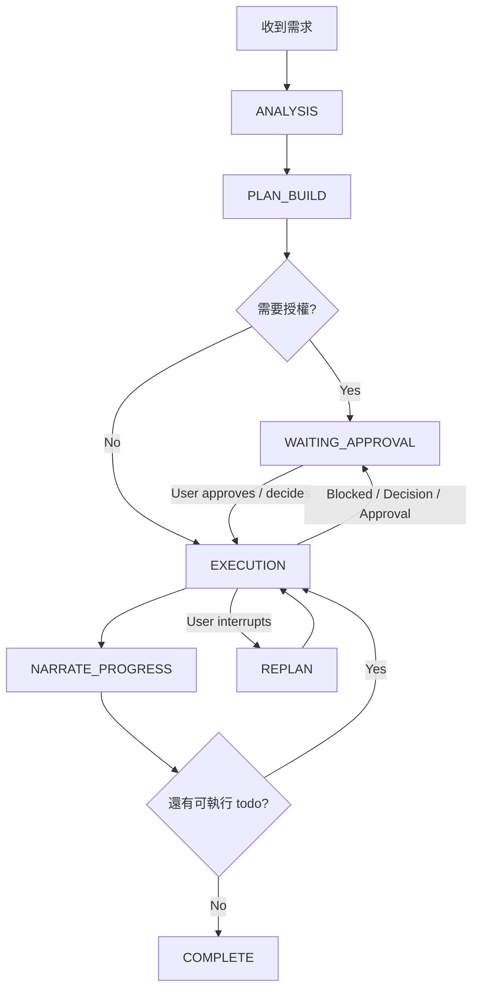

# Agent Workflow (Autonomous-Ready Edition)

本技能不是只有通用 SOP；它同時定義本系統 autonomous agent 可以安全持續運作的最小契約。

## 0. 核心原則

1. **Autonomy 依賴計畫，不依賴靈感。**
2. **計畫不必完美，但必須可執行。** 至少要有目標、todo、依賴、stop gates。
3. **todo 是 mode-aware runtime contract。** Plan mode = working ledger（可自由寫）；Build mode = execution ledger（嚴格對齊 planner）。
4. **一律對話中可觀測。** 重要進展、阻塞、replan 必須可被使用者理解。
5. **可持續執行 ≠ 可靜默亂跑。** 遇到 approval / decision / blocker 必須停。
6. **Debug 必須 system-first。** 複雜 bug 一律先看系統邊界、資料流與觀測訊號，不得只憑局部症狀下判斷。
7. **Delegation-first。** 能安全切分的 execution slice，預設先考慮委派而不是全部由主代理親手完成。
8. **Narration ≠ Pause。** 進度敘述是可觀測性，不是把控制權交還給使用者；只有 stop gate 才應真正暫停。

---

## 1. Autonomous 必要條件（缺一不可）

在進入可續跑狀態前，必須先具備：

1. **明確目標**
   - 使用者要什麼
   - 完成的判準是什麼

2. **可執行 todo 集**
   - 至少 2 個以上步驟
   - 每步可被執行、驗證、完成或阻塞

3. **結構化 planner metadata**
   - `action.kind`
   - `risk`
   - `needsApproval`
   - `canDelegate`
   - `waitingOn`
   - `dependsOn`

4. **停止條件（stop gates）**
   - approval needed
   - product decision needed
   - blocked / external wait
   - max continuous rounds

5. **狀態一致性**
   - 同一時間最多一個 todo 為 `in_progress`
   - 其餘為 `pending` / `completed` / `cancelled`

若以上不成立，先補 plan，不要假裝 autonomous 已可安全開始。

---

## 2. 核心狀態機



---

## 3. Phase A — ANALYSIS（釐清需求）

目標：建立最小但足夠的執行前提。

### 必做

1. 釐清：
   - 目標
   - 範圍 IN/OUT
   - 完成判準
   - 是否允許直接執行

2. 找出阻塞型未知數：
   - 若不問就會做錯，立即問
   - 若可先假設不致危險，記錄假設後繼續

3. 搜集 SSOT：
   - 先 search，再 read
   - 不得憑空猜 API、型別、路徑
4. 若任務含 debug / unexpected behavior：
   - 先拆系統層次、模組邊界、資料/控制流
   - 先規劃 instrumentation，再規劃 fix

### 提問規則

- 只問 **阻塞性問題**。
- 優先選項題 / A-B 題。
- 若可先用合理假設推進，先推進並標記假設。

---

## 4. Phase B — PLAN_BUILD（把對話變成可續跑計畫）

目標：把需求轉成 runtime 可執行 todo。

### 計畫品質標準

計畫至少要包含：

1. **Goal**：一句話描述要完成什麼
2. **Scope**：IN / OUT
3. **Tasks**：原子步驟
4. **Dependencies**：哪些步驟要先做
5. **Validation**：每段怎麼驗證
6. **Stop gates**：哪裡需要 approval / decision
7. **Delegation candidates**：哪些步驟可交由 subagent 執行
8. **Architecture thinking**：constraints / boundaries / trade-offs / critical files

### `todowrite` 強制規範（mode-aware）

todo authority 依 session mode 而定：
- **Plan mode (working ledger)**: 可自由建立、重組、更新 todo，用於 exploration / debug / small fix / 暫時追蹤。不需要 planner artifacts 才能寫 todo。Runtime 會自動將 structure change 升格為 `working_ledger` mode。
- **Build mode (execution ledger)**: todo 必須與 planner-derived tasks 對齊。Structure change 只允許在 `plan_materialization` 或 `replan_adoption` mode 下進行。`status_update` mode 只能更新狀態，不能改 structure。

每個非瑣碎計畫都應寫成結構化 todo：

```json
{
  "content": "Implement X",
  "status": "pending",
  "priority": "high",
  "id": "t1",
  "action": {
    "kind": "implement",
    "risk": "medium",
    "needsApproval": false,
    "canDelegate": true,
    "waitingOn": "subagent",
    "dependsOn": ["t0"]
  }
}
```

### `action.kind` 使用準則

- `implement`: 直接實作
- `delegate`: 明確交給 subagent
- `wait`: 等待 subagent / external
- `approval`: 需要使用者批准
- `decision`: 需要產品/方向決策
- `push`: push / deploy / release
- `destructive`: delete / reset / drop
- `architecture_change`: breaking schema / architecture refactor

### `dependsOn` 使用準則

- 有前置依賴就一定要寫
- 沒依賴才省略
- 後續高風險步驟若依賴尚未完成，不應提早攔住整體 autonomous loop

### 何時可進入 autonomous execution

只有在以下條件成立時才可「一口氣往下跑」：

- 目標已清楚
- todo 已結構化
- 至少有下一個 dependency-ready 步驟
- 已知 stop gates 已標註
- 沒有未回答的阻塞性問題

若不成立，先完成計畫，不要急著執行。

---

## 5. Phase C — EXECUTION（依 todo 驅動，不靠即興）

### 執行規則

1. 一次只推進一個 `in_progress` todo
2. 完成後立刻：
   - 標記 `completed`
   - dependency-ready 的下一步可轉 `in_progress`
3. 若步驟可安全切分，預設優先委派 subagent，再由主流程整合結果
4. 遇到 subagent：
   - 父任務保留可追蹤 todo
   - `waitingOn=subagent`
5. 遇到 approval / decision：
   - 不得硬做
   - 停下來請求使用者
6. 每輪改動後都要驗證

### Documentation Agent（Mandatory for Non-trivial System Knowledge）

把文件視為 autonomous agent 的持久化系統模型，而不是收尾附屬品。

當任務涉及以下任一項時，Main Agent 應主動委派 `documentation` 類型的 subagent，並搭配 `doc-coauthoring`：

- 新增或變更模組邊界
- 新增或變更資料流 / sync flow
- 新增或變更狀態機 / lifecycle
- 新增或變更 debug checkpoints / observability 路徑
- 大型 refactor / architecture-sensitive change
- 複雜 bug 的根因已確認，值得沉澱為長期知識

### 核心文件責任分工（Hard-coded Repo Contract）

1. **`specs/architecture.md`**
   - 全 repo 長期文件 / 單一真相來源
   - 用於保存：
     - system overview
     - module boundaries
     - runtime flows
     - state machines / lifecycles
     - data flow / sync paths
     - external contracts
     - core directory tree
     - debug / observability map

2. **`docs/events/event_<YYYYMMDD>_<topic>.md`**
   - 任務級事件與決策紀錄
   - 用於保存：
     - 需求 / 範圍
     - 任務清單
     - 對話重點摘要
     - debug checkpoints
     - 關鍵決策
     - 驗證結果
     - architecture sync 結論

### Debug / Development 文件使用順序

複雜開發或 debug 任務，不要直接從原始碼開始猜。優先順序應為：

1. 讀 `specs/architecture.md` 的相關章節
2. 讀相關 `docs/events/` 歷史事件
3. 再 search/read 原始碼
4. 再建立當前 issue 的 instrumentation plan

### Documentation Agent 交付要求

文件 agent 的輸出應該幫主流程節省 token，而不是製造新雜訊：

- 只更新與本次任務相關的章節
- 優先產出框架圖式資訊，而不是冗長流水帳
- 目標是讓下一個 debug / dev session 能先讀文件再下判斷

### 統一 Debug Contract（Syslog-style）

所有開發 / debug 任務若涉及 bug、異常行為、reload blank、state mismatch、跨層資料錯誤，都必須遵守以下標準化 checkpoint：

1. **Baseline**
   - 症狀
   - 重現步驟
   - 影響範圍
   - 初始假設
   - 已知相關模組 / 邊界

2. **Instrumentation Plan**
   - 要在哪些 component boundary 埋 checkpoint
   - 每個 checkpoint 觀察哪些輸入 / 輸出 / 狀態 / env / correlation id
   - 使用哪些工具（log / trace / browser / test / script）
   - 預期要排除或確認哪個假設

3. **Execution**
   - 實際埋了哪些 checkpoints
   - 第一次收集到什麼證據
   - 哪個假設被排除 / 強化

4. **Root Cause**
   - 真正根因
   - causal chain（哪一層 → 哪一層 → 最終症狀）
   - 為何不是其他假設

5. **Validation**
   - 驗證指令
   - 通過 / 失敗
   - regression 風險
   - 是否移除或保留 debug instrumentation

### Component-boundary 埋點規則

若問題跨多層（例如 page → router → session sync → server → persistence），必須至少在每一層邊界觀察：

- 進入資料
- 輸出資料
- 狀態轉移
- config / env / permission 傳遞
- 錯誤 / fallback / retry 訊號

禁止只在最終報錯點附近盲改。

### Subagent 指派契約

Task prompt 至少包含：

1. Objective
2. Constraints
3. Absolute paths
4. Minimal snippets / line ranges
5. Validation command
6. 回報格式：`Result / Changes / Validation / Next(optional)`

---

## 6. Phase D — NARRATION（對話內可觀測）

autonomous agent 必須持續說明自己在做什麼。

但請記住：**narration 是 side-channel visibility，不是 pause boundary**。

### 必須可見的 narration 類型

1. **Kickoff**
   - 現在開始哪個步驟

2. **Subagent milestone**
   - 已委派什麼
   - 完成了什麼
   - 哪裡卡住

3. **Pause / Block**
   - 為什麼停
   - 需要誰提供什麼

4. **Complete**
   - 哪個計畫段落完成

5. **Replanning**
   - 因新使用者訊息中斷
   - 正在以新資訊重排

禁止 silent long-running autonomy。

---

## 7. Phase E — INTERRUPT-SAFE REPLANNING

當使用者插話、補充新想法、改方向時：

1. **承認中斷發生**
   - 說明舊 autonomous run 已被中斷

2. **重評估既有 todo**
   - 哪些保留
   - 哪些取消
   - 哪些延後
   - 哪些新增

3. **重新排序**
   - 更新 `dependsOn`
   - 保持只有一個 `in_progress`

4. **重新宣告下一步**
   - 讓使用者知道現在將如何續跑

### Replan 原則

- 不要把舊計畫整份丟掉，除非已完全失效
- 優先保留仍然有效的已完成工作
- 若方向改變導致舊 todo 失效，明確標記 `cancelled`

---

## 8. WAITING_APPROVAL / STOP CONTRACT

遇到以下情況必停：

1. `needsApproval=true`
2. `action.kind in {push, destructive, architecture_change}` 且策略要求批准
3. `waitingOn=approval`
4. `waitingOn=decision`
5. 真正 blocker（權限、外部依賴、不可恢復錯誤）

### 暫停時回報格式

```text
Paused: <原因>
Need:
  - <使用者批准 / 決策 / 外部資訊>
Next after reply:
  - <恢復後的第一步>
```

---

## 9. 文件 / Event / Completion Gate

### Event Ledger First

非瑣碎任務一律先建/更新：

- `docs/events/event_<YYYYMMDD>_<topic>.md`

至少包含：

- 需求
- 範圍（IN/OUT）
- 任務清單
- 對話重點摘要
- Debug Checkpoints
  - Baseline
  - Instrumentation Plan
  - Execution
  - Root Cause
  - Validation

### Completion Gate

未完成以下項目，不得宣告完成：

1. 相關 todo 已收斂
2. 驗證已執行
3. event 已更新
4. `specs/architecture.md` 已同步或註記 `Verified (No doc changes)`
5. 若任務涉及框架知識變動，已完成 documentation agent 同步或明確記錄不需要同步的理由

---

## 10. 操作準則摘要

- Search first, then read
- Read before write
- Absolute paths only
- One `in_progress` todo at a time
- Use structured todo metadata, not vague bullet lists
- Narrate meaningful progress in the conversation
- Prefer delegation-first execution for bounded slices
- Stop for approval / decision / blocker
- Replan explicitly when the user interrupts
- Finish only after validation + event + architecture sync
