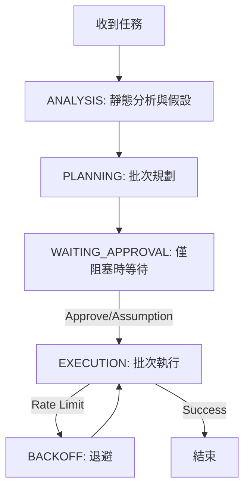

# Agent 工作流程標準規範 (Token-Efficient Edition)

本規範強制執行「更少 Token、更快收斂」的開發模式。

## 核心原則 (Core Principles)

1.  **最小充分回覆 (MSR)**: 只回覆結論、變更與下一步。禁止長篇教學或冗詞。
2.  **先做後解釋**: 能給 Code/Patch 就不要純文字解釋。
3.  **單一事實來源 (SSOT)**: 依據 `README`, `package.json`, `CI config` 為準。不要憑空猜測框架版本。

## 核心狀態機 (Core State Machine)



### 1. ANALYSIS (靜態分析與假設)

- **目標**: 建立執行所需的最小資訊集。
- **SSOT 檢查**: 優先讀取 `package.json`, `go.mod`, `README.md` 確認技術堆疊。
- **阻塞式提問 (Blocking Questions Only)**:
  - **只有**在「不問就會做錯」時才停下來問（如：API Schema 不明、破壞性操作）。
  - **非阻塞問題**: 建立合理假設 (Assumption)，標記為 `TODO` 或在 Commit Message 註記，然後繼續。
  - **提問限制**: 最多 2 個問題，且必須是「二分決策 (A/B)」或「選項題」。

### 2. PLANNING (批次規劃)

- **Task Batching**: 將相關修改合併為單一 Request。
- **Assumption Protocol**:
  - 若資訊不足，先給出「最佳假設下的可行方案」。
  - 例：「假設使用 JWT Auth (依據 package.json)，將實作 Bearer Token 驗證。」
- **Template-First**: 對 recurring tasks（bugfix/refactor/docs/test）優先使用短模板，避免每輪重覆長指令。

### 3. EXECUTION (批次執行)

- **Context Handover**: 僅提供必要的程式碼片段 (Snippet)，嚴禁倒整個檔案。
- **Output Format**: 強制 Subagent 使用標準回報格式 (見下文)。
- **Parallel-First**: 互相獨立的工具呼叫（查詢/搜尋/檢查）盡量同回合平行發送，減少 request round。
- **Search-Then-Read**: 先 `glob/grep` 收斂，再 `read` 精讀，避免大面積讀檔。

---

## 輸出格式規範 (Standardized Output)

Orchestrator 與 Subagent **必須**遵守以下輸出結構，以減少 Token 消耗：

### 1. 一般任務回報 (Result / Changes / Validation / Next)

```text
Result: [一句話總結完成了什麼]
Changes:
  - [修改檔案 A]: [關鍵變更]
  - [修改檔案 B]: [關鍵變更]
Validation:
  - [passed/failed]: [關鍵驗證或第一個錯誤重點]
Next:
  - [可選；僅在需要使用者操作時列出 1-3 點]
```

### 2. 程式碼輸出 (Code Delivery)

- **優先順序**: **Diff/Patch** > 單檔完整內容 > 片段。
- **禁止**: 貼上一大段未修改的程式碼。
- **指令**: 只提供「可複製貼上」且必要的指令 (最多 5 行)。

### 3. 測試與錯誤回報

- **格式**: `passed/failed`、失敗的測試名稱、**第一個** Stack Trace 重點。
- **禁止**: 貼上整份 Log。請使用 `grep` 或摘要。

### 4. 差異導向回報 (Delta-Only)

- 僅回報本輪「新增變更」與「最新驗證結果」。
- 不重述前輪已確認資訊，除非使用者要求完整 recap。

---

## 協作與脈絡管理 (Context & Orchestration)

### Orchestrator 指派任務模版

當呼叫 Subagent 時，Prompt 必須包含明確的省 Token 指令，並**強制注入安全協議**：

```javascript
Task({
  subagent_type: "coding",
  description: "[Batch] 實作登入功能",
  prompt: `
    # 安全協議 (Mandatory Protocol)
    - 編輯前必須使用 default_api:read 讀取檔案。
    - 禁止盲目編輯 (Check timestamp)。

    # 目標
    實作 JWT 登入 API。

    # 脈絡 (Pruned)
    - Schema: /src/schema/auth.zod.ts (L10-L40)
    - Utils: /src/utils/jwt.ts (Signature Only)

    # 假設 (Assumptions)
    - 假設 Token 時效為 1h (若錯誤請標註 TODO)。
    - 假設使用現有的 Redis Client。

    # 輸出規範 (Strict)
    - 嚴禁廢話。
    - 使用 "Result / Changes / Next" 格式。
    - 程式碼優先提供 Diff 或 Patch。
  `,
})
```

### Rate Limit 處理

1.  **429/Overload**: 立即暫停，標記該 Provider 冷卻。
2.  **Context Overflow**: 執行 **Log Compression**。
    - 回覆用戶：「Log 過長，我只需要：1. Error Summary, 2. First Stack Trace, 3. Config Snippet。」

## 安全與品質底線

1.  **不做「假設式正確」**: 不確定 API 是否存在時，先 `grep` 確認，不要幻覺。
2.  **隱私**: 不輸出 Secrets (.env)，排查時要求「遮罩後」的片段。
3.  **一致性**: 遵循專案既有的 Lint/Format 規則，不另起爐灶。
